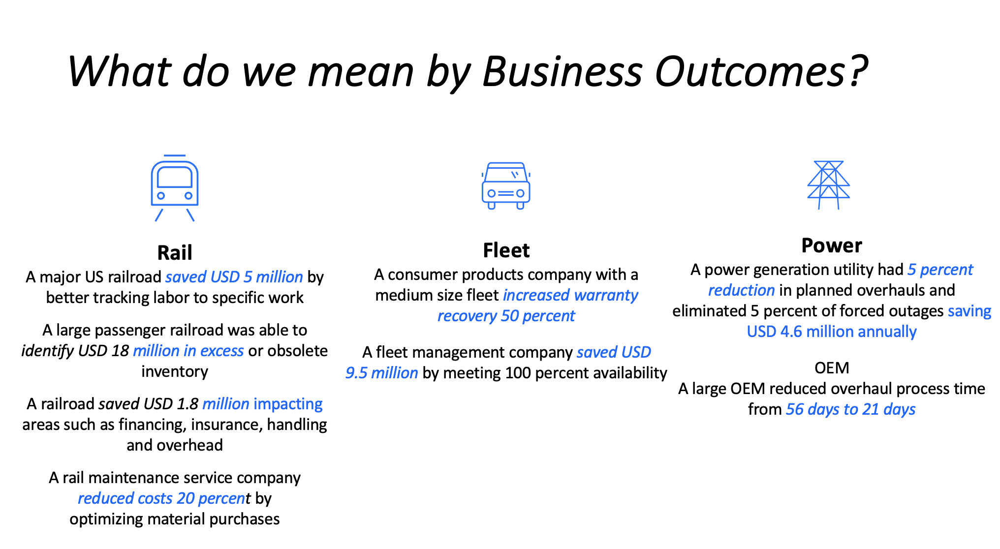

import {Link} from 'gatsby'

<AnchorLinks small>
<AnchorLink>What are Business Outcomes</AnchorLink>
<AnchorLink>When should I use the Business Outcomes Framework?</AnchorLink>
<AnchorLink>What do I need to prepare?</AnchorLink>
<AnchorLink>Who participates?</AnchorLink>
<AnchorLink>Steps to use the Business Outcomes Framework</AnchorLink>
<AnchorLink>Business Outcomes Framework assets by brand</AnchorLink>
<AnchorLink>Outcomes</AnchorLink>
<AnchorLink>Next steps in Gainsight</AnchorLink>
</AnchorLinks>

<Row>
<Column colMd={8} colLg={8}>

## What are Business Outcomes?

Business outcomes are the value - the savings, the process improvement, the time reduction - that the customer anticipates as a result of implementing a solution.

The Business Outcomes Framework is a collection of IBM Customer Success best practices, tools, and templates for guiding the definition and measurement of the business value clients expect from an implemented solution.

Use the framework to:  
Identify potential business outcomes by use case 
Measure the value of each business outcome 
Define and measure business outcomes with your customer

## When should I use the Business Outcomes Framework?

There are several instances when you might use this framework. You should have the business outcome discussion with your customer when you have a prioritized use case defined. When you are defining a use case, you should discuss pain points that convert into business outcomes.

## What do I need to prepare?

To prepare for a Business Outcomes discussion with your customer, you will need to review the business outcomes calculators to become familiar with the data that is used to calculate the value of the business outcomes for the customer’s use case. You will need the data for the KPIs so you can use the calculators to determine the value of the business outcomes.

## Who participates?

| IBM | Customer |
| -------- | --------- |
| You, the CSM |  No more than 5 - 7 people |
| ATL and others from the IBM Account team | See the customer workshop decks for suggested participants base on the customer use case |
| Domain SMEs, as necessary | |

</Column>
</Row>

<Row>

<Column colMd={8} colLg={8}>

## Steps to use the Business Outcomes Framework

**Step 1:**  Meet with your customer to initiate the conversation around business outcomes. Use the Business Outcomes Customer Workshop deck as your base for the discussion.

**Step 2:**  Review and validate the use case. Use the Use Case Discovery session to help ensure you have a prioritized use case that will solve a customer's critical problem.

**My customer has a defined use case** 

* Check to see if the customer has a business outcome baseline. For the identified business outcomes, you need to collect the baseline metrics to compute the current status and expected benefits.

* Review the business outcomes metrics, calculators, and customer deck based on the customer’s use case

**My customer does not have a defined use case** 

* Conduct a use case discovery session with your customer to identify a use case
* Review the business outcomes metrics, calculator and customer deck based on the customer’s use case

**Step 3:**  Discuss potential business outcomes for the use case as described in the business outcomes workshop deck. Select the business outcomes, KPI’s, and metrics based on the customer's goals.

**Step 4:**  Define the baseline and target for each business outcome. The business outcomes calculators include the KPIs and metrics used to calculate the value of the business outcomes.

The calculators include:

* The data needed from the customer to establish the baseline and target

* Any industry metrics that you can leverage

**Step 5:** Gather the data from the customer to determine the business value using the calculators.

**Step 6:** Enter the information you calculated into Gainsight.

</Column>

<Column colMd={3} colLg={4}>

 
 

<Aside>

**Identify the use case**

<Link to="/use-case-discovery" target='_blank' rel='noreferrer noopener'>Use Case Discovery</Link>

</Aside>

</Column>

</Row>

<Row>

<Column>

## Business Outcomes Framework assets by brand

| Brand | Business Value Metrics | Calculators | Customer Workshop |
| ----------- | ------------------ | ------------- | -------------- |
| **Cloud Pak Platform** | | | |
| Instana | <a href='https://ibm.box.com/s/xlavfdh0felhthgq7qvk8x8ggvllz9vl' target='_blank' rel='noreferrer noopener'> Instana metrics</a> | <a href='https://ibm.box.com/s/mpxgi4an5x8e112og4tgjmzcs6plzj99' target='_blank' rel='noreferrer noopener'>Instana calculator</a> | <a href='https://ibm.box.com/s/qfe65tsut7uoat8vm7x8n7kvwhdq8av0' target='_blank' rel='noreferrer noopener'>Instana workshop</a> |
| Turbonomic | <a href='https://ibm.box.com/s/qkedox2hefhyprhas465lvdhitvrt5ky' target='_blank' rel='noreferrer noopener'>Turbonomic metrics</a> | <a href='https://ibm.box.com/s/97jxkn2rmhrgbhkr7bj90vyiq5r8xtmk' target='_blank' rel='noreferrer noopener'>Turbonomic calculator</a> | <a href='https://ibm.box.com/s/i4axkmtb7am8149a7u1pffy4hh0rjhar' target='_blank' rel='noreferrer noopener'>Turbonomic workshop</a> |
| CP4WAIOPS | <a href='https://ibm.box.com/s/bhcltm047b0bdsp1nuj13nigky87w6fe' target='_blank' rel='noreferrer noopener'>CP4WAIOPS metrics</a> | <a href='https://ibm.box.com/s/30hye3g9wn1m3ou1epohqn98b3o848xz' target='_blank' rel='noreferrer noopener'>CP4WAIOPS calculator</a> | <a href='https://ibm.box.com/s/9okxib9gy4ahahyy5ihmvs4hyhg2r2x4' target='_blank' rel='noreferrer noopener'>CP4WAIOPS workshop</a> |
| Integration | <a href='https://ibm.box.com/s/knvk30asfac1acxz2fp5uvfbozrmp97r' target='_blank' rel='noreferrer noopener'>Integration metrics</a> | <a href='https://ibm.box.com/s/vcvma1l1m9jli3sc7c0l3nn2o868tb9z' target='_blank' rel='noreferrer noopener'>Integration calculator</a> | <a href='https://ibm.box.com/s/ymncskow78k2ftbwzfglihs46evfshv3' target='_blank' rel='noreferrer noopener'>Integration workshop</a> |
| CP4BA | <a href='https://ibm.box.com/s/n7qc3j1o2hhd9w5t3pvzpb8a9tbf5pd1' target='_blank' rel='noreferrer noopener'>CP4BA metrics</a> | <a href='https://ibm.box.com/s/p05dgon96x0t3axtkyn3qw7ecdj10mo0' target='_blank' rel='noreferrer noopener'>CP4BA calculator</a> | <a href='https://ibm.box.com/s/jdmicirkba21l2i8bd8wdcrs2jm59sjd' target='_blank' rel='noreferrer noopener'>CP4BA workshop</a> |
| Data Fabric/Management | <a href='https://ibm.box.com/s/oocbiziatpcfdy1fzde4umye8mjzrg93' target='_blank' rel='noreferrer noopener'>Data Fabric metrics</a> | <a href='https://ibm.box.com/s/2bsmw8b5ss5jvxj882xnzmyvsmdkv569' target='_blank' rel='noreferrer noopener'>Data Fabric calculator</a> | <a href='https://ibm.box.com/s/t6shit7p5ybk1ilqfzodkgkl4fww3ria' target='_blank' rel='noreferrer noopener'>Data Fabric workshop</a> |
| Customer Care | <a href='https://ibm.box.com/s/36k5c7b0irbdzqves9dsh4dhi0bbo690' target='_blank' rel='noreferrer noopener'>Customer Care metrics</a> | <a href='https://ibm.box.com/s/7g80xuro8pqvheyyudphdh0jwgbwrszk' target='_blank' rel='noreferrer noopener'>Customer Care calculator</a> | <a href='https://ibm.box.com/s/s6j3mz9164gk0usjk803y4sq5f3ax3h9' target='_blank' rel='noreferrer noopener'>Customer Care workshop</a> |
| Security | <a href='https://ibm.box.com/s/48ztb251vc1gi14mup5ybcpuam7v3jqf' target='_blank' rel='noreferrer noopener'>Security metrics</a> | <a href='https://ibm.box.com/s/4hkxlgtfewt8qntq0voiijpbcf608w2k' target='_blank' rel='noreferrer noopener'>Security calculator</a> | <a href='https://ibm.box.com/s/0r1x9vi9n6f6vckng0ylxhkj5sp79mo2' target='_blank' rel='noreferrer noopener'>Security workshop</a> |
| Business Analytics | <a href='https://ibm.box.com/s/7k0vvdc7bs4w9b4rgqn4ksg6rfobofxl' target='_blank' rel='noreferrer noopener'> Business Analytics metrics</a> | <a href='https://ibm.box.com/s/0ceh0by00uq1baj0l34akvi7cwfaw1a2' target='_blank' rel='noreferrer noopener'>Business Analytics calculator</a> | <a href='https://ibm.box.com/s/daajnzb0wa4pvh12grqq2nwgaoqln9l0' target='_blank' rel='noreferrer noopener'>Business Analytics workshop</a> |
| **Sustainability** | | | |
| Weather solutions | <a hrf='https://ibm.box.com/s/czlpk7qa7cgxdl86m7wi4q6fmj2dkte4' target='_blank' rel='noreferrer noopener'>Weather metrics</a>  | <a href='https://ibm.box.com/s/bnro1naywsmx7u3sxqo0dcwl26jc5u3a' target='_blank' rel='noreferrer noopener'>Weather calculator</a> | |
| Maximo | <a href='https://ibm.box.com/s/4rionkapvhv6gxlr2c6blr585772srlx' target='_blank' rel='noreferrer noopener'>Maximo metrics</a> | <a href='https://ibm.box.com/s/h744tkrjc1a26pg9y0rhk820xdq2zaw2' target='_blank' rel='noreferrer noopener'>Maximo calculator</a> | <a href='https://ibm.box.com/s/yiugx00qqmz709dbgqyfeiwzp3dvjydp' target='_blank' rel='noreferrer noopener'>Maximo workshop</a> |
| TRIRIGA | <a href='https://ibm.box.com/s/xiaftlaz7w1qlynp3w4w1kg7j9ldi6pp' target='_blank' rel='noreferrer noopener'>TRIRIGA metrics</a> | <a href='https://ibm.box.com/s/ruoujc5q7mzo5jyr9pr6i81wasb3ea0h' target='_blank' rel='noreferrer noopener'>TRIRIGA calculator</a> | <a href='https://ibm.box.com/s/iqu0td55xyg8v261uefx1pftounb67im' target='_blank' rel='noreferrer noopener'>TRIRIGA workshop</a> |
| Supply Chain | <a href='https://ibm.box.com/s/8u8vjh7ab2ywp5j4hrc7fust72yhesgu' target='_blank' rel='noreferrer noopener'>Supply chain metrics</a> | <a href='https://ibm.box.com/s/3d97ahnqlahvfhsbx0vb2os0ujjz10kv' target='_blank' rel='noreferrer noopener'>Supply Chain calculator</a> | <a href='https://ibm.box.com/s/0xincrgpapcaf362bkugpt0ujmtkdqv4' target='_blank' rel='noreferrer noopener'>Supply Chain workshop</a> |

</Column>
</Row>

<Row>

<Column colMd={8} colLg={8}>

## Outcomes

At the end of the workshop, you should have specific business outcome targets for each prioritized use case.

</Column>
</Row>

<Row>

<Column colMd={8} colLg={8}>

## Next steps in Gainsight

After you have your business outcomes and targets defined, you can enter them into Gainsight.  This will enable you to define your KPIs for each product, associate CTAs (Calls to Action) and success plans to the KPIs, and track the progress of each KPI.  You will use the "Customer Goals" function in Gainsight to enter your KPIs.

**Step 1: Gather your information**
* KPIs
* Baseline and baseline start date
* Target, target end date, and target measurement

**Step 2: Create your Customer Goal**
1. Navigate to the R360 for the product you're working with.
2. Click the Customer Goals tab and click "Add goal"
3. Add each KPI as a Customer Goal, filling out as many fields as possible (you will fill in the Actual field later on)
4. Save the goal by clicking "Add goal"

**Step 3: Associate CTAs and Success Plans as desired**
1. In the Associated Work section, click either CTAs or Success Plans
2. Click "Associate" to select an existing CTA or success plan to this KPI or click "Create" to create a new one

CTAs and success plans remain separate from the KPI.  You can remove the association from the KPI and the CTA or success plan remains intact.  As you complete CTAs and success plans, the Work Progress indicator for your KPI will start to show progress.

**Step 4: Review your KPI progress**

After an agreed-upon period of time, set a review with the customer to determine if the expected benefits match or exceed the targets that were originally set. Use the "KPI Actual" field to record an actual measurement at that point in time. Depending on the results, you might:
* Re-define the Business Outcomes based on a better understanding of the customer's environment
* Make changes to the implementation by deploying new use cases or modifying how the use cases are developed
* Improve how the data points were collected.

</Column>

<Column colMd={3} colLg={4}>

 
 

<Aside>

**Need a detailed Gainsight walkthrough?**

<Link to="https://ibm.box.com/s/jx5xxqpmw78svk9w6r0vs0zitm87xxrg" target='_blank' rel='noreferrer noopener'>Business Outcomes in Gainsight</Link>

</Aside>

</Column>
</Row>
