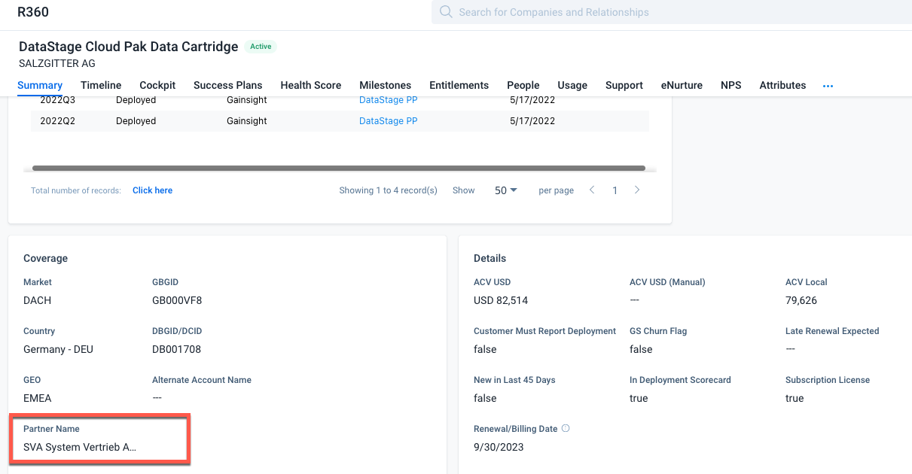
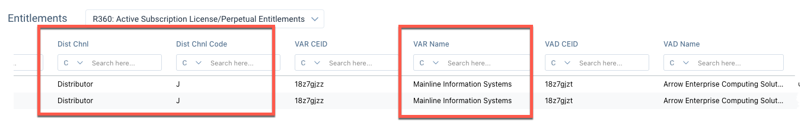
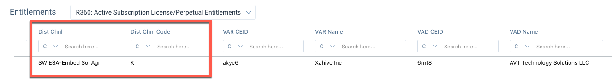

import {Link} from 'gatsby';
import FileLink from '../../components/FileLink';

<AnchorLinks small>
  <AnchorLink>Is there an IBM partner working with my customer?</AnchorLink>
  <AnchorLink>How to find a partner contact</AnchorLink>
  <AnchorLink>Introduce yourself to a partner</AnchorLink>
  <AnchorLink>Common Concerns and Guidance</AnchorLink>
</AnchorLinks>

<Row>
<Column colMd={8} colLg={8}>

This section of the playbook provides how-to's and resources to help you engage with partners early. Be sure to review the <Link to="/onboard/csm-partner-ecosystem" target='_blank' rel='noreferrer noopener'>Ecosystem Fundamentals</Link> before you begin.

</Column>

<Column colMd={4} colLg={4}>

<Aside>

Communicate using the <a href='http://ibm-cloud.slack.com/archives/C056H6QHCAE' target='_blank' rel='noreferrer noopener'>#csm-ecosystem</a> slack channel

</Aside>

<Aside>

<a href='https://ec.yourlearning.ibm.com/w3/event/10354009' target='_blank' rel='noreferrer noopener'>US Ecosystem Office Hours</a> (open to all CSMs, all Geos)

</Aside>

</Column>
</Row>

<Row>
<Column colMd={9} colLg={9}>

## Is there an IBM partner working with my customer?

It is common to discover that your customer purchased IBM software from an IBM Partner.  Partners also provide services to customers for onboarding, deploying and supporting IBM technology.  Follow these steps to determine if your customer has a relationship with a partner:

1. View the Gainsight relationship (R360) Summary tab. The field "Partner Name" will be populated if a partner sold the product to the customer.

2. For additional insight into the partner relationship type, check Gainsight entitlement details for the Distribution Channel and associated Code. These can be found to the far right of the Entitlement details. If the code G,H,J,K,M, or X appears, a partner is involved with your customer in some way. Below is a brief list of these codes. For a complete list of channel codes and definitions, refer to this <a href="https://w3.ibm.com/w3publisher/bpdm/user-information/channel-codes" target='_blank' rel='noreferrer noopener'>reference guide</a>.
  * K suggests a Build relationship and your account IS a partner.
  * G or M suggests a Service relationship.
  * For codes G,H,J,K,M, Gainsight will show the name of the Value-Added Reseller (VAR) and their CEID.
  * Code X indicates the entitlement was sold through a Cloud Aggregator or Subcontractor, most commonly found with SaaS offerings. The specific aggregator or subcontractor name will be shown in the VAR Name column.
  * If the code A, this is IBM direct sales. But that doesn’t mean there isn’t a partner. Check with the account team and ask. Code Z is also directly sold through digital channels.

Here are two examples of what you will see in Gainsight:

Reseller partner

Build partner

3. After you identify the likely partner, validate with the IBM team (sales or ecosystem team).

  * Ask whether and how partners are engaged in your account.
  * If a direct sales team, be sure to ask if the customer has contracted with a partner for implementation services outside of IBM.
  * If your customer is a Build partner, work with the TPS and PTS to get background and discuss your role.
  * If your account is a Global Systems Integrator (GSI), work with the TPS to understand how the entitlements are expected to be used (internal use or customer projects) and how this entitlement fits within the overall strategy they are driving with that partner.

4. Engage the IBM partner before meeting with any end customer. The Partner must be viewed as a key member of your team in support of the customer. Review the <Link to="/onboard/csm-partner-ecosystem" target='_blank' rel='noreferrer noopener'>Ecosystem Fundamentals content</Link> for a deeper understanding of the different types of partners and how CSMs should engage with them.

5. Finally, just because a partner is not shown, does not mean there is not a partner involved with the customer. Customers may have separate contracts with partners for consulting or implementation services and we should try to discover and work with them as appropriate.

## How to find a partner contact

Many partners have decades-long relationships with customers. Always reach out to the partner before engaging the end customer.
* If there is IBM direct sales coverage, check with the for partner contacts. This includes checking with the digital seller if there is no dedicated account team.
* If the account does not have IBM direct sales coverage, there are a few options to find the IBM Ecosystem sellers working with the partner. Engage them for an introduction to the appropriate contacts at the partner:
    1. Use Seller Search in IBM Sales Cloud (ISC)
    2. Use the <a href="https://ibm.ent.box.com/s/wii435byg8spv3ivol1fns3bjtd3jkms" target='_blank' rel='noreferrer noopener'>Global Mapping Tool for Partners to IBM Reps</a>
    3. Americas only: Use the Coverage Chatbot. Visit <a href="https://w3.ibm.com/w3publisher/pts-us-ecosystem/partner-coverage" target='_blank' rel='noreferrer noopener'>this landing page</a> for instructions on how to set up an account and use the tool to find all 2022 Ecosystem roles covering a specific partner.

## Introduce yourself to a partner

Many misunderstandings can be avoided when the partner has a clear understanding of your role and value. And, how you can help them achieve their goals.

The <a href="https://ibm.box.com/s/tnerkzckvygc3wu5ljc3onfw9eia4wv3" target='_blank' rel='noreferrer noopener'>"Plan your partner introduction"</a> one-pager will help you plan your introductory meeting with the partner. The document includes:
* Suggested meeting agenda
* Talking points to articulate CSM role and value
* Suggested discovery questions to learn more about the partner and the customer
* Recommended responses to partner objections
* Key areas to consider when defining how you will engage together with the partner going forward

 
<em>US Only Note: When engaging with Sell partners aligned to TD Synnex as their Value-Added Distributor (VAD), please use <a href="https://ibm.box.com/s/c3tc4hxhrvf77wbettxwq09won7remz4" target='_blank' rel='noreferrer noopener'>this version of the planning one-pager</a> which provided details on how to connect with these partners through TD Synnex. You can find the VAD in the Entitlement Details in the Gainsight relationship. They are shown as AVT Technology Solutions.</em>

Download and customize this presentation to support your discussion: <a href="https://ibm.box.com/s/hq4xbu4ej95wf0m4hjoqukjv1g6qubj7" target='_blank' rel='noreferrer noopener'>Introduction to a Partner (PPT)</a>

## Common concerns and guidance

<Accordion>

<AccordionItem title="I have determined that my customer is working with a partner but I don’t know who to contact in the company.">

* If there is IBM direct sales coverage, check with them for partner contacts. This includes checking with the digital seller if there is no dedicated account team.

* If the account does not have IBM direct sales coverage, there are a few options:
  * Use Seller Search in ISC
  * Americas only: Try the <a href="https://w3.ibm.com/w3publisher/pts-us-ecosystem/partner-coverage" target='_blank' rel='noreferrer noopener'>Coverage Chatbot 2022</a>. On the landing page, read the instructions on how to use it and click the link to the chatbot.

* If you get stuck, reach out to @janebossert.

</AccordionItem>

<AccordionItem title="The partner is not responsive or is blocking access to my customer so I am unable to determine a plan of action.">

* Make sure the Partner understands your role and the value you bring, and how you can help each other. Use the "Introduction to a Partner" deck to support your discussion.

* Seek out the Partner rep (TPS,BPS or PTS) for help.

* Seek support from your management team if needed.

* It is not recommended to go directly to the customer without the partner’s agreement to avoid any channel tension.

</AccordionItem>

<AccordionItem title="The customer prefers to work with through their Business Partner with whom they have trusted relationship. How do I complement their efforts? Do I need to be involved directly with the customer?">

* Make sure the partner and customer understand your role, the value you bring, and how you can help each other.

* It’s perfectly OK for the Partner to work with the customer directly. Many partners have deep expertise in our technologies and the customer’s industry and have long-term relationships with these customers. You and the partner might decide you should work with the partner behind the scenes if that is what the customer ultimately prefers.

* Discuss with your manager and, if you both agree the partner is addressing the needs, consider reassignment to a customer or partner where you could have a greater impact.

</AccordionItem>

<AccordionItem title="How do I know what skills the Partner has? Will they be on a path to successful implementation for the customer?">

* Do your research. Find out what the IBM team knows about the partner’s focus. Search the Business Partner Directory on <a href="https://www.ibm.com/partnerworld/bpdirectory/" target='_blank' rel='noreferrer noopener'>IBM PartnerWorld</a>. Review their website and look at their customer references. Search for third-party reviews on sites such as Trust Radius or G2.

* Seek out the BPS assigned to get proper alignment based on skills.

</AccordionItem>

<AccordionItem title="My customer is used to working with IBM directly but since our sales coverage has changed, they no longer have access to that sales relationship. They are being introduced to a new Business Partner.">

* Make sure your customer understands your ongoing relationship.

* Seek out the BPS to ensure alignment on the partner skills and needs of the customer.

</AccordionItem>

<AccordionItem title="The Partner skills are not adequate, or they are not implementing according to our best practices. How do I share feedback on the partner? Should I intervene and how? How do I help the partner improve?">

* Discuss the situation with the partner to better understand the situation.

* Seek out and share IBM resources such as the IBM Center for Cloud Training or IBM Documentation. You may also share some resources from the Communities of Practice. Confirm with the practice leader that it is OK to share.

* Introduce the partner to other experts who might be able to assist (e.g., IBM Support, product management, or Ecosystem Labs as appropriate) if they are in need and receptive.

* Discuss with the Ecosystem team (TPS, PTS if available) to share experience and recommendations

</AccordionItem>

<AccordionItem title="I need to find a partner for my customer with XXX skills (in cases where the customer prefers to NOT have GBS or IBM Services for whatever reason).">

* The Business Partner Directory on <a href="https://www.ibm.com/partnerworld/bpdirectory/" target='_blank' rel='noreferrer noopener'>IBM PartnerWorld</a> is a good starting resource.

* After you have reviewed, reach out to the BPS to discuss plan next steps to engage.

* If no BPS is aligned with your account, reach out to the Ecosystem sales leader in your market for guidance.

</AccordionItem>

</Accordion>

</Column>

<Column colMd={12} colLg={12}>

  

<Aside>

**Learn More**

<Link to='/onboard/csm-partner-ecosystem'>Working with IBM Partners | Ecosystem Fundamentals</Link>

</Aside>

</Column>

</Row>
