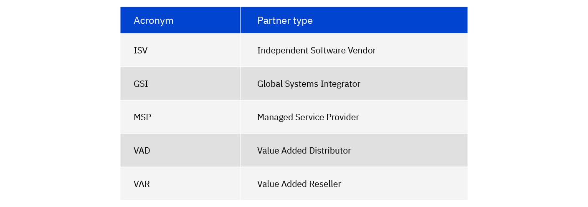
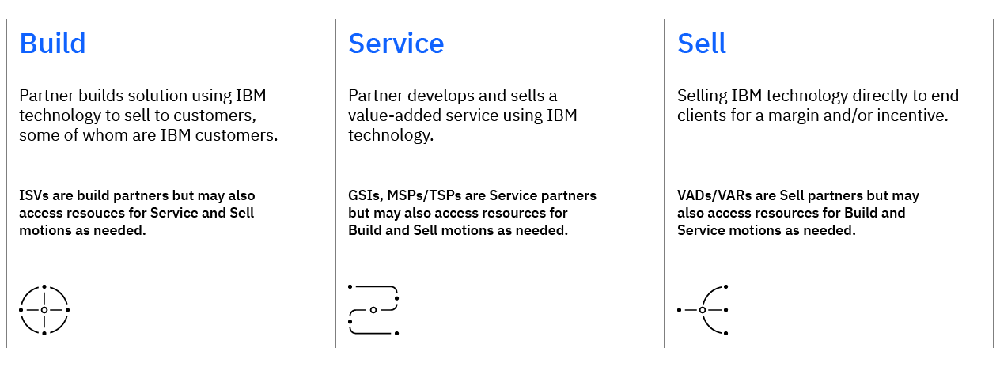
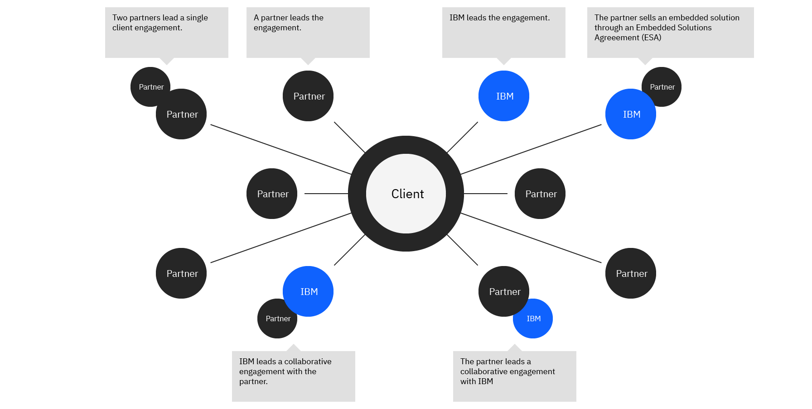

import {Link} from 'gatsby';
import FileLink from '../../components/FileLink';

<AnchorLinks small>
  <AnchorLink>Introduction</AnchorLink>
  <AnchorLink>Partner types and sales motions</AnchorLink>
  <AnchorLink>What are the different Partner type agreements?</AnchorLink>
  <AnchorLink>IBM Ecosystem Sales Roles</AnchorLink>
  <AnchorLink>CSM engagement</AnchorLink>
  <AnchorLink>Working with Partners in Gainsight</AnchorLink>
  <AnchorLink>CSM and PTS collaboration deep dive</AnchorLink>
  <AnchorLink>Partner programs</AnchorLink>
</AnchorLinks>

<Row>

<Column colMd={3} colLg={3} noGutterSm>

</Column>

<Column colMd={3} colLg={3}>

  Entry point 
You have a baseline of understanding about the customer and have learned that they work with an IBM partner.

</Column>

<Column colMd={3} colLg={3} noGutterSm>

  Outcomes 
You have an understanding of how to engage and successfully work with the IBM partner.

</Column>

</Row>

<Row>

<Column colMd={9} colLg={9}>

## Introduction

There is a good chance that a partner is working with your customer. It is even possible that your customer is an IBM Partner.  Each relationship will be unique &mdash; it is important that the partner understands the role of the CSM and has trust before introducing you to their customer. Be sure to reach an agreement early on how you will work with the customer and the partner.

This section of the playbook consists of two parts:
1. Ecosystem Fundamentals - A key first step to working with partners is learning about the types of partners, key roles within their organization, and how you as the CSM will engage with the partner based on the type of motion they are driving.
2. <Link to="/onboard/business-partner" target='_blank' rel='noreferrer noopener'>Ecosystem Execution</Link> - Once you have the basics, you are ready to engage. This section will help you find out if a partner is working with your customer; find the right contact; prepare to introduce yourself to a new partner. It also provides guidance our common situations that may arise.

</Column>

<Column colMd={3} colLg={3}>
 
 
<Aside>

<a href='https://ibm.box.com/s/8l3issr97i1u5jm9m23ae12t7xku60qc' target='_blank' rel='noreferrer noopener'>Ecosystem 101 Cheat Sheet (PDF)</a>

</Aside>

</Column>

</Row>

<Row>

<Column colMd={9} colLg={9}>

## Partner types and sales motions

There are many types of partners, each with their own acronym.  Before moving forward, let’s sort out the different partners you will encounter when working with the partner ecosystem. These are industry-standard terms.

Regardless of the type, it is important to understand how they participated in the sales process and the role they will assume with the onboarding and ongoing support of your customer.

IBM organizes partner programs into three partner motions. As the chart indicates, a partner may access resources across any of the motions based as needed for their specific business objective:

For more information, visit the <a href="https://w3.ibm.com/w3publisher/ibmsaleszone/ibm-ecosystem">IBM Ecosystem pages on SalesZone</a>

</Column>
</Row>
<Row>

<Column colMd={9} colLg={9}>

## What are the different Partner type agreements?

Depending on the type of partner, they may have different types of agreements and contracts with IBM.

**Business Partner Agreement (BPA)** 
The Business Partner Agreement (BPA) is the overarching agreement that establishes the relationship between the partner and IBM and authorizes the partner to market IBM Infrastructure, Software and Services under the Sell motion.  
**Embedded Solution Agreement (ESA)** 
The Embedded Solution Agreement (ESA) is the primary contract supporting the 'Build with IBM' Program. The key requirement in an ESA is the solution value-add: what makes the partner solution of greater value than the IBM functionality it uses, the partner must have created that value-add to use the ESA agreement. The agreements are typically sold directly by IBM to the partner and are identified in the entitlement detail with a channel code K.  
**IBM Partner Marketplace Relationships** 
The IBM Marketplace Relationships authorize Business Partners to participate in one of IBM's easily consumed purchase models. These relationships allow Business Partners to order and sell IBM's digitally-enabled offerings and provide them to their customers via their Marketplace. There are two types of agreements: the Cloud Aggregator Agreement and the Cloud Marketplace Reseller Agreement. The agreements are typically identified in the entitlement detail with a channel code X.  
**Partner Plus Agreement** 
The IBM Partner Plus Agreement is an agreement entitling Business Partners to participate in the IBM Partner Plus Program and access related offerings and benefits, such as the Customer Success Premier Program.
</Column>

<Column colMd={3} colLg={3}>
 
 
<Aside>

**Learn more**

<a href='https://ibm.seismic.com/Link/Content/DCW34qD6bMQ7DGqJc8fT8Dg3DH9j' target='_blank' rel='noreferrer noopener'>IBM Agreements</a>
 
 
<a href='https://w3.ibm.com/w3publisher/bpdm/user-information/channel-codes' target='_blank' rel='noreferrer noopener'>Channel Codes</a>

</Aside>

</Column>

</Row>

<Row>
<Column colMd={9} colLg={9}>

## IBM Ecosystem Sales Roles

Become familiar with some common roles you will encounter when working with IBM sellers that are aligned with the ecosystem.

**IBM Technology Partner Specialist (TPS)** - Drives sell-to and sell-through revenue across IBM brands within a named set of partners. There are specialties for build, sell and service partner coverage. 

**IBM Partner Technical Specialist (PTS)** - Shapes partner’s technical agenda toward IBM’s offerings, with a skew toward Growth offerings. There are specialties for build, sell and service partner coverage. 

**Partner Recruitment Leader (PRL)** - Drives recruitment and onboarding of targeted new partners, measured on revenue growth with new partners.

**<Link to='/intro/who-is-who#who-else-can-i-call-on-to-help'>Ecosystem Engineering</Link>** - Project-based teams helping partners build and/or migrate solutions to IBM hybrid cloud and other technologies, and to strengthen services practices around IBM Technology. (focus on Build and Service partners)

**IBM Brand Partner Specialist (BPS)** - Covers a territory of customers and identifies and passes leads to partners.

**ISV Success Manager (ISM)** – The ISM creates go-to-market plans with Build partners for their solution. They assist partners to generate end-client demand to adopt their solution (co-sell) and drive IBM and partner revenue growth. They engage with IBM clients to identify, nurture, and progress leads that help generate demand for the partner solutions and promote their solution at the clients until the deal is closed.

**Service Success Manager** – This is a specialty of the Technology Partner Specialist that create go-to-market plans with your partners for their service, assist partners to generate end-client demand to adopt their service (co-sell) and drive IBM and partner revenue growth. 

## CSM engagement

When working with customers and partners, the relationship varies by partner and customer.  Be sure to reach an agreement early on how you will work with the customer and the partner.

</Column>

</Row>

<Row>

<Column>

Every CSM is responsible for driving deployment (especially, where applicable, on Red Hat OpenShift) and ensuring renewals. However, when working with partners, how and with whom you do that may vary depending on the type of partner and the sales motion. The table below outlines the unique aspects and activities for each scenario.

|  | Build | Service | Sell |
| ---------- | ----------- | ----------- | ----------- |
| CSM Focus | Ensure the partner unlocks the full value of IBM technology within the solution build | Ensure the partner successfully delivers IBM technology for the customer solution | Ensure the customer successfully deploys the IBM technology |
| Who Owns Entitlement? | Partner | Customer, unless part of a packaged solution from partner | Customer |
| Who Works with the Customer? | Partner | Shared (Partner and CSM) | Typically, the CSM |
| CSM Assignment | Assigned to the partner | Assigned to partner or customer (depending on who owns the entitlements) | Assigned to the customer |
| Typical Activities | Drive architectural design and configuration decisions for the market-ready solution    Assist the partner during the build to implement best practices and overcome technical hurdles   Identify opportunities to incorporate additional IBM growth offerings into solution or future solutions | Guide partner and/or customer through architectural and configuration decisions of the deployment, recommending best practices   Assist the partner throughout the implementation of the solution addressing implementation challenges (e.g., troubleshooting, debugging) |  Develop and prioritize use cases that align to customer goals, preferably alongside the partner   Ensure customer utilizes the full capabilities of entitled software   Guide partner and/or customer through architectural and configuration decisions of the deployment, recommending best practices   Assist the partner and customer throughout PoX and/or implementation |
| How to get started | Align with TPS/PTS to understand the partner’s business focus and technology landscape, and background on solution to be developed    Engage with the partner to help them move forward with the solution development    Where needed, work with the Ecosystem Labs to support the partner with build and/or migration and assist with PoXs | For end-customer CSM assignments, engage with the sales team to understand if a services or implementation partner is involved   For Service-partner CSM assignments, align with the TPS/PTS to gather background on the intended use of the entitlements. Identify whether they are for internal development or for end-customer projects| Determine partner name via Gainsight    Align with the TPS/BPS/PTS to connect with the partner and discuss the value of CSM. Use available tools to identify IBM partner sellers    Define together with the partner how you will engage with the customer to drive consumption and adoption |
| Tracking deployments | **Initial Deployment**   Each new use case constitutes a deployment and is achieved when the first customer is live with a production workload. As partner development and GTM processes may differ, this can occur with beta customers or paid customers, either before or after General Availability (GA) date. Growth plans should include GTM status (beta, pre-GA, GA, paid customer, etc.) when marked deployed.   **Additional deployments**   - *Additional capability:* Expanding the technical capability of the solution. New use case, new growth plan and must consume additional licenses beyond initial deployment.  - *Additional customers:* CSM must be directly engaged with partner to activate the customers, e.g., providing configuration guidance, etc.  Consolidate new customers into one new growth plan per quarter. Must consume additional licenses beyond initial deployment.   - *Additional country rollout of solution:* Consolidate new country deployments into one new growth plan per quarter. Must consume additional licenses beyond initial deployment.   Additional deployments will be reviewed, audited, and re-evaluated at the end of Q2 2024. The CSM should be prepared to present the additional deployment use case to executive leadership. | Managed service scenario, for example, A Security Operations Center where the technology is installed once and available to many customers, a deployment is achieved when the partner goes live with the solution in production with their first customer. Subsequent customers onboarded to the same solution do not qualify for additional deployments.   Customer contracted with the Partner to deliver a specific implementation against their unique requirements.    For partner-owned entitlements, each unique customer implementation can qualify for deployment. | These are customer-owned entitlements and each unique customer use case achieves deployment when it is live and in production. |

</Column>
</Row>

<Row>

<Column colMd={9} colLg={9}>

## Working with Partners in Gainsight

Only partners participating in the CS Premier Program are eligible to access Gainsight. Access requests are managed by Leticia.Arias@ibm.com and jbossert@us.ibm.com.

Partners cannot currently see usage data or support ticket details, nor do they have the ability to create person records.

Note that Partners cannot see success plans that you create. They will only be able to see ones that they create.

To see if a Partner CSM is assigned to a relationship, go to the R360 Summary tab in the Details section and view the Partner tab. 

Partners can contribute to the Health Score. On the R360 Partner tab, there is a report for Partner Relationship Health.  This reflects the manual sentiment scores that partners enter.  These scores are one component of the Overall Health Score.

### Partner-created Success Plans 

Partner success plans are currently implemented as custom CTAs rather than traditional success plans. (This is an interim solution with migration to traditional success plans expected later this year.)

These will not flow to scorecards - yet. After the traditional Success Plan approach is released later this year, these CTAs will be migrated to Success Plans and will then be counted as deployments. 

These CTA types are ONLY for use by Partner CSMs. (Partner CSM-Growth and Partner CSM-Retention)

DO NOT create your CTAs using "PCSM Growth" or "PCSM Retention."

Only create a traditional growth plan after a partner has identified the use case as deployed so it will flow to the scorecard. Do this only if necessary as it results in duplicate growth plans, which will have to be removed at a later date.
When we release the traditional success plan approach later this year, partner-created CTA Growth Plans will be migrated, which will result in duplicates being reported.

### Collaborate with a Partner in Gainsight

To collaborate with a partner on a relationship, have the Partner CSM create the custom CTA growth plan so that you can both view the status and use Timeline to share updates.
Partners do not have access to Global Timeline. They can only use Timeline within a CTA. Engage partners with @mention in their CTAs.

### Partner support for Gainsight

Partners can provide feedback about their Gainsight experience through our email at IBM.Partner.Customer.Success@ibm.com.

For bugs, login issues, and data concerns, they can either email us or submit a case via Partner Plus Support (http://ibm.com/partnerplus/support). Click "Open a case" and select "Other Services". Mention "Gainsight" in the case title and description along with the issue description. Upon review of submitted tickets, the CSM Partner Program Owners will submit internal Github tickets as needed.

## CSM and PTS collaboration deep dive

CSMs will frequently collaborate with IBM PTS during a partner-led customer engagement. Some of the common activities and responsibilities by sales motion are outlined here.

</Column>

</Row>

<Row>

<Column>

| Engagement Type | IBM Partner Technical Specialist (PTS) | IBM Customer Success Manager (CSM) |
| ---------- | ----------- | ----------- |
| | Shapes partner's technical agenda toward IBM's 'Growth' offerings.   Enables partner's technical capability, both pre-sales and delivery to ensure productive use of IBM technology.   Drives partners to adopt IBM technology as the basis for solutions and as part of their reference architectures. | Engages post-sale to help partners who have bought IBM technologies to embed in their solutions or customers serviced by a partner to leverage the full capabilities and value.   Applies best practices, addresses technical barriers, accelerates time to value, and ensures consumption/renewal. |
| Build | Work with TPS on overall strategy, and set vision for ‘Growth Offerings’ in the solution build.    May engage HCBT for PoX.   Ensure technical handoff to CSM, where assigned.| Ensure vision is realized through successful implementation of growth offerings in partner solutions.    Help partner fully leverage technology, addressing technical hurdles during build. Collaborate with HCBT, if engaged.    Help partner stay abreast of new release capabilities and impact on the solution.    Identify opportunities to grow and expand partner investment (progressed by PTS). |
| Service | Influence and develop partner capabilities in ‘Growth Offerings’.  If a partner has purchased a catalog for use with end customers, PTS will work with the partner to identify use cases and support their GTM. | Focus is on end-customer solution delivery and ensuring the customer receives full value of the technology. (CSM may be assigned to a partner or customer depending on the entitlement ownership.)   If the partner has purchased a catalog for use with end customers, PTS takes the lead to drive the partner’s GTM. CSM monitors for customer engagement when identified. |
| Sell | Enables the partner to sell (value and technical) ‘Growth Offerings’.  Support specific partner deals, as needed (to enable the partner to be self-sufficient). | Focus is on end customer solution delivery and ensuring the customer receives the full value of the technology. CSM assigned to end customer. Limited, if any, PTS/CSM interaction is expected. |

</Column>

</Row>

<Row>

<Column colMd={9} colLg={9}>

## Partner programs

Below are the current partner programs CSMs should be aware of.

### IBM Partner Plus
 
IBM Partner Plus is the revamped IBM partner program that offers tiered benefits based on the partner's IBM revenue and IBM technology skills. The program includes new incentives launching in April 2023 and new co-marketing programs effective in July 2023.

</Column>

<Column colMd={3} colLg={3}>

 
 

<Aside>

**Partner Plus**

<a href="https://w3.ibm.com/w3publisher/ibmsaleszone/ibm-ecosystem/ibm-partner-plus" target='_blank' rel='noreferrer noopener'>SalesZone for IBMers</a> 
 
<a href="http://ibm.com/partnerplus" target='_blank' rel='noreferrer noopener'>Partner Plus site</a>
  
<a href='https://www.ibm.com/partnerplus/support' target='_blank' rel='noreferrer noopener'>IBM Partner Support</a>

</Aside>

</Column>

</Row>

<Row>

<Column colMd={9} colLg={9}>

#### IBM Customer Success Premier Program
 
Launched as a part of IBM Partner Plus and available now, this new benefit, aimed at our largest Partners — the Platinum partner, is unlike any other in the industry. Eligible partners can choose whether to participate in some or all of the following components:

* **Practice** – Training and workshops to help partners build skills in the discipline of Customer Success. Partners that enroll in the benefit will have access to one individual Gainsight Pulse+ digital learning subscription.

* **Platform** – Partners enrolling in this benefit have a limited number of licenses to access the IBM Gainsight platform to operationalize their practice. They will be able to manage adoption and deployment activities for the IBM offerings they sell and collaborate with IBM CSMs where they are assigned. This capability is expected to launch this quarter.

* **People** – Investment from IBM to support the partner’s investment in CSM resources. To be eligible to receive this funding, partners must assign a CSM resource and demonstrate deployment progression.

* **Assets** – Partner CSMs need to know how to support their end customers at every step of the journey. IBM will provide CSM practices and technical playbooks to partners.

<InlineNotification>
Only partners enrolled in the CS Premier Program are eligible to use Gainsight. See our participation report for the current list of active partners.
</InlineNotification>

</Column>

<Column colMd={3} colLg={3}>

 
 

<Aside>

**CS Premier Program Details**

<a href="https://ibm.seismic.com/Link/Content/DCPR9h4J3WWgcGfVfdjHPdjX3Dp8" target='_blank' rel='noreferrer noopener'>Seismic page for Partners</a>

 

<a href='https://ibm-cloud.slack.com/archives/C056S5QMTA6' target='_blank' rel='noreferrer noopener'>#cs-partner-premier</a> Slack channel

</Aside>

<Aside>

**Platinum Partner - CS Program Enrollment Status**

<a href="https://ibm.box.com/s/o7h0q9lq30ju8tyjmrm3l2r7nf3ng8se" target='_blank' rel='noreferrer noopener'>Participation report</a>

</Aside>

<Aside>

**CS Premier Program**

<Link to="/onboard/premier-program-guide" target='_blank' rel='noreferrer noopener'>Guide to managing the CS Premier Program</Link>

</Aside>

</Column>
</Row>
<Row>
<Column colMd={9} colLg={9}>

### Ecosystem Investment - Build Fund

The Build Fund (formerly known as the Cloud Engagement Fund, CEF) invests in our partners to drive Build Revenue by embedding IBM technology into a solution they sell to their clients and taking advantage of the IBM Embedded Solution Agreement (ESA). The program supports the following priorities:

* **Embeddable AI** - Drive growth with Watson Libraries, Watson Assistant, Watson Discovery, Instana, and Maximo Visual Inspection

* **FS Cloud** - Onboard and scale ISVs on FS Cloud, starting with 50+ISVs across 3 key banks then expanding

* **Software ESAs** - Partners embedding Software across Data & AI, Automation, Security, & Sustainability

* **OpenShift** - Grow and scale OpenShift focusing on large strategic deals

CSMs can request support for:

* **IBM Technical Resources** - Internal funding for migrations or development of new software assets including Build Lab

* **Partner Resources** - External Funding for resources supporting the development or integration of IBM technology in an embedded solution

* **Cloud Credits** - Reduce Infrastructure Costs for partners building on IBM Cloud

</Column>

<Column colMd={3} colLg={3}>

 
 
<Aside>

**Program details**
<a href="https://ibm.seismic.com/Link/Content/DCpgDQbcTX2JBGMTqFqJHGc3pm7V" target='_blank' rel='noreferrer noopener'>Learn more</a>

</Aside>

 

<Aside>

**Make a Build Fund request**

<a href="https://cef.us1a.cirrus.ibm.com/cef-request/newform" target='_blank' rel='noreferrer noopener'>Build Fund request form</a>

</Aside>
</Column>
</Row>

<Row>
<Column colMd={9} colLg={9}>

### IBM Sales Partner Advocacy Program

The IBM Sales Partner Advocacy Program is designed to encourage sales team collaboration with our Business Partners, prevent channel conflict and align sellers around the growth opportunities offered by IBM Business Partners.

</Column>

<Column colMd={3} colLg={3}>

 
 

<Aside>

**Partner Advocacy**

<a href="https://ibm.seismic.com/Link/Content/DCMccjq6GGXhbG7P82P4H4cGgfcj" target='_blank' rel='noreferrer noopener'>Learn more</a>

</Aside>
</Column>

</Row>
