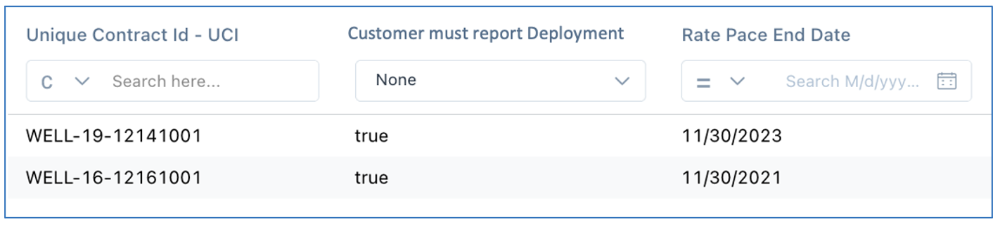

import {Link} from 'gatsby'

<Row>

<Column colMd={8} colLg={8}>

## What ELAs is this entitlement part of?
Entitlements that are part of an ELA will show the "ELA Attributes" report in the Entitlements tab of their R360.  This report gives more information about the ELA/s tied to this relationship.  If a relationship is not tied to any ELAs, this report will be blank.

</Column>

<Column colMd={3} colLg={4}>

  

<Aside>

**Watch the enablement video**

<a href='https://ibm.box.com/s/tl543vlyhiuy12vjz39bj3lvhw7mbf0y' target='_blank' rel='noreferrer noopener'>Learn about the ELA Attributes Report.</a>

</Aside>

</Column>

</Row>

<Row>

<Column colMd={8} colLg={8}>

## The ELA Attributes report

Fed to Gainsight from CADET, this report provides key details about the ELAs that your entitlement is a part of.

**Columns:**

**Unique Contract ID (UCI)** - an internal identifier for the specific contract.  This shows how many ELA contracts your entitlement is contained in. 

**Customer must report Deployment** - An indicator used to determine if the relationship can be marked Deployed with or without a customer-reported deployment.  If all the contract IDs for this entitlement (i.e., in this report) are marked "true" then this relationship requires that the customer report deployment before a Deployed milestone will be generated. If there is at least one "false" then a Deployed milestone can be created as soon as a validated, Deployed growth plan (or ISC deployment opportunity) is sent to the scorecard. 

After the customer has reported a deployment for that product, the flag will turn to false and deployed milestones will be generated as deployments occur.  If your customer's offering is in the reporting section but the flag is false - check the milestones.  There's likely a Deployed milestone already reported.  If a customer reports deployment for an offering, they cannot un-report it, so the flag remains false.  The only time this might change is if the ELA expires or is closed, and the customer has to then report on the entitlements in the new ELA.

**Rate Pace End Date** - Most ELAs renew well before their contract end date, which is usually 3-5 years.  Rather than show the ELA End Date, we are now showing the Rate Pace End Date.  Based on what the customer has used of their ELA so far, this date is the best guess at when the contract will be renegotiated and is the date that the Go to Market teams use most often.  If the Rate Pace End Date is in the past, it means that the ELA is in the close-out process which can take several months.  Until the ELA is closed, the contract remains open and visible in this report.

**Example:**

The screenshot below displays an example ELA Attributes report for Cloud Pak for Data.  This entitlement is contained in two ELA Contracts (two UCIs) and is requires the customer to report deployments (every line is "true"). One contract is expected to be renegotiated around November 30, 2023, and the other contract is being closed out, yet is still open during the close-out process.

</Column>
</Row>
