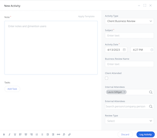
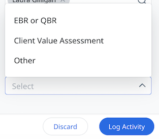

<AnchorLinks small>
  <AnchorLink>What is an EBR and why is it important?</AnchorLink>
  <AnchorLink>When should I hold an EBR?</AnchorLink>
  <AnchorLink>How do I prepare to hold an EBR?</AnchorLink>
  <AnchorLink>Who should participate?</AnchorLink>
  <AnchorLink>Steps to hold the meeting</AnchorLink>
  <AnchorLink>Outcomes</AnchorLink>
  <AnchorLink>Next steps</AnchorLink>
  <AnchorLink>Resources</AnchorLink>
</AnchorLinks>

import {Link} from 'gatsby';
import FileLink from '../../components/FileLink';

<Row>

<Column colMd={8} colLg={8}>

What your client’s executive team thinks of your product or service carries a lot of weight, and Executive Business Reviews (EBRs) are the perfect time to show exactly how big of an impact you’ve had on their business.

</Column>

</Row>

<Row>

<Column colMd={8} colLg={8}>

Customer Success Managers frequently engage with clients to advise and guide them through the tactical day-to-day activities they face and assist in removing adoption barriers that they encounter.  While these engagements are critical to the successful deployment of our offerings, there are two additional meetings that you cannot overlook.

| Checkpoints | Executive Business Reviews |
| --- | --- |
| A periodic review with the total team, including the client, any partners, and IBM to ensure alignment on the specific initiative underway. This should include key milestones, offering best practices, and offering enhancements that would be of value. | A periodic review with the **executive sponsors** from the client and IBM to ensure alignment on more strategic initiatives. This is a time to reinforce the progress the client is making in their adoption and align on the strategic objectives of the client. |

Checkpoints are an important activity that the total team participates in (client team, IBM and partners). These meetings center around tactical priorities and focus on detailed activities and short-term actions needed to be successful for a particular initiative.  They are an important activity to communicate among the team and manage success during client events such as onboarding or rolling out new capabilities.

This practice focuses on the second type of meeting – the Executive Business Review (EBR).

## What is an EBR and why is it important?

An EBR is a periodic review with the executive sponsors from the client and the IBM team (and partners) to ensure alignment at a strategic level.  It should be held quarterly. This is a time to reinforce the progress the client is making in their adoption, align on the strategic objectives of the client, uncover additional opportunities, and review the customer’s entitlement and deployment.

The EBR is an opportunity to align with the client’s executive team on past accomplishments, the current state, and future direction.  Be sure to include the business outcomes that result from implementing the solution. The meeting should have a strategic focus and participation of the client’s executives or high-level decision-makers is essential.

</Column>

</Row>

<Row>

<Column colMd={8} colLg={8}>

## When should I hold an EBR?

The periodic EBR meetings usually begin sometime after the client has successfully moved a workload into production.  Another approach is to hold the EBR after a success plan is complete. It is best to hold these meetings quarterly.

**Note:** If you are a CS Account Specialist working with a Diamond ELA client:
* You will use the EBR template to start the conversation with your client by focusing on ELA progress and alignment on strategic initiatives.
* You are required to hold quarterly, if not monthly governance reviews with your client.

## Why hold an EBR?

EBRs are used for several purposes.

**CS Account Specialists** initially use the EBR template to start the conversation with Diamond accounts. This meeting focuses on reviewing the existing ELA deployment projects and includes opportunity identification and a deployment plan (project working sheet/action plan). After the initial conversation, the CS Account Specialist should use the quarterly EBR meeting as an opportunity to update the client executive team to ensure alignment on strategic objectives.  
**CSM Architects** use EBRs for product-focus deep dives with the executive team. CSM Architects can work with the account team to ensure that deployment data, product roadmaps, and strategy alignment are included in the EBR.

</Column>

<Column colMd={4} colLg={4}>

  

<Aside>

**Diamond use of the EBR template**

<Link to='/onboard/ELA' target='_blank' rel='noreferrer noopener'>Use the EBR for your initial and then quarterly checkpoints with your Diamond ELA client
</Link>

</Aside>

</Column>

</Row>

<Row>

<Column colMd={8} colLg={8}>

## How do I prepare to hold an EBR?

Preparing for an EBR is like preparing for any important client meeting. The meeting should be held face-to-face whenever possible.

Coordinate with the client sponsor before the meeting to learn what topics are on their mind, what is causing any dissatisfaction as well as feedback applicable to improving the business. If it doesn’t fit the agenda, work with the client in the days leading up to the meeting to address or resolve the issue or topic.  This will help keep the meeting on track and prevent it from veering away from the agenda.  Based on what you learn, find the appropriate executive sponsor from IBM (or partner) to help balance the discussion.

</Column>

<Column colMd={4} colLg={4}>

   

<Aside>

**Open the conversation with a Diamond ELA client using the EBR template**

<Link to='/onboard/ELA/#open-the-conversation-with-the-customer' target='_blank' rel='noreferrer noopener'>Read about how to use the EBR to align with your customer</Link>

</Aside>

</Column>
</Row>

<Row>
<Column colMd={8} colLg={8}>

Review the EBR template (ensure you have the correct template for your agenda and account type – Diamond ELA or non-Diamond). You will use the following resources to complete the template:

* CADET External Customer View (Diamond only. Do not use any views from DMS/Diamond Management System Dashboard)
* Client Value Acceleration (Diamond only)
* Use case discovery session
* Business Outcomes Framework (agreed upon metrics)

Plan to do a dry run through the agenda and materials internally before the meeting.  Consider holding prep calls with any speakers who will attend.

</Column>

<Column colMd={4} colLg={4}>

 

<Aside>

<a href="https://w3.ibm.com/w3publisher/client-success-and-software-adoption/cadet" target='_blank' rel='noreferrer noopener'>Using CADET</a>

  

<Link to='/onboard/customer-value-acceleration' target='_blank' rel='noreferrer noopener'>Customer Value Acceleration session</Link>

  

<Link to="/use-case-discovery" target='_blank' rel='noreferrer noopener'>Discover the prioritized use case</Link>

  

<Link to="/onboard/business-outcomes-framework" target='_blank' rel='noreferrer noopener'>Understand and communicate the value of the business outcomes</Link>

</Aside>

</Column>
</Row>

<Row>
<Column colMd={8} colLg={8}>

### EBR agenda

The agenda will vary by client, but they all should include time to discuss the following:

* Celebrate past accomplishments.  Highlight major milestones achieved and the team involved. 

* Validate the present state. Focus the discussion on where we are and what we plan to accomplish in the near term.  

* Diamond only:  Include the status of the ELA contract section deployment, specifically what’s been deployed or in use and what they have available to consume using CADET External Customer View. 

* Diamond only:  Review agreed-upon projects from CADET External Customer View 

* Discuss future objectives and direction. Items on this list should be at least 6-12 months away. 

An EBR must make the client feel heard and allow them to validate the success plan moving forward.  A successful EBR will generate a list of follow-up items for you and your team and guide the next client success plan.

## Who should participate?

Confirm who will attend before the meeting.  Understand their role in the organization and influence on decision-making.  The size of the client’s organization will probably impact who attends. Consider rescheduling if the client executive is not able to attend.

Keep the portion of the meeting with the client’s executive team to under an hour and a half.  Often EBRs will have an additional “working” session with the stakeholders and other team members – keep this separate from the strategic discussion with client executives.

| IBM | Customer |
| ------- | -------- |
| Executive sponsor (Your manager, Your market executive, A geo brand leader, Andy Grohman)  TSL/MD   ATL (when available)  Dealmaker  CS Account Specialist (Diamond)  CSM Architect | Executive sponsor  Project sponsor  LOB executive  Individual who engages, consumes or has responsibility for software agreement |

## Steps to hold the meeting

**On-site at the client or at IBM:**

* Identify a central point of contact for a client on-site meeting to help with logistics.

* Verify that the meeting room is reserved and can accommodate all of the attendees.

* Determine if security badges will be needed at the client site.  Arrive early enough to complete this process.

* Arrange wi-fi access with the client sponsor before the meeting.

* Verify that a projector or display will be available.

* Arrange for catering or restaurant reservations (follow IBM guidelines) ahead of time.

* Share web meeting info ahead of time for those not attending in person.

**Virtual meeting:**

* Ensure everyone has access to the web meeting platform.

* Test with the client meeting sponsor before the meeting.

Align as much as possible to the way your client works.  Customize the presentation, using their language, terms, metrics, colors and logo.

### Tips from the field

Some tips and guidance from seasoned CSMs for holding a successful EBR include:

Bring something new to share with the client each time you meet.  This will add a fresh aspect to the meetings and help keep the client engaged with the solution and IBM.  It can also help guide the client’s future direction and engagement.  Consider sharing industry benchmarks and how they measure up against them.  Highlight an article or paper that is relevant to the client’s plans and future direction.  Make it a goal to educate and engage in a different way each time. 

Plan to present your client with a “big ask” at each meeting.  It will be different for each client and depend on the current state of the relationship.  Some examples are asking them to be a reference, attend or speak at a conference, provide feedback to OM, participate in beta testing or commit to moving forward on future roadmap items.  Support this with the content covered in the meeting. 

A lot of information is shared and discussed in a short period at an EBR, so select another team member to take notes.  As the CSM you will likely be playing the role of “master of ceremony” and will not have much time for anything else. 

Don’t wait for the client to come up with their desired future state – be prepared to tell them where they should focus and what they need to be doing.

Keep in mind that an EBR is for validation of the current state and future path. 

Guard against the discussion going off-topic or turning into a performance review.  Consider using the “parking lot” approach to table anything that should be discussed at another time.  Prevent it by addressing as much as possible with the client before the meeting.

## Outcomes

You should expect to leave the meeting with:

* A discussion and alignment regarding outcomes achieved since the last EBR 

* Relationship and agreement regarding the health assessment 

* A shared understanding of the software consumption and utilization 

* Any issues (business, technical, engagement) identified and surfaced so they can be addressed promptly 

* New projects or areas for expansion 

* Possible new access/entry points

## Record the client session in Gainsight

1. Go to Timeline and add a New Activity. From Activity Type, select Client Business Review. (For Diamond accounts, do this at the Customer level, not the Relationship level)

2. Under Review Type, select EBR or QBR. For Account Specialists, specify the Review Type as CVA or EBR)

3. Mark Client Attended

4. Set the Date of the event

5. Record both IBM and Customer Attendees

6. In the Notes field, be sure to include any follow-up tasks from the meeting.

## Resources

* <FileLink to="/files/EBR-Sample-Template-01142023.pptx" target='_blank' rel='noreferrer noopener'>EBR presentation template </FileLink>

* <a href='https://ibm.box.com/s/9o9srhd0cnl062287hvox028pozhq7qg' target='_blank' rel='noreferrer noopener'>EBR presentation template for Diamond ELA accounts</a>

* <a href="https://gainsight.app.box.com/v/pulse-2018-slides/file/287025389983" target='_blank' rel='noreferrer noopener'>Gainsight - Flawless Business Review presentation</a>

* <a href="https://ibm.ent.box.com/embed/s/ouyo0e6hpyw5clrddu9ncgscqis4j3kq" target='_blank' rel='noreferrer noopener'>CBR video</a>

* <a href="https://www.smartkarrot.com/resources/blog/what-is-qbr/" target='_blank' rel='noreferrer noopener'>Article: What is a Quarterly Business Review (QBR): 5 Choices That Make or Break It</a>

* <a href="https://www.gainsight.com/guide/the-essential-guide-to-quarterly-business-reviews/" target='_blank' rel='noreferrer noopener'>Article: The essential guide to quarterly business reviews</a>

* <a href="https://ibm.seismic.com/Link/Content/DClpwgVTWgpkGD1VI9dD2vjg" target='_blank' rel='noreferrer noopener'>Customer success practice page</a>

</Column>

</Row>
