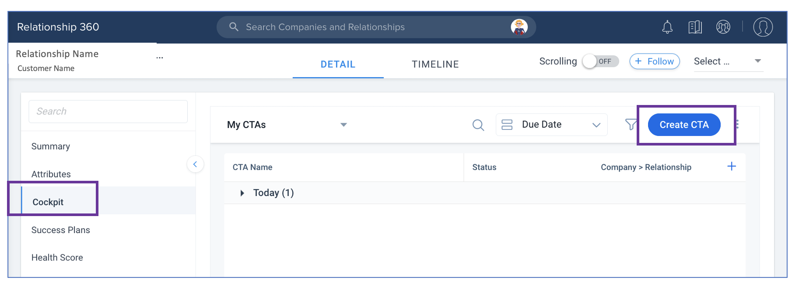
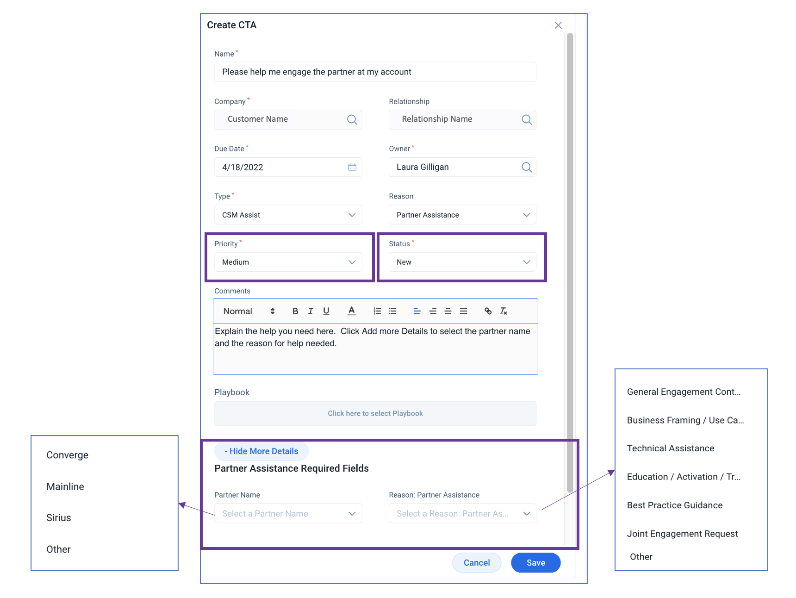

import {Link} from 'gatsby'

<AnchorLinks small>

<AnchorLink>I need help with a Partner</AnchorLink>
<AnchorLink>How do I request assistance with a Partner?</AnchorLink>

</AnchorLinks>

<Row>

<Column colMd={9} colLg={9}>

## I need help with a Partner

Many Cloud Pak Platform CSMs are assigned to entitlements that have a Strategic Partner. That Partner could be involved through the sale as a software reseller, within service delivery on a statement of work or through joint deployment implementation on behalf of a client.

CSMs might need help with that partner, either in making the initial connection, assessing the background on a sale, working through a deployment, or even aligning training for a client.  In the U.S., CSMs have a direct path from Gainsight to ask for help.

U.S. CSMs can now request assistance using the CSM Assist CTA with a Reason of Partner Assistance in Gainsight.

Examples of strategic Partner types in scope are:

Software Resellers (VAR) -  Converge, Mainline, Sirius 
Software Distributors (VAD) - Arrow, Ingram Micro, TD Synnex/Avnet 
Alliance Hyperscalers - AWS, Azure 
Other Strategic Partners - RedHat, IBM Consulting 

<InlineNotification>
**Note:**  Leaders can use the "Partner Assistance Needed" Cockpit view to see these requests and understand trends.
</InlineNotification>

</Column>

</Row>

<Row>

<Column colMd={7} colLg={7}>

## How do I request assistance with a Partner?

Cloud Pak Platform CSMs can create a Partner Assist CTA:

1. Log into Gainsight.
2. Navigate to the Relationship with which you need assistance, and select Cockpit.  (Note: you can also use the main Cockpit from the left Gainsight menu, but it is more convenient to create the CTA from within the Relationship because the Company and Relationship values will be filled in for you.)
Click Create CTA (upper right).
3. Enter a name for the CTA such as a brief summary of the help needed.
4. Select the Owner name as appropriate. See the section below for guidance.
5. Change the Type to "CSM Assist"
6. Set the Reason of "Partner Assistance"
7. Set the Due Date and Priority fields to values that make sense for your situation.
8. Explain your request in the Comments field
9. Click on the Add More Details to expand the Partner Assistance Required Fields
10. Select the Partner name from the Partner drop down
11. Select the Reason most appropriate for your request
12. Leave the Status as New and click Save.

### Who should the owner be?

Select the CTA Owner names based on the Partner with which you need assistance:

| Software Resellers (VAR) | Contact |
| --- | --- |
| Converge (VAR CGI) | Sid Mehta |
| Mainline (VAR CGI) | Dina Imbabazi |
| Sirius (VAR CGI) | Joshua Taylor |
| Amazon (AWS) | Gunveet Chawla |
| Microsoft (Azure) | Gunveet Chawla |
| RedHat | Gunveet Chawla |
| IBM Consulting | Gunveet Chawla |
| All others | Select "Assistance Needed" |

</Column>

<Column colMd={5} colLg={5}>

  

 
 

</Column>
</Row>
