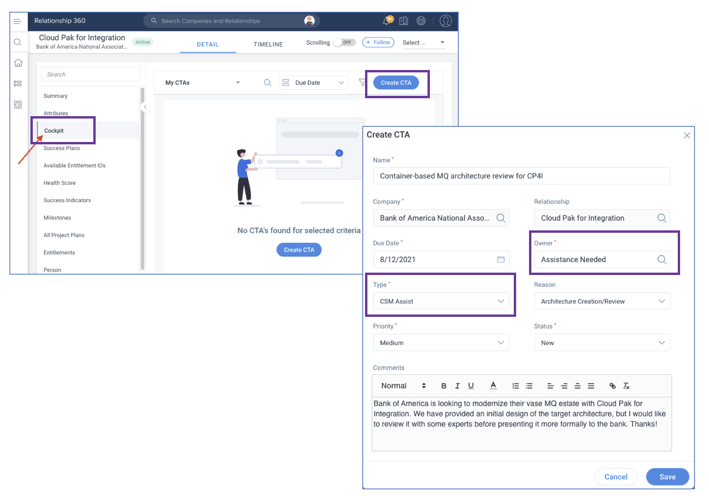
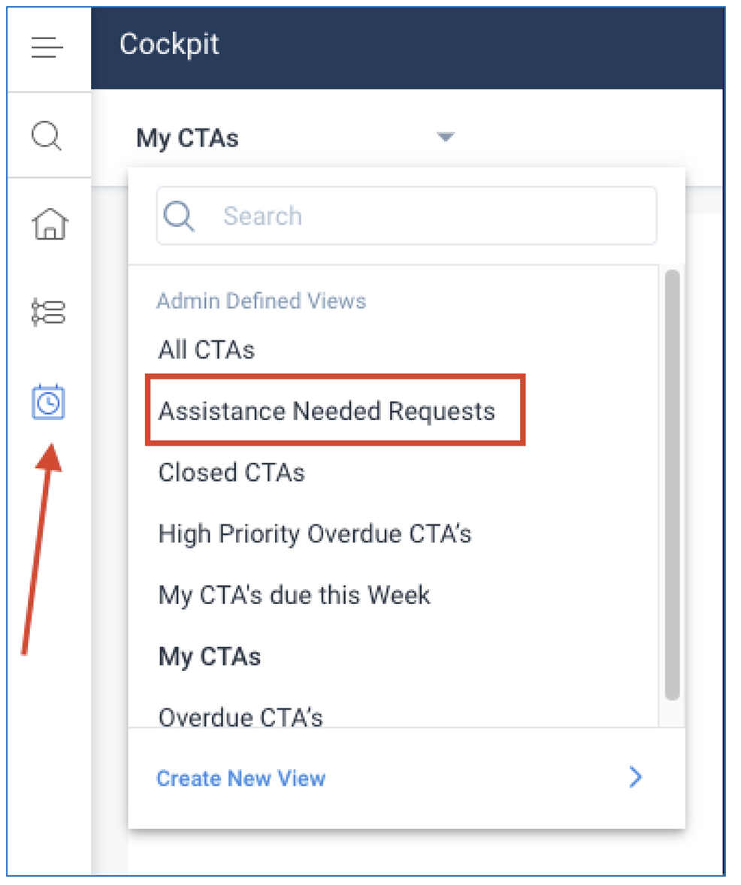

import {Link} from 'gatsby'

<AnchorLinks small>

<AnchorLink>Who can I ask for help?</AnchorLink>
<AnchorLink>Who can submit requests?</AnchorLink>
<AnchorLink>How do I create an Assistance Request?</AnchorLink>
<AnchorLink>How can I assist a CSM by grabbing a Request?</AnchorLink>
</AnchorLinks>

<Row>

<Column colMd={9} colLg={9}>

## Who can I ask for help?
As primary CSM to your customer, you can enlist a peer CSM's assistance to jumpstart additional deployments at your customers. This is the request process for peer assistance from your market and geography for customer deployment engagements. This will help increase deployment engagements with customers and provide a direct shadowing opportunity to learn in a community-like environment. This will also allow Community of Practice Leaders to work much more closely with CSMs in every market and region to collaborate with our customer projects more actively.

## Who can submit requests?

Only CSMs should submit requests.
You are encouraged to develop a community of CSMs who work together to assist one other, learn together, and continue to delight our customers through successful deployment projects.

### Example requests for assistance

This process focuses on tangible engagement requests for deployment projects at your customer.  Here are some example requests:

| Request | Description |
| --- | --- |
| Framing sessions | Your customer has asked for a framing session for a specific product or Cloud Pak solution, and you need an SME on a call with customer to answer technical questions or demo sessions of a capability |
| Architecture creation/review | reation or validation of architecture before presenting to your customer |
| Sandbox/MVP | Assistance with installing/configuring products, or creation of a MVP for an engagement |
| Production Best Practices | Assistance on making recommendations for customers with production environments, such as sizing, scoping, architecture, etc. |

<InlineNotification>

**Note:** This is NOT the forum for simple product capability or roadmap Q&A needs.  Those questions should be submitted to the <a href='https://w3.ibm.com/w3publisher/customersuccess/community-connections/community-connections' target='_blank' rel='noreferrer noopener'>Community of Practice</a> slack channels.

</InlineNotification>

</Column>

</Row>

<Row>

<Column colMd={7} colLg={7}>

## How do I create an Assistance Request?

When you first enter Cockpit, you'll see the default view - which is useful, but not always exactly what you need. You can customize your Cockpit with a variety of views to help you run more efficiently by using the filters.

1. Log into Gainsight.
2. Navigate to the Relationship with which you need assistance, and select Cockpit.  (Note: you can also use the main Cockpit from the left Gainsight menu, but it is more convenient to create the CTA from within the Relationship because the Company and Relationship values will be filled in for you.)
3. Click Create CTA (upper right).
4. Enter a name for the CTA such as a brief summary of the help needed.
5. If you know who you need help from, type their name in the Owner field. Otherwise, change the Owner to "Assistance Needed" to put the CTA in a 'pool' from which anyone can select and own the CTA.
6. Change the Type to "CSM Assist"
7. Set the Due Date, Reason and Priority fields to values that make sense for your situation.
8. Leave the Status as New and click Save.

</Column>

<Column colMd={5} colLg={5}>

  

</Column>
</Row>

<Row>

<Column colMd={7} colLg={7}>

## How can I assist a CSM by grabbing a Request?

Any CSM can pick up a request from the "Assistance Needed Requests" cockpit view.  It is best to pick up no more than two at a time, but ultimately your workload is your decision.  Note that picking up Assistance Requests does not relieve you from your primary customer assignment responsibilities.

Chapter CSMs and Practice Leaders will check the cockpit view to see if they can assist their peer for any technical help. Supporting your peers can count towards support of deployment progressions, support for production deployments, collaborate on team projects for technical community give back, and build new network and connections. This is captured and tracked through Gainsight by your leadership for proper recognition.

1. Log into Gainsight.
2. Open the main Cockpit view on the Gainsight left menu and select "Assistance Needed Requests"
3. After you identify a request you can help with, set the Owner to yourself and the Status to "Work in Progress"
4. Contact the CTA Creator and start collaborating!
5. When you are done, update the Status to the appropriate "Closed" value and record a Teaming for Success timeline entry on the Relationship.

</Column>

<Column colMd={5} colLg={5}>

  

</Column>
</Row>
