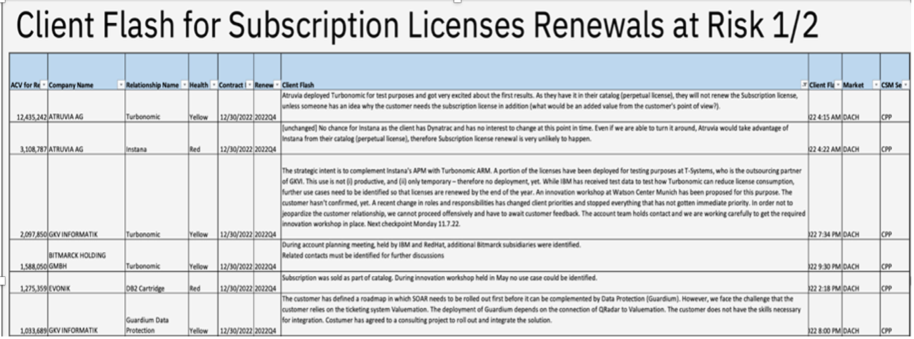
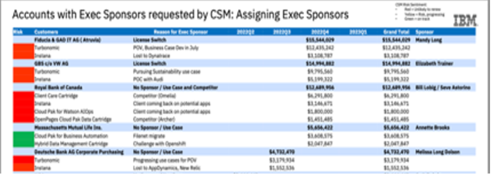
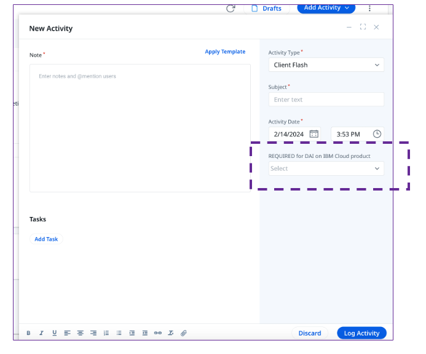

import {Link} from 'gatsby'

<Row>

<Column colMd={9} colLg={9}>

## Use Client Flash to update execs

Use Client Flash in Timeline to provide executives with the current state of an entitlement for an account. Every two weeks you should provide a 1-2 sentence headline describing the current state, next steps, and any reasons for a loss (if applicable). Only Client Flash updates made in the last two weeks are displayed; otherwise, the update will not be shown. This is to ensure the executives see only the current status. There is one exception: If the relationship has an open defection report, the last Client Flash update is displayed, regardless of the date it was made.

Do not summarize the entire deployment in Client Flash. If you need to provide a detailed summary, use an Update in Timeline. 

**For Public & Federal Market Clients:** Please ensure Client Flash does not contain any sensitive identification information outside of what is already shared in Gainsight.

## Unpacking a well-written Client Flash

The following Client Flash examples are well-written:

**Example 1**  Positive outcome from CP4BA use case exploration with 17 participants on July 25, Meeting with exec on July 29th for next steps of POV for Turbo.  

**Example 2**  Deploying CP4I, customer problem tickets since March, managed escalation since April.  Daily meetings with support to resolve. Need help to escalate Redhat support engagement.  

A well-written Client Flash has the following characteristics.

</Column>
</Row>

<Row>
<Column>

| Contains | Example |
| ------ | ---------|
| Current state of the deployment | Positive outcome from CP4BA use case exploration with 17 participants on July 25. Seeking sponsor user with help of ATL and Linkden for TurboPOC completed on July 8th for Guardium Exec sponsor meeting held July 15th with CTO to attempt to get sponsors for CP4WAIOP.|
| Next steps of the deployment | Meeting with exec on July 29th for next steps of POV for Turbo DV and WKC deployed in test and proceeding to preproduction on Aug 5. Targeting 3Q dev environment deployment for CP4BA starting August 10. Daily meetings with support to resolve managed escalation. |
| Any help needed | Need help to escalate Redhat support engagement. Managed escalation still not getting quick time to resolution. Need exec sponsor given no progress due to audit. |
| In case of a loss | Loss to Dynatrace, as Instana can’t monitor transactions tracing for APIC, pursuing Turbo attach   Customer still pursuing POV for Turbo, but Subscription License lost to ELA catalog   Loss due to quality of CP4DS to Azure, shifting to CP4I to keep engaged   Audit prevented us from customer engagement, despite multiple attempts |

## How to transform your Client Flash

| Don't do this | Do this instead |
| ------ | ---------|
| The strategic intent is to complement Instana's APM with Turbonomic ARM. A portion of the licenses have been deployed for testing purposes at T-Systems, who is the outsourcing partner of GKVI. This use is not (i) productive, and (ii) only temporary – therefore no deployment, yet. While IBM has received test data to test how Turbonomic can reduce license consumption, further use cases need to be identified so that licenses are renewed by the end of the year. An innovation workshop at Watson Center Munich has been proposed for this purpose. The customer hasn't confirmed, yet. A recent change in roles and responsibilities has changed client priorities and stopped everything that has not gotten immediate priority. In order not to jeopardize the customer relationship, we cannot proceed offensively and have to await customer feedback. The account team holds contact and we are working carefully to get the required innovation workshop in place. Next checkpoint Monday 11.7.22. | Sponsor changes resulted in a change in priorities. IBM proposed an innovation workshop at Watson Center Munich to identify use cases and re-engage the new team, pending customer confirmation.  Next checkpoint Monday 11.7.22 to finalize the workshop. |
| The renewal is set for December this year. We have been in an escalation for months. I have handled those daily escalation meetings together with IBM Consulting. We have fixed many issues and move forward with results. Unfortunately new issues appeared when we thought we were out of the woods.This lead to a managed escalation and we have restarted those escalation meetings. Overall the customer don´t have many severe issues anymore and in a much better place, but they need to feel that we are taking care of them and holding their hand. We are doing this with great success and customer is happy with that. Maximo seems more important to Scania then claimed before. I really believe live they renew even though we have had these issues. Question is, do they want to move to another cloud provider? How many App Points do they need? I will go on vacation next week but the team will continue to have weekly meetings with Scania. SRE and Product will attend those meetings. I will be available for any calls that need my help during my vacation. |  Turning around a customer escalation ongoing for 10+ months.  All severe issues resolved, continued care and hand holding still required to avoid future issues before they will consider renewal coming up this December.  Meeting with customer sponsor end of July. |
| In the last ELA contract, CP4S has been bundled into the contract as a subscription with a validity of one year. The idea was that a PoC would be performed during the year. Favorably, kubus is quite open to rely on ROS. Unfortunately, at the beginning of 2022, the decision was made to outsource parts of the IT. Against this background, large parts of the IT staff are working on defining the requirements for the tender and carrying out PoCs does not currently have priority 1. Nevertheless, we are in contact with the customer and discuss the option of carrying out a PoC with him at regular intervals. Next customer contact planned for end of July. | Customer purchased CP4S for a PoC that got de-prioritized and did not get implemented due to a change in their IT outsourcing strategy.  Meeting with customer end of July to discuss the PoC implementation.  |

</Column>
</Row>

<Row>

<Column colMd={9} colLg={9}>

## What is Client Flash used for?

A well-written Client Flash enables CSMs and Market & WW Leaders to focus on resolving customer issues instead of spending time manually producing slides. The goal is to transition all Renewal discussions to the glass and reduce the number of manual edits required for discussion. Client Flash Timeline entries are displayed on various dashboards, including the Gainsight Renewals dashboard and the watsonx Deployment dashboard in ISC. 

### Weekly leadership reviews within market & geo:

### Monthly geo reviews (including exec sponsor chart for clients most at risk for Tom Rosamilia’s leadership meeting)

</Column>
</Row>

<Row>

<Column colMd={9} colLg={9}>

## How to update Client Flash?

In Gainsight, you can update Client Flash by adding an activity in the Success Plan or in the Timeline - Relationship 360.

Data and AI Offerings on IBM Cloud require an additional step:  
Select the products that the flash entry relates to in the REQUIRED for DAI on IBM Cloud product field. 

</Column>

<Column colMd={2} colLg={3}>

  

<Aside>

**Learn to update Client Flash**

<a href='https://ibm.box.com/s/erbo9c069qpwmpm7eyrmqufgxr81qg2h' target='_blank' rel='noreferrer noopener'>Watch this video</a>

</Aside>

<Aside>

<a href='https://ibm.box.com/s/qpx4x1x8s9xt56g3gqn808my1ln2vp0b' target='_blank' rel='noreferrer noopener'>Learn to update Data & AI offerings</a>

</Aside>

</Column>

</Row>
