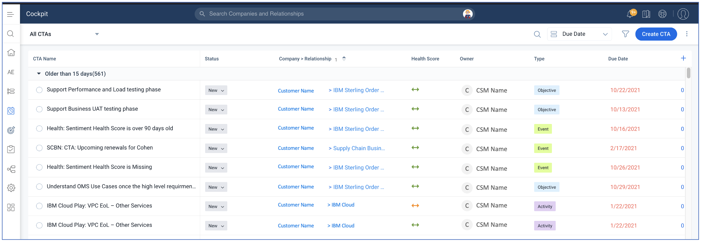
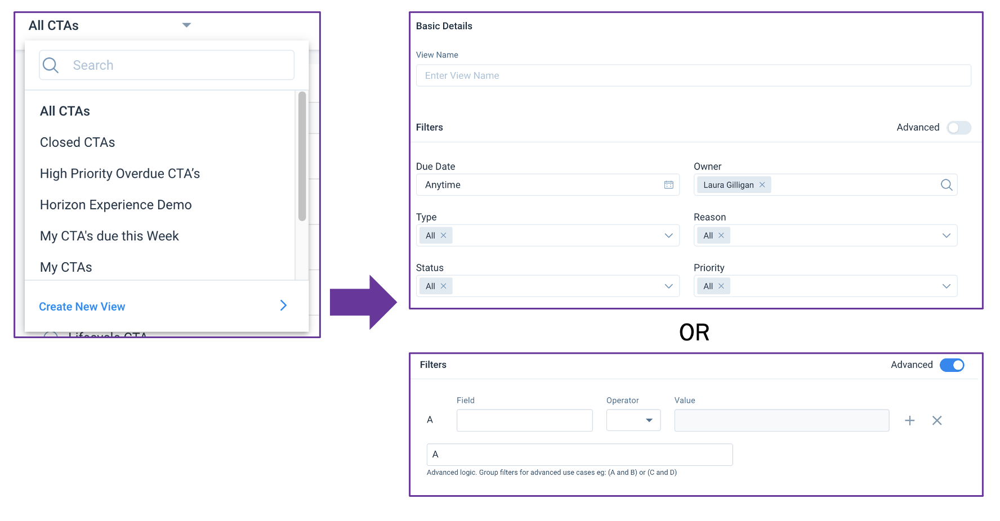

import {Link} from 'gatsby'

<AnchorLinks small>

<AnchorLink>What is the Cockpit and how do I work with CTAs?</AnchorLink>
<AnchorLink>Access Cockpit</AnchorLink>
<AnchorLink>Customize your view</AnchorLink>
<AnchorLink>CTA Types</AnchorLink>
<AnchorLink>CTA Categories</AnchorLink>
<AnchorLink>Common CTAs Generated by Gainsight</AnchorLink>

</AnchorLinks>

<Row>

<Column colMd={9} colLg={9}>

## What is the Cockpit and how do I work with CTAs?

Cockpit is your home base for viewing and managing key customer activities. This consolidated view will show all Calls to Action (CTAs). You can manually create a CTA for yourself or another user, or another user can create a CTA for you.  Gainsight may also create CTAs automatically using business rules. CTAs can be:

* Objectives and tasks as part of an active success plan you created
* Manually created follow-ups opened as part of a timeline update
* Automated alerts for you to take action based on business rules.  Commonly created Gainsight CTAs are listed below.

After you finish your CTA, you need to close it so you don't continue to see it in your dashboard.  You can close it from within the CTA or from the Cockpit by changing the Status to Closed.  Select the appropriate Closed value:

- Closed - Successful
- Closed - No Action Needed
- Closed - Outcome not Achieved

You can also close a CTA from the Cockpit by clicking the radio button on the left. This will set it to "Closed - Successful" and will mark all the associated Tasks Closed Successful as well.

Check out the Gainsight CTA education for an overview of CTA functionality.  Keep in mind that IBM has made many customizations so what you see will differ slightly.

</Column>

<Column colMd={3} colLg={3}>

  

<Aside>

**New to CTAs?**

<a href='https://education.gainsight.com/gainsight-cockpit-playbooks-nxt-replaces-102' target='_blank' rel='noreferrer noopener'>Gainsight education</a>

</Aside>

</Column>

</Row>

<Row>

<Column colMd={8} colLg={8}>

## Access Cockpit

Quickly access Cockpit by clicking the Cockpit icon on the left nav in the UI.  Or click the Cockpit tab on the top of a C360 or R360 to see CTAs specific to that customer or relationship.

To get back to the last dashboard you were viewing, you can click the Home button.

From this view, you can:

* Click on any to-do to see more details in the CTA 
* Mark the task complete by clicking the circle to the left.  This will cause a line to strike through the text, which indicates that it is complete. 
* Add a timeline update to an objective from within this view to provide an update on progress against the tasks. 

**Note:** While it is possible to add additional CTAs from within this view, due to the complexity of IBM customer relationships it can be a challenge to find the "right" customer for it to show up against.  To ensure the CTA shows up for the right customer, create your CTAs from within the C360 or R360, through timeline updates, or via success plan objectives.

</Column>
</Row>

<Row>

<Column colMd={9} colLg={9}>

## Customize your view

When you first enter Cockpit, you'll see the default view - which is useful, but not always exactly what you need. Using the filters, you can customize your Cockpit to help you work more efficiently.

Use the Basic filter to select common fields or you can change to the Advanced filter to add other fields to your view.

Save your new view and easily access it again later.

</Column>

<Column colMd={3} colLg={3}>

  

<Aside>

**Learn about the features and function**

<a href='https://ibm.box.com/s/3mfwnpqdc1qdnwxyt2lkkji3j5zc6rqt' target='_blank' rel='noreferrer noopener'>See the slide deck</a>

</Aside>

</Column>

</Row>

<Row>

<Column colMd={9} colLg={9}>

## CTA Types

When creating a CTA, select the Type that best fits the purpose. This will allow for meaningful Cockpit filters, and some types have special fields for more information specific to that type. Within types are the reasons, which provide an added level of categorization to your CTA.

Standard Types (others may be created as needed to respond to business needs):

| CTA Type | Description |
| --- | --- |
| Risk | To highlight a situation that poses a risk to the company, our engagement, the deployment, etc. Examples: low usage, retention issues, customer concerns.   If there is a risk on your project, create a Project Risk CTA from the Objective tab in your project. See  <Link to='/expand-renew/project-risks' target='_blank' rel='noreferrer noopener'>Highlighting Project Risks</Link>  for more details. |
| Activity | The default type for CTAs created from Timeline. Used to record general activity around the account. |
| Event | Can be set to recur. Record key happenings at the client. |
| Objective  | Every success plan objective is a CTA of type Objective that will appear in your timeline. Objective CTAs are only created through success plans.   If you want to highlight a risk on your project, create an Objective of Category = Risk. See  <Link to='/expand-renew/project-risks' target='_blank' rel='noreferrer noopener'>Highlighting Project Risks</Link>  for more details. |
| CSM Assist | Request assistance from someone by sending them this CTA. If you need assistance with a Partner, set the Reason to "Partner Assistance" for Cloud Paks |
| Brand Assist | Leadership asks the CSM questions on Success Plans. |
| Forecasting | IBM Cloud only. Used for forecasting activities. |
| Onboarding | IBM Cloud only. Used for activities tied to the onboarding of new Cloud clients. |
| New Assignment | Automatically sent when a CSM is assigned to a new customer or a new relationship.  Contains questions about joint deployment project work, and has tasks for the CSM to follow to get started. |

</Column>

<Column colMd={3} colLg={3}>

  

<Aside>

**CTA Assist**

<Link to='/onboard/gainsight-assist-ctas'>CSM CTA - Assistance needed</Link>

</Aside>

<Aside>

**CTA Partner Assist**

<Link to='/onboard/gainsight-assist-ctas-partner'>CSM CTA - Partner Assistance needed</Link>

</Aside>

</Column>
</Row>

<Row>

<Column colMd={9} colLg={9}>

## CTA Categories

High-level CTA Categories are used in management reporting to provide insights into the types of activities the team is performing or being asked to complete. These categories are:

| CTA Category | Description |
| --- | --- |
| Account Planning | an action that the CSM is aware of, created either through a success plan or manually by the CSM |
| Action Alert | an action that was pushed to the CSM and requires a response, but the CSM may not be aware of it |
| Play | actions tied to worldwide plays that people are being asked to focus on |
| FYI | a system-generated closed CTA to make the CSM aware of something that occurred, such as the opening of a Sev 1 ticket. Requires no action by the CSM. |

</Column>
</Row>

<Row>
<Column>

## Common CTAs Generated by Gainsight

Gainsight will automatically create CTAs for several reasons: to help CSMs with data hygiene; suggest key actions to take; and make them aware of certain events.  Common CTAs are described below.

<Accordion>

<AccordionItem title='New Relationship Assignment'>

**Purpose:**  To alert the CSM of a new relationship for an existing customer, and provide steps to learn about this new entitlement.

**When sent:**  Once the CSM assignment has been pushed to the new relationship.

**Action required:**  CSM should work through the steps to ultimately meet with their customer about this new relationship. If the customer agrees to work together on a deployment, close the CTA as "Closed - Successful".  If the CSM cannot reach the customer or the customer is not willing to work together, close the CTA as "Closed - Unsuccessful". CSM must also answer the questions around the Transition Document.

</AccordionItem>

<AccordionItem title='Missing Sponsor'>

**Purpose:**  To ensure that the project sponsor's name is provided. Without a sponsor, a project could be at risk, so a missing sponsor name could indicate a potential problem.

**When sent:**  If the project is in the stage of Sponsored, Planning or Deploying and no sponsor name has been provided.

**Action required:**  CSM should add the sponsor as a Person record, then select the sponsor name in the Project Sponsor field on the project Plan Info tab.  If there are issues confirming a sponsor, the CSM should reach out to his manager.

</AccordionItem>

<AccordionItem title='Missing Deployment Platform'>

**Purpose:**  To ensure that the Deployment Platform is set, since this is a required field for the Cloud Pak Scorecard and is important information about a project.

**When sent:**  If the project is in the stage of Deploying or Deployed and no Deployment Platform has been selected.

**Action required:**  CSM should select the Deployment Platform on the project Plan Info tab.

</AccordionItem>

<AccordionItem title='Upcoming Renewal in 120 days'>

**Purpose:**  Notify a CSM that a SaaS or IBM Cloud renewal activity is pending.

**When sent:**  120 days before the renewal

**Action required:** Engage with the Renewal Team to build a communication plan to guide subsequent interactions with the customer regarding the renewal.

<Link to='/expand-renew/renew-offerings' target='_blank' rel='noreferrer noopener'>Engage the Renewals team</Link>

</AccordionItem>

<AccordionItem title='CSM Sentiment Expiration'>

**Purpose:**  To ensure that the manually set CSM Sentiment field is kept fresh and up to date.

**When sent:**  If the CSM Sentiment has not been updated or refreshed in 90 days.

**Action required:**  CSM should refresh the CSM Sentiment on that relationship.  If no action is taken, the CSM Sentiment will be nulled out in 10 more days (100 days from last update)

Perpetual licenses will never churn in Gainsight because the client always owns the license and can choose to renew S&S at any time.  To avoid receiving CSM Sentiment CTAs (which are sent if the sentiment has not been updated in 90 days), follow these steps to exclude the R360 from the CSM Sentiment CTA rules:

1. Close the CTA as "Closed - No Action Necessary"
2. Set the reason as "Customer Not Using"

</AccordionItem>

<AccordionItem title='FYI&#58; New Support Ticket'>

**Purpose:**  To inform the CSM that a Sev 1 support ticket was opened by their customer in the last 24 hours so that the CSM can follow up with the customer as needed and be aware of the situation.

**When sent:**  A Sev 1 support ticket was opened by the CSM's customer in the last 24 hours.  Support tickets are visible from the R360.

**Action required:**  None. This is only for information and is created in the Closed state.

</AccordionItem>

<AccordionItem title='TIPS&#58; Low remaining subscription credits'>

**Purpose:** To alert Technical Product Specialists when their customers who have a PaaS subscription and are using Data and AI services are running out of subscription credits.

**When sent:** When the prior month's paas usage (all usage, not just Data and AI) is greater than the sum of the remaining subscription credits.

**Action required:** Work with Renewal Reps and/or Brand Sellers for an expansion subscription or a renewal subscription.

<Link to='/expand-renew/renew-offerings' target='_blank' rel='noreferrer noopener'>Engage the Renewals team</Link>

</AccordionItem>

</Accordion>

</Column>
</Row>
