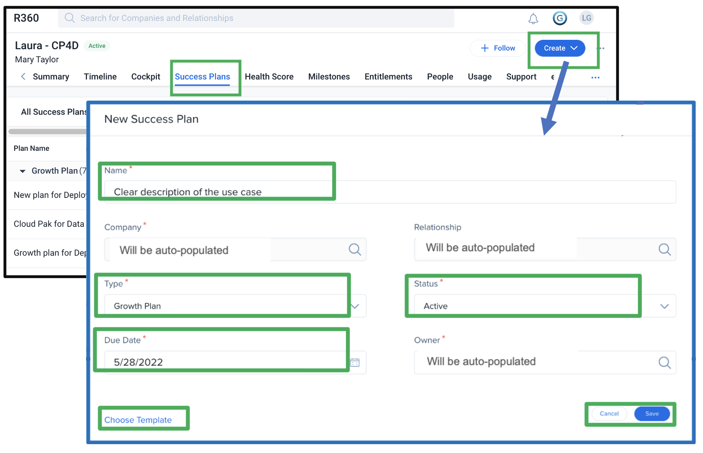
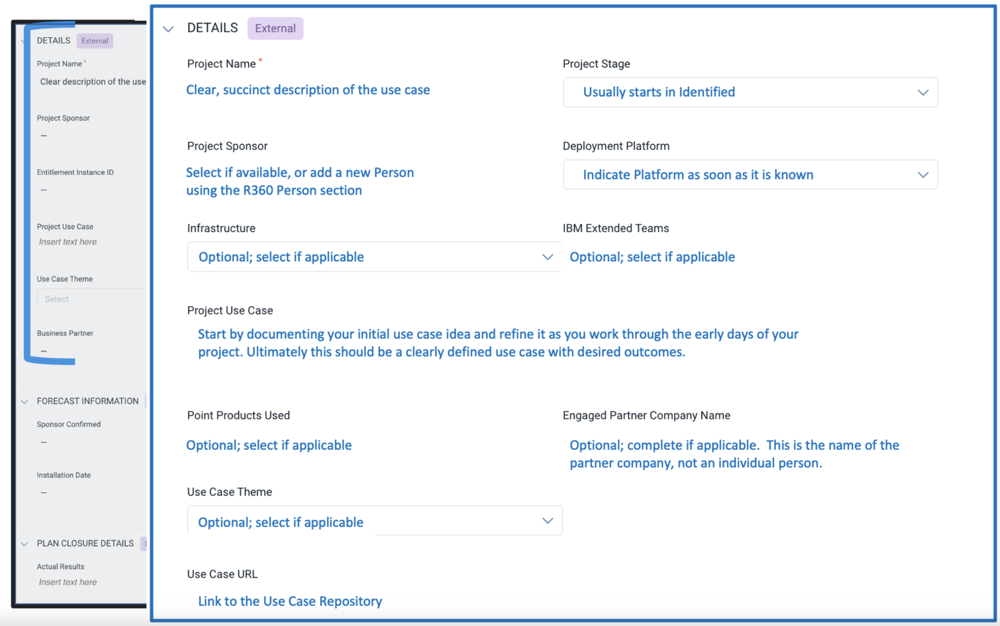
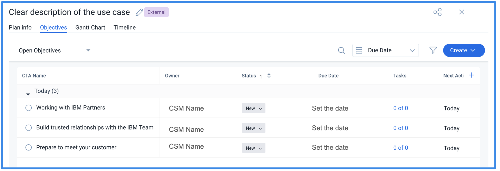

<AnchorLinks small>
 <AnchorLink>Drive deployment by using a Growth Plan</AnchorLink>
 <AnchorLink>Get started</AnchorLink>
 <AnchorLink>When do I need a Growth Plan?</AnchorLink>
 <AnchorLink>Build a solid Growth Plan</AnchorLink>
 <AnchorLink>Build a Growth Plan for multiple Relationships</AnchorLink>
 <AnchorLink>Build a Diamond ELA Growth Plan</AnchorLink>
 <AnchorLink>Continue to update the plan</AnchorLink>
 <AnchorLink>Gainsight Growth Plan fields in ISC</AnchorLink>
 <AnchorLink>Delete a Growth Plan</AnchorLink>
 <AnchorLink>Close the plan</AnchorLink>
</AnchorLinks>

import {Link} from 'gatsby'

<Row>

<Column colMd={9} colLg={9}>

## Drive deployment by using a Growth Plan

Deploying our software is essential to driving software usage in every customer situation, securing business value for our customers and ensuring continuous business growth. A Growth Plan represents a use case that a client would deploy and obtain value from.

You can create a growth plan at any time during the deployment lifecycle, but most growth plans are created when a use case is first identified. The growth plan articulates the action plan to meet a goal - in many cases, deployment of a use case.

The actual implementation of that use case might have multiple milestones and deliverables. Each project will deploy against an entitlement, either an ELA or a standalone offering. In Gainsight, a relationship can have several Growth Plans. It is important to keep deploying use cases until the entitlement is fully deployed.

Both Account Specialists and Brand Architects use growth plans to track deployment progress.

**Note:**  <Link to='/intro/use-isc' target='_blank' rel='noreferrer noopener'>IBM Sales Cloud (ISC)</Link> has a similar concept of deployment plans, called Deployment Opportunities.

</Column>
<Column colMd={3} colLg={3}>

 
 

<Aside>

**Success Plans in Gainsight**

<Link to='/deploy/identify#document-the-success-plan'>Document the Success Plan</Link>

  

**Growth Plans for IBM Cloud**

<a href='https://w3.ibm.com/w3publisher/gainsight-user-community/using-gainsight/ibm-cloud' target='_blank' rel='noreferrer noopener'>Learn how Growth Plans are implemented in IBM Cloud</a>

</Aside>

</Column>
</Row>

<Row>

<Column colMd={9} colLg={9}>

## Get started

Your growth plan does not have to be perfect when you start. Capture your initial use case ideas and update the plan as you learn more and refine your ideas.

When you're ready to move the plan to Active and start working on it, your Use Case field should have a clear description of the use case and the desired outcome.

TIP:  Look at the available templates to see if you can use any pre-defined sets of steps to get started.

Some best practices:

Use the plan type of "Growth Plan" in all situations except those listed below:
* Account Specialists can use the "Other Diamond Products Growth Plan" if working on a deployment for a product that is not a CS-covered offering eligible for a Speciality Architect.
* Data and AI CSMs deploying Watson or CP4DaaS on the IBM Cloud relationship should use the "CPP on Cloud Growth Plan"
* The "Kyndryl Only Growth Plan" should ONLY be used by the Kyndryl team.  If in doubt, do not use this plan type.

Ensure your plan name clearly states the use case so that others understand the goal.

Before creating a Growth Plan, be sure it isn't a duplicate plan owned by someone else. You can change the owner to yourself if you are now responsible for progressing the deployment.

Create one Growth Plan to represent a use case that a client would deploy and obtain value from. You can use Objectives to document different impacted locations or different environments that you will stand up along the way to that production use case deployment.

</Column>

<Column colMd={3} colLg={3}>

  

<Aside>

Use a template to get started 

<Link to='/onboard/gainsight-success-plan-templates' target='_blank' rel='noreferrer noopener'>Jump start your plan with a template</Link>

  
Review the sections on the C360 and R360  

<Link to='/onboard/gainsight-what-was-sold' target='_blank' rel='noreferrer noopener'>Understand what was sold</Link>

</Aside>

</Column>
</Row>

<Row>

<Column colMd={9} colLg={9}>

## When do I need a Growth Plan?

A growth plan represents a use case that a client would deploy and achieve value against a strategic objective.  The actual implementation of that use case can have multiple milestones and deliverables along the way.

Create a growth plan when you have an idea for a use case. Move it from Draft status to Active as soon as you are ready to talk to the customer. Estimate the <Link to='/info/licensing-sizing'>sizing</Link> as soon as you have enough information about the use case, then continue to refine it as the deployment progresses. You can have several draft growth plans if you have multiple use cases.  If one doesn't play out, close it as No Plans to Deploy.

You can also create a growth plan when you need to preserve a milestone.  This typically is needed when the technical sales team had previously documented a deployment in ISC and you are now working on additional use cases for that product. If you are working on a growth plan for a relationship and see an existing Deployed milestone that came from ISC, create a closed, deployed plan for the platform on which the milestone is recorded. This will preserve the deployment in Gainsight.
For more information see <Link to='/onboard/gainsight-milestones' target='_blank' rel='noreferrer noopener'>Making Sense of Milestones</Link>.

Many nuances in our business can make it difficult to determine when to create a growth plan.

| Scenario    | Create a growth plan or not? |
| ------------ | ------------- |
| My customer is trying to solve a specific problem with our technology. | **Growth plan!** Articulate the problem and initial solution in a growth plan to track the progression. |
| I see a potential opportunity for my customer to accelerate their strategic objectives by leveraging our technology. | **Growth plan!** Outline your ideas, discuss them with your customer, and expand your growth plan to cover the entire use case. |
| I need to help my customer upgrade to a newer version of our software. | **Growth plan!**  Document the steps you'll take in a growth plan. |
| I need to forecast the burndown for my Diamond client's ELA offering. | **Growth plan!** Document the deployment plan using the standard fields, being sure to convey the business objective the client is seeking to achieve and use the fields in the DIAMOND ELA PLANS section to forecast the burndown. |
| My customer has a phased roll-out plan to scale the use case. | **Growth plan** - with guidelines.  Consider the roll-out dates and consolidate the dates within a quarter on one growth plan, using the objectives of the growth plan to track any specific interim dates.   **Example:**   Let's say the initial rollout will cover 5 countries, and then 2 more countries will be deployed each month for a year.  Create a growth plan for the initial deployment, then create a new growth plan each quarter to cover the subsequent rollouts covering each group of 6 countries. |
| My customer is starting with a development environment to prove a use case before standing up on other environments. | **Not a growth plan** - by itself.  The growth plan will represent the entire use case, and standing up a development environment is one of the objectives of the overall growth plan.  Note: Successfully installing the offering in development may mark the "Deploying" stage.  See Tracking Your Project using Project Stages for more information. |
| I see a Deployed milestone from ISC but there is no growth plan to support it. | **It depends.**  Work with the tech seller on the deal to understand exactly what was deployed. If you can validate that it is truly the deployment of a valid use case, then you can create a growth plan in Gainsight.  This will ensure that the milestone is preserved if another use case is started and documented in Gainsight.   If you cannot prove a valid deployment, then do not create a growth plan but instead reach out to your manager for assistance. |
| My customer reported more licenses in use against their ELA or ESA. | **Not a growth plan** in most scenarios.  You would only create a growth plan if you were aware of the additional use case that was not previously reported. |
| My customer renewed their contract for another 2 years. | **Not a growth plan.**  You can document this in Timeline as a "Renewal Update" activity. |
| I plan to meet with my customer on XYZ. | **Not a growth plan.** This could be the starting step in a growth plan that's focused on an eventual deployment, but it's not a growth plan by itself. |
| My customer already has a deployed growth plan, but I didn't create it. | **Not a growth plan.**  There is no need to re-create a growth plan to record a deployment if one already exists.  This would result in double-counting.   If you can develop a new use case for the customer to use more of the entitlement in a new way, that would be a new growth plan. |
| My customer/partner is a Build partner with an Embedded Solution Agreement (ESA). They are building a new solution that is enhanced with IBM Technology. This is a new use case. | **Growth plan.** Each new use case constitutes a deployment and is achieved when the first customer is live with a production workload. As partner development and GTM processes might differ, this can occur with beta customers or paid customers, either before or after General Availability (GA) date. Growth plans should include GTM status (beta, pre-GA, GA, paid customer, etc.) when marked deployed. |
| My customer/partner is a Build partner with an Embedded Solution Agreement (ESA) and has an existing solution (previously deployed) that has expanded the use of IBM technology that offers new, marketable functionality. This is a new use case utilizing the new functionality. | **Growth Plan with these guidelines.** Must consume additional licenses beyond initial deployment. |
| My customer/partner is a Build partner with an Embedded Solution Agreement (ESA) and has an existing solution (previously deployed) that has been sold to a new customer. | **Growth Plan within these guidelines:** CSM must be directly engaged with partner to activate the customers, for example, providing configuration guidance, etc.  Consolidate new customers into one new growth plan per quarter. Must consume additional licenses beyond initial deployment.  |
| My customer/partner is a Build partner with an Embedded Solution Agreement (ESA) and has deployed an existing solution in a new country. | **Growth Plan within these guidelines:** CSM must be directly engaged with partner to deploy in additional countries. Consolidate new country deployments into one new growth plan per quarter. Must consume additional licenses beyond initial deployment. |
| I cover a Sell partner that has sold IBM software to their end customer. They are driving the customer deployment for a new use case. | **Growth plan.** Coordinate with any IBM CSMs covering the customer before creating a new growth plan. If there is a Partner CSM, they should have a partner-created Growth Plan. |
| My partner is a Service partner who is providing a managed service with IBM Software to multiple end customers. | **Growth plan** only for the first onboarded customer. No additional growth plans for subsequent customers on the same solution. |
| My partner is a Service partner who is delivering a customer project with entitlements that the partner owns. | **Growth Plan.** |
| My partner is a Service partner who is delivering a customer project with entitlements that the customer owns. | **Growth Plan.** Coordinate with any IBM CSMs covering the customer before creating a new growth plan. If there is a Partner CSM, they should have a partner-created Growth Plan. |

**Important** Only set the Growth plan status to Closed if it is set to Deployed (work is complete) or No Plans to Deploy (the use case will not be deployed.)

## Build a solid Growth Plan

Be sure to include a clear description of the use case, the reason for the use case, and the desired outcome. Work with your peers and manager to get ready to propose your idea to the customer... then work with the customer to continue to refine the use case.  You may want to consider BETO when writing your use case:

**B** - What is the business problem that this use case is tackling? 
**E** - What is the current environment at the customer driving the prioritization of tackling the problem? 
**T** - What is the technical environment to be aware of impacting the success of this use case? 
**O** - What would the client consider a successful outcome? 

**The project sponsor:**  Who at the customer is sponsoring this use case? If you don't see the name in the select box, you may add a new contact under the R360 Person section. (Note: first name, last name and email address are required)

**The deployment platform (OpenShift or Point Product):** You might not know this right away, but as soon as you do, update this field. 

Provide the company name of the business partner with whom the customer is working, if any. This might be the name of the resell partner if they are also driving deployment activities, or of another consulting partner. This information is used by the Ecosystem team.

Add as much information as possible (infrastructure, use case theme, point products used, IBM External Teams).  This information can be used by Product Management and leadership to make decisions about product roadmap, themes and investment.

The <a href='https://ec.yourlearning.ibm.com/w3/series/10210687?layout=grid' target='_blank' rel='noreferrer noopener'>Brilliant at the Basics session on Growth Plans</a> contains some excellent tips on creating effective plans!

## Build a Growth Plan for multiple Relationships

If a customer has two Relationships that will be deployed together within the same project, such as a Cloud Pak and a Cartridge, or two Cloud Paks that work together, select the primary Relationship that will drive the deployment. Create the Growth Plan for that Relationship.  As you work through the deployment, update the primary Relationship Growth Plan with objectives, timeline entries, etc.

Steps:

1. Create the deployment project on the primary relationship and keep this plan detailed and up to date with all activity (Objectives, Timeline Entries, etc).
2. Create projects on the secondary relationships so that you can track deployment for those relationships as well.  In the Project Use case, indicate that this project is tied to Project Name on XX relationship.   
These 'secondary' projects should have all the fields on the Plan Info tab filled out, but you do not need to create Objectives or record Timeline entries on them.  As you update stages and forecast dates on the main project on the primary relationship, update these secondary projects to match.  If certain information, such as Deployment Platform, Infrastructure, Use Case theme etc. differs for the secondary relationships then ensure these fields are accurately filled out for each project.

3. Copy the URL of each plan and refer to it from the other.  When you're on the success plan, copy the URL (it will end in "/plan_info") and paste it into the Project Use Case field to show that this plan is linked to the other.
4. Fill out and keep these fields updated and accurate on the secondary projects:
 - Project stage
 - Sponsor name
 - Deployment platform
 - Infrastructure
 - Use case theme if applicable
 - Point products used, if applicable
 - Forecast date fields

</Column>
</Row>

<Row>

<Column colMd={9} colLg={9}>

## Continue to update the plan

Set up a review with your manager and peers to get feedback and update your plan as needed. Set your plan to Active as soon as you start to share it with the customer and before you size it.

As you progress through the deployment, update the following fields to reflect progress and ensure your plan remains current and relevant. Record your activity using Timeline:

| Field | Description |
| --- | --- |
| Project Stage | Each deployment progresses through a standard lifecycle tracked by the Project Stage field on the Growth Plan. These stages are consistent between Gainsight and IBM Sales Cloud so that every deployment is tracked in the same manner.     Deployments are reported based on the project stage. If your project stage is out of date, your deployment progress will not be correctly reported.    Additionally, project stages drive Milestones, which are generated by CADET and flow to the executive scorecard.  <Link to='/onboard/gainsight-milestones' target='_blank' rel='noreferrer noopener'>Read more about Milestones</Link>. |
| Deployment Platform   Point product or OpenShift | Several SaaS relationships only run on OpenShift. To ensure that deployments are properly reflected, a nightly rule runs to set the Deployment Platform on these growth plans to "OpenShift". You will see a comment in the Admin updates section at the bottom of the plan if this update is made for the following products:   - Cloud Pak for Security SaaS   - QRadar XDR SaaS   - ACE SaaS   **Note:** API Connect SaaS was removed from this list in Nov 2023 as it can be deployed as either a point product or on OpenShift in some geographies. |
| Objectives | Use the Objectives tab to clearly define the steps to execute - and keep them updated using Timeline! Ensure your Objectives grow with your plan: close them when complete; add new ones as needed; and create Tasks to keep yourself on track.  You can use Objectives to document different impacted locations or different environments that you will stand up on the way to the production use case deployment.   |
| Project sponsor | Who at the customer is sponsoring the deployment?   This field is populated from the Person names from the Relationship, not the Customer.  Project Sponsor names should be created as a Relationship level Person. Add this person through the Person section (you need their email, first name and last name) of the R360, then select them in your plan.  If your growth plan is eligible to release an NPS survey request, this is the person who will receive the request. |
| Product information |  Infrastructure, use case theme, point products used, and IBM External Teams are optional fields that provide deeper information about the deployment to Product Management. |
| Forecast dates | Your best guess at when the customer will reach key steps in their deployment journey. Predict when your project will reach key stages by using the <Link to='/onboard/gainsight-forecast-dates' target='_blank' rel='noreferrer noopener'>Forecasting information in Gainsight</Link>. |
| Deployment Type | Some use cases drive the initial usage of the product, some use cases drive more usage, and other use cases record important efforts such as upgrades that don’t increase usage but lay the foundation for future growth.  Use the Deployment Type field to indicate what this use case is driving. If this field is blank, the plan will not influence the Deployment Milestone.  The values are:  - Initial deployment: The first deployment reported for the client running a production workload that is using licenses of that product.   - Additional deployment: An additional use case running in a production environment that uses more licenses than the number used by the use case for the initial deployment.   - No additional licenses used: An upgrade or evolution of a use case that does not result in additional licenses consumed by the client for that product. |
| License Type | Select the type of license that the customer is using for this use case: SaaS, Subscription License, or Perpetual (S&S).  If the relationship has only one license type, a rule runs overnight to update this field; if this happens, you will see a comment in the Automated Admin Change Log at the bottom of the plan.  If this field is blank, the plan will not influence the Deployment Milestone.  See <Link to='/intro/licensing-sizing'>Licensing and sizing</Link> for more information. |
| Deployment Play | If the growth plan is tied to a <Link to='/common/modernization/overview' target='_blank' rel='noreferrer noopener'>Modernization</Link> or <Link to='/common/acceleration-plays/overview' target='_blank' rel='noreferrer noopener'>Acceleration</Link> play, select the appropriate play from the drop-down list to enable leadership to track the effectiveness of these plays. In addition, there are also new templates available (and still being added) that you can add to success plans that are associated with the deployment plays. |

</Column>
</Row>

<Row>
<Column colMd={9} colLg={9}>

## Gainsight Growth Plan fields in ISC
A feed from Gainsight to ISC automatically creates and updates Deployment records in ISC from the Gainsight Growth Plans. This table shows the names of the Gainsight fields sent and their corresponding ISC fields.  These ISC Deployment records are read-only.

In ISC, the CSM Managed field is selected to distinguish the Gainsight records from other Deployments.

| Gainsight Growth Plan | ISC Deployment Plan |
| --- | --- |
| Growth Plan Name | Deployment title |
| Growth Plan Owner | Owner |
| Project Use Case | Client Use Case |
| Forecast - Production Go-Live | Target Deployment Date |
| Project Stage | Stage |
| derived from Project Stage | Stage of Engagement |
| if deployment platform is OpenShift | Assets / Using OpenShift |
| Expected Customer Reporting Date | not mapped at this time |
| ELA UCI | not mapped at this time |
| Revenue Used Forecast (USD) | Total Revenue for Deployment | 
| Infrastructure | Assets / Target Infrastructure |
| How is the system used? (Exec summary) | Status Summary |
| Sponsor Confirmed | Target Decision Date |
| Date Growth Plan Was Moved to Deployed | Date Deployed to Production |
| Date Growth Plan Was Moved to Deploying | Date of Installation | 
| ELA yes or no per CADET | Orders / Is an ELA?
| Date of Purchase per DSW/SSABL | Orders  / Date of Purchase |
| Product Family of the Product that the Growth Plan is on | Assets / Product Family |
| UT30 of the Product that the Growth Plan is on | Assets / Product Name |

For joins to Customer and Product and updates:  

* Gainsight Growth Plan Project ID
* Gainsight R360 ID
* DBGID/DCID-Country Code that the Growth Plan is on  
* Growth Plan created Date, Modified Date

</Column>
<Column colMd={3} colLg={3}>

  

<Aside>

**ISC Integration with Gainsight**

<a href='https://ibm.seismic.com/Link/Content/DCW4VTfhb2jMp8cGFhM3C3QWV3fV#/?anchorId=220cd966-3083-4543-a62f-19c94a91d800' target='_blank' rel='noreferrer noopener'>ISC and Gainsight in Seismic</a>

</Aside>

</Column>
</Row>

<Row>
<Column colMd={9} colLg={9}>

## Build a SaaS Growth Plan

With SaaS, CSMs should include key SaaS elements for Provisioning and Onboarding. 
Provision and Onboard the product no later than the Planning phase of the Growth plan. 
Do not change the status to Deploy until the solution is deployed. 

</Column>
</Row>

<Row>
<Column colMd={9} colLg={9}>

## Build a Diamond ELA Growth Plan

Account Specialists who are assigned to a Diamond ELA Client are responsible for the entire ELA catalog.  Since Gainsight does not know which products are contained in a specific client's catalog, all non-SaaS, non-IBM Cloud products are available in Gainsight for every Diamond ELA Client.  This means that a relationship for every product covered by Brand Architects is created for the Diamond client. 

If the relationship has entitlement details, then the customer has either purchased this offering separately or has started to use it.  If there are no entitlement details, then the relationship may be part of the customer's ELA.  Look up your customer and their ELAs in CADET to see which relationships are part of the customer's catalog.

Do not assign yourself to all of these relationships - only assign yourself to the ones you're working with your client to deploy. 

If you are working with a Diamond client and need to forecast the burndown of an entitlement in the Reporting section of the ELA, use the fields in the DIAMOND ELA PLANS section.  The "Revenue Used Forecast" indicates how much revenue this particular use case will burn, and the "ELA UCI Used" field is the unique contract identifier for the ELA being burned down.  Hint: you can find the UCI in the ELA Attributes section on the Entitlements tab of the R360 or in CADET.

Depending on the product being deployed, two types of growth plans can be used to track the deployment progress and rate pace forecast for a Diamond ELA use case, Growth Plan and Other Diamond Products Growth Plan:

**If the product is a CS-covered offering that the CSM Architects cover, use the Growth plan.**  Navigate to the relationship and use the standard plan type, **Growth Plan**. Typically, the
Brand Architect assigned to the relationship owns this growth plan. If there is no architect
assigned, the Account Specialist can create and own the plan.

**If the product is not specifically on the CS-covered offering list, use the Other Diamond Product.**  As a CS Account Specialist, navigate to the **Other Diamond Products** relationship. Assign yourself as the CSM on the R360 Summary tab and use the Success Plans tab to create the Other Diamond Products Growth Plan.  It has a modified R360 layout that only shows Summary and Success Plan information.

</Column>
<Column colMd={3} colLg={3}>

  

<Aside>

**Size Diamond ELA deployments**

<Link to='/deploy/size-the-deployment' target='_blank' rel='noreferrer noopener'>Learn how to create a sizing for a Diamond ELA</Link>

</Aside>

  

<Aside>

**CS-covered offerings**

<a href='https://w3.ibm.com/w3publisher/customersuccess/the-practice/csm-covered-offerings' target='_blank' rel='noreferrer noopener'>Growth offerings</a>

</Aside>

</Column>
</Row>

<Row>
<Column colMd={9} colLg={9}>

### Key differences for Diamond ELA Growth Plans

For the most part, the activities to create a Growth Plan are the same; however, there are two key differences when deploying a use case for a Diamond ELA catalog item: 

**Difference 1 - "Diamond ELA Plans" section:**  This section is contained in both the standard Growth Plan and the Other Diamond Products growth plan, and is right below the Forecast Information section.  The fields in this section are required for Diamond ELA growth plans:  
**Revenue Used Forecast:**  This is the Internal Deployment USD value of customer-reported deployment that you expect will be generated by this use case - (see <Link to='/deploy/size-the-deployment' target='_blank' rel='noreferrer noopener'>Size the ELA Diamond deployment</Link>)  
**ELA UCI:** The unique contract identifier (UCI) for the ELA will be burned down by this use case. To determine the ELA UCI, visit the R360 Entitlements tab and look at the ELA Attributes report. If there is more than one, work with your account team to understand how each of the contracts is being used. Usually, you will hear that the customer is only using this one and the other one has no value left.  If still not sure, make your best guess based on how the client reporting has been going.  If you are working on an Other Diamond Product growth plan, the ELA UCI will be in CADET - it will be the one you used when you did the Internal Deployment calculations.
 

**Expected Customer Reporting Date:** This date should reflect the quarter in which you expect the deployment to be recorded by the Deployment Program Office [DPO].  For example, if you expect the customer to report a 3Q deployment, enter “September 30”.  This is not the date that you expect to see the customer’s report. In this example, the actual customer report might appear in October – however, you would not report an October date since that would forecast the Deployment for 4Q.

This date should be aligned with the frequency that the customer is required to report per the ELA terms of the contract.
 
For example, in the case of a quarterly reporting customer, the latest reporting date that you should enter for the project to be forecasted in a QTR is on or before the last day of that quarter (1Q = March 31, 2Q = June 30, 3Q = September 30, and 4Q = December 31). Most customers submit their reports within 1 to 30 days after the end of a QTR; however, the date you enter should be no later than the last day of the QTR you are forecasting the project to be declared in active use by the client.
 

**Reserved Use:** Some clients with ELA catalogs want to adopt SaaS products instead of using the products in their catalog. There is a limited availability program for these largest clients that allows these clients to convert some of their ELA cap into SaaS entitlements (only watsonx for now).  Check “Reserved Use” to indicate that the revenue forecast for this growth plan is tied to a new Reserved Use term.  CADET will then add this field to the ELA Pipeline. As the customer deploys the SaaS product, create CPP on Cloud Growth plans on the IBM Cloud relationship to reflect each use case.

**Difference 2 - IBM Product field:** Only available on the Other Diamond Products Growth Plan, this is a list of all products that might be in a Diamond ELA but are not CS-covered offering eligible for Brand Architects.  Select the product for which you're building the growth plan. 

To deploy products not covered by Brand Architects, each Diamond ELA Client has an "Other Diamond Products" relationship.  The growth plan on this relationship contains the IBM Product drop-down list which contains the products that could be in a Diamond ELA.  You can see this <a href='https://ibm.box.com/s/u9n9upisqeussjkndwvnxkkgm2whpcpi' target='_blank' rel='noreferrer noopener'>list of products </a> with their UT30 codes. This list is current as of February 2, 2023.

**Important:** When using this plan a product must be selected in this field - otherwise, the deployment will not be added to your pipeline.

</Column>

<Column colMd={3} colLg={3}>

  

<Aside>

**These fields are required for Diamond ELA growth plans:**  

Revenue Used Forecast  

ELA UCI  

Expected Customer Reporting Date (when deploying from a reporting contract section)  

IBM Product (if using the Other Diamond Products growth plan)

</Aside>

</Column>
</Row>

<Row>

<Column colMd={9} colLg={9}>

## Delete a Growth Plan

Do not delete a Growth Plan. It can cause broken links and confusion.  If the plan generates a Deployed milestone and the plan is later deleted, the Deployed milestone will be removed and a -1 will be generated. In this case, there is no longer a growth plan or any history to refer back to.

Instead, if you've started a growth plan and the customer will not pursue the use case, set the Project Stage to "No Plans to Deploy" and the plan status to "Closed".  Create a Timeline entry to explain what has happened. 

If you feel that a Deployed growth plan was created in error and the milestone should not be Deployed, it is better to set the Project Stage to "No Plans to Deploy" and create a timeline entry to explain why the deployment was removed.  This will still generate a -1, but people will be able to see the reason why this happened.

The only time you might want to delete a success plan is if it truly was created in error - on the wrong relationship, or the wrong type of plan was created, or there truly was no reason to create a plan in the first place.  It is not easy to recover a deleted plan and in many cases, is not even possible.

### Error when navigating to a Success Plan

If clicking on the Success Plan link, or putting a copied URL into the browser results in an error, it's likely that the Success Plan was deleted.  They are very hard to recover if they can even be recovered. 

## Close the plan

After your plan is complete - or will not be pursued - provide details on what happened.

Was the plan successful?  Why or why not?

What lessons were learned?  Any next steps?

Did things not work out?  If so, set the stage to No Plans to Deploy, update the Plan Outcome field, and explain what happened in a Timeline entry.

Best practice: Document both successes and failures.  It is important to record every use case you attempt so that everyone knows what has been tried.

</Column>
</Row>
