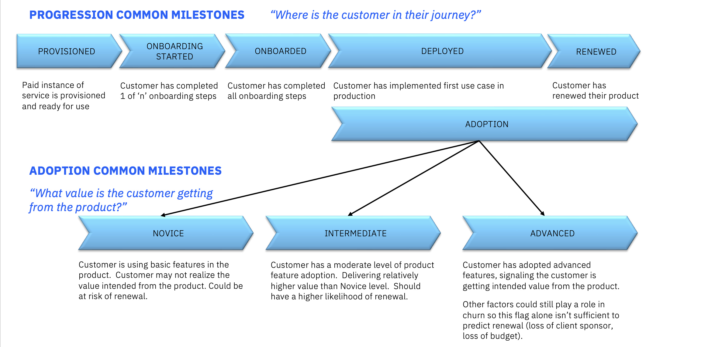

import {Link} from 'gatsby';
import FileLink from '../../components/FileLink';

<Row>

<Column colMd={9} colLg={9}>

## Post-sales customer digital journey

## Digital CSM workflow

Digital CSMs monitor customer health indicators across a large number of accounts.  Those indicators show specific customers who need assistance.  The Digital CSM will receive Calls to Action (CTA) based on pre-defined triggers and automation.  They might also engage with customers based on the progression of user milestones, lack of progress, usage trends, or other signals.  

Tooling provides visibility and insight into assigned accounts, enabling a view of this information at scale.  The Digital CSM will use the Digital CSM dashboard in Gainsight and associated CTAs.  A general overview of daily Digital CSM tasks is:

**Review the various reports in the Digital CSM Dashboard**
* Review <Link to='/health-scores'>Client Health</Link>
    * Focus on triaging red and yellow accounts.  For PLG SaaS customers, an AI-based renewal prediction model using several risk variables drives the health score.  
    * Click into the view of red or yellow accounts to see a summary of the accounts including their current lifecycle phase and renewal likelihood score.  
    * Drill into the R360 Entitlement view for a specific customer to see the risk factors driving the renewal likelihood score. 
* Review clients in the **Onboarding phase**
In the Onboarding phase, digital nurture is in place to welcome the user with getting-started content, checklists, and an offer to consult with a CSM. The user has access to tutorials and how-to content.
   * Investigate clients who are < 50% complete after sorting on the number of days the customer has spent in onboarding.  This will help identify customers who might have stalled and need assistance.  
   * The Digital Lifecycle view in the R360 will indicate the onboarding steps that have been completed, providing the Digital CSM with an idea of where the customer needs assistance.
* Review clients in the **Deployment phase**
  * Reach out to clients who have completed onboarding but might be stalled in the deployment phase. 
  * Sort by number of days in deployment to view those customers who might be stalled. 
* Review clients in the **Adoption phase**
In the Adoption phase, there is digital nurture in place for accounts that are lagging in their deployment or who have already deployed. The Digital CSM reviews usage data to understand if the user is recognizing value based on feature use and the level of adoption.
  * Investigate clients who are in the Novice or Intermediate stage.
  * Click on the Novice level customers to view a summary.  Sort on # of days to see how long they have been at the novice level.  Further, investigate by looking at the Digital Lifecycle view in the R360 to understand what specific features have been adopted and if any progress towards intermediate features has been made.  
  * The same review can be performed by looking at Intermediate level customers.
* Review License Usage or Rated Usage (varies by product) 
    * Understand licenses consumed compared to the entitlement or view monthly ratings.
* Recognize expansion opportunities 
Digital nurture is in place for users reaching entitlement capacity. Manually review or note the automated CTAs for upsell moments that are triggered by high usage or entitlement capacity.

** Review CTAs**
* The dashboard will show the number of <Link to='/onboard/gainsight-cockpit'>CTAs by age</Link>.  The Digital CSM can click into those that are oldest to ensure timely action is taken.  
* Respond to customer inbound inquiries.
* Customers will have the option to reach out to IBM Customer Success via email mailboxes (example: maas360cs@ibm.com). Digital CSMs will play a role in responding to inbound customer inquiries.  
*  Digital CSMs will also respond to customer or partner inquiries that are sent directly to their IBM email.

**Engage in user community discussions** 

In addition to daily monitoring of client health, there are other tasks performed weekly or monthly.  
*	Assess product features with low adoption to adjust upcoming webinar topics as needed or for sharing information on those features in user communities.
*	Review survey results & user feedback
*	Hosting of Webinars and Office Hours

## Identify customers at risk 

You should watch for signs that a customer is at risk for renewal:

* Under-deployed or not deployed after x number of days
* Low usage or declining usage
* High number of support tickets

</Column>
</Row>

