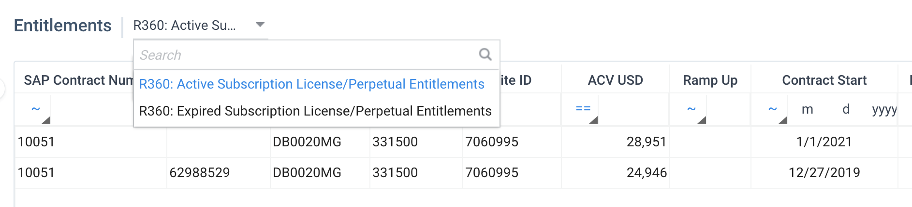
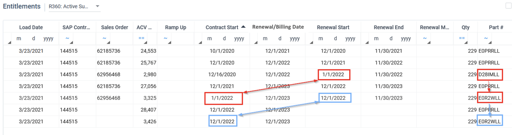
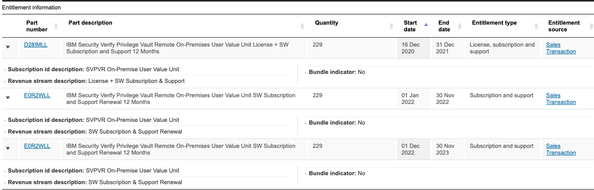
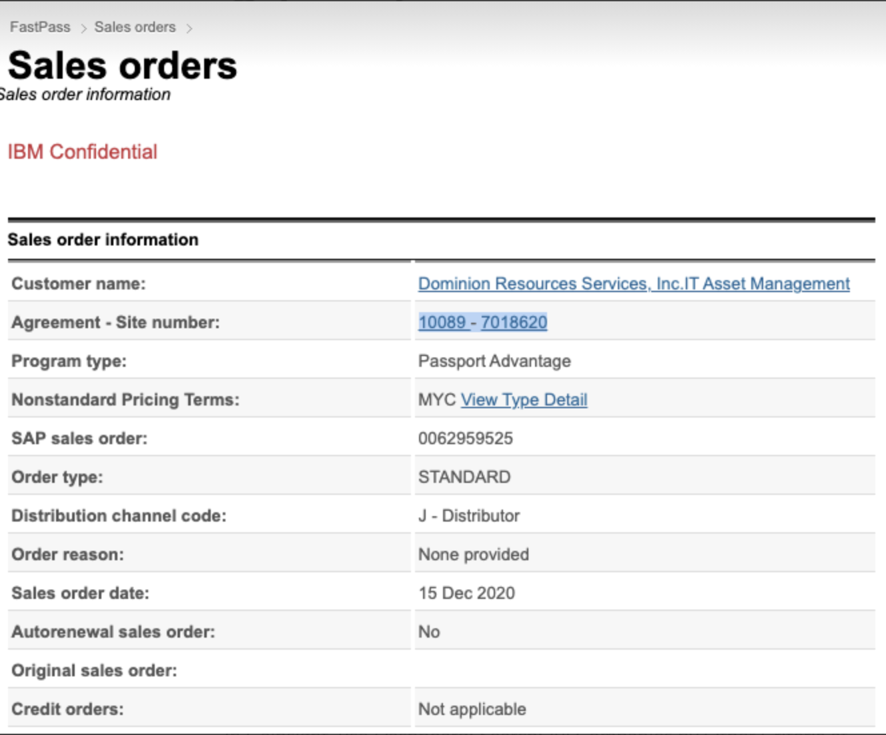
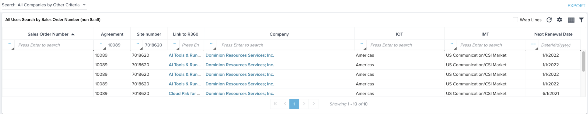
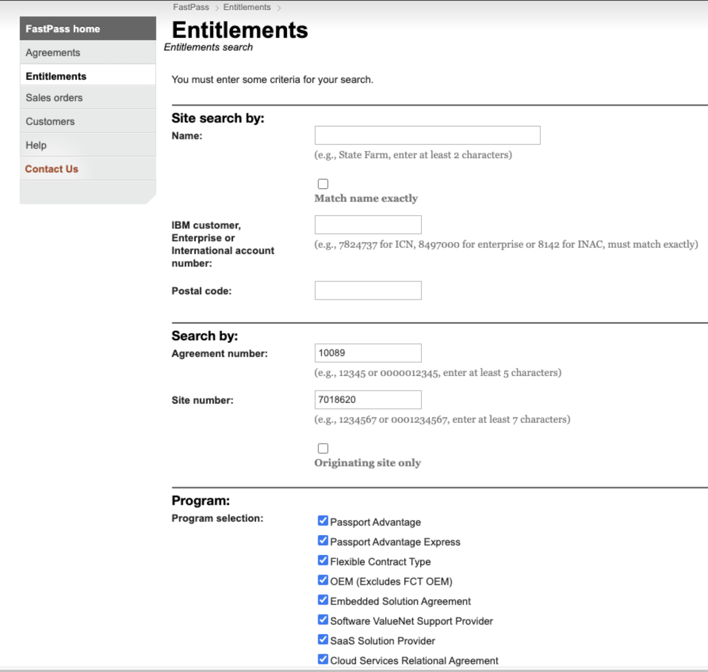
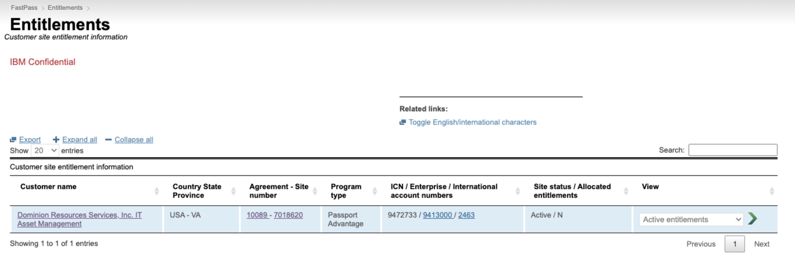

import {Link} from 'gatsby'

<Row>

<Column colMd={8} colLg={8}>

## What are Entitlements?
Entitlements are what the customer has purchased from IBM.  Fed into Gainsight from different sources, entitlement data can be accessed from the R360 and includes information such as the sales order number, part number, ACV contract start date and next renewal date.
Entitlements flow into Gainsight automatically and Gainsight creates new Relationships as required.  A CSM will never need to manually create a Relationship.

If you do not see a Relationship for an offering in Gainsight, check to be sure it is a CSM-covered offering. If it is not listed, then it's not one of our covered offerings and you will want to find another person within the IBM client team to help. Examples: Tech sales, a client engagement manager, a renewal rep, etc.  Once you've located that person who can help, do a graceful handover for the client. 

### Entitlement Sources and timing

After an offering is sold, it typically takes about 5 days after the order has a start date to be processed through IBM systems. It can take longer based on SaaS provisioning time, credit check delays, or end-of-quarter processing.

There can be delays on this start date.  Examples:

- SaaS entitlements can experience delays in provisioning.
- Some delays are due to the time required for credit checks.
- Sometimes ELAs are held up at quarter-end.

Managers can see new, unassigned entitlements on the Customer Assignment dashboard and determine where to assign a CSM.  CSMs should get involved as the deal is closing (before the entitlement appears in Gainsight) when possible; follow the steps on the <Link to='/intro/csm-tools-of-the-trade/#ibm-sales-cloud'>IBM Sales Cloud page</Link> to create a report to monitor upcoming deals.

After it is processed through IBM systems, active entitlements are loaded into Gainsight, following the schedule below.  Different license types have different sources.

| Source | License type | Schedule |
| --- | --- | --- |
| SSABL | SaaS | Daily |
| BSS | IaaS and PaaS | Daily |
| DSW | Subscription License and S&S | Weekly plus |


</Column>

<Column colMd={3} colLg={4}>

<br/><br/>

<Aside>

**Looking for information about ELAs?**

<Link to='/onboard/ela-attributes' target='_blank' rel='noreferrer noopener'>See the ELA Attributes Report.</Link>

</Aside>

</Column>

</Row>

<Row>

<Column colMd={8} colLg={8}>

## Viewing Entitlements

When you click into the Entitlement section, you see a list of the active entitlements by default.  To view what your customer had previously ordered, you can view an expired entitlements report. You can elect to view the expired entitlements by using the drop-down menu at the top as shown below:



**Active entitlements:**  load date within the past three days <br/>
**Expired entitlements:**  load date greater than 3 days but within the last year.  The load date indicates the last date they were considered active. <br/>

### R360 with no Active Entitlements

There are several possible reasons to explain why you might not have any Active Entitlements:

* This is a Diamond ELA Client.  Every relationship in Gainsight is created for Diamond ELA Clients so that CS Account Specialists can work on any product in the customer's catalog.  Check Cadet to see if the relationship is in the catalog; if not, the relationship can be ignored.

* Many Relationships were created to align the Executive Scorecard and Gainsight. They are a one-time load of ACV USD = $0, TCV USD = $0, and the Next Renewal Date from the Executive Scorecard (ELA) or FastPass (Standalone), which may be in the past for a Perpetual license without S&S; the R360 Entitlement Report will be blank. This is because the entitlement detail is not in DSW, possibly due to an ELA substitution or PTL software installed, the client might still be using but has no active entitlement to S&S now. The "Available Entitlement IDs" report will be populated after the end of the week sync.

* A SaaS part number has been mapped to an On-Prem relationship or vice versa.  The SaaS entitlement details won't flow to an on-prem relationship, so nothing appears in Entitlements (and vice versa.) If you encounter this situation, please submit a GitHub ticket and the Gainsight team will resolve it.

<InlineNotification>
Note that when you revisit the entitlement section, it will remember the view you last used, so if you last viewed the expired list, that is what you will see next time.
</InlineNotification>

### Trade ups to Cloud Paks

For on-prem relationships, you can view the Attributes tab on the R360 to see if this is a trade-up relationship.  There are also trade-up indicators and filters on certain dashboards and reports.  See this <a href='https://ibm.box.com/s/bhmr44fv1aby95h6aosx3u2vbdwgvcbn' target='_blank' rel='noreferrer noopener'>enablement deck</a> for all the details. 

The term, Trade up, is used in two ways for on-prem offerings:<br/>
**Trade-up eligible:** Point product part numbers that can allow the customer to trade up to a Cloud Pak. If the customer has these parts and meets requirements such as paying S&S, they can trade up to a Cloud Pak. Important: the customer has not yet traded up, so Customer Success does not cover these parts and they are not in Gainsight.<br/>
**Trade-up executed:** The customer agreed to trade up and paid more money and/or met the terms of the trade-up contract.  The customer now has dual entitlement to both the original point product and the Cloud Pak. These parts are covered by Customer Success and should be in Gainsight.

### Sales order numbers for perpetual entitlements

<InlineNotification>
There is a known situation where sales order numbers are missing on some perpetual licenses in the entitlements section of Gainsight relationships.  In this situation, you can use the ICN number shown in the section as a lookup to FastPass, and compare the order details between the two systems.
</InlineNotification>

The sales order number that shows for perpetual licenses is the renewed sales order.  If the sales order number is blank, this means that Gainsight has not received a renewal for this part.  If the sales order number is showing, this means that the part has been renewed, and you can match the renewal in the entitlements section by using the renewal and contract start dates.

In this example, part D28IMLL is renewed through order 62956468. The renewal start date shows as 1/1/2022, so this is matched to part E0R2WLL (because the renewal start date of D28IMLL matches the contract start date of E0R2WLL). E0R2WLL, renewed through order 62956468, then matches to the last line of the same part number (renewal start date matches the contract start date highlighted in blue). On the last line, there is no sales order showing because Gainsight has not received a renewal for this part.



<Accordion>

<AccordionItem title='Columns in the Entitlements report'>

| Column | Description |
| --- | --- |
| Load Date | The date on which the entitlement line item was last pulled into Gainsight because the line item is active.  Date within the last 3 days = Active.  Date older than 3 days = Expired. |
| Contract Start | The original contract or charge agreement and line item numbers start date. This is the initial contract term for this charge agreement/line item. It may or may not be the original contract date when the customer initially signed up for the offering. |
| Renewal/Billing Date | For Subscription License or Perpetual, this is either the next subscription renewal date or the next ELA billing date + 1 day from DSW.  For XaaS it is the contract end date or renewal end date + 1 day from SSABL. |
| Renewal Model Code | Explains what happens at the end of the initial term <br/>C - Continuous billing <br/>O - Auto-renewal for original term<br/>R - Auto-renewal for 12 months<br/>T - Terminate at end of term<br/>N - Not applicable |
| Billing Frequency | A - Annually<br/>M - Monthly<br/>U - Upfront |
| Distribution Channel Code | E - Private Digital Comm<br/>C - Self Serve Digital Sale<br/>Z - Gold Service<br/>A - IBM Sales<br/>J - Distributor<br/>H - Reseller<br/>B - Seller Assisted Digital Sale<br/>M - System Integrator<br/>K - Retail |


</AccordionItem>

</Accordion>

</Column>
</Row>

<Row>

<Column colMd={8} colLg={8}>

## Renewal/Billing Date, Next Renewal Date and Rate Pace End Date

There are three renewal-related dates in Gainsight:

**Renewal/Billing Date:** For subscription License or Perpetual, this is either the next subscription renewal date or the next ELA billing date from DSW.  For XaaS it is the contract end date or renewal end date + 1 day from SSABL. For an ELA, the DSW next billing date is good to be aware of because adjustments may occur or an early renewal may be completed and replace the date. This field is displayed on the R360 Summary and will be populated (where available) for all entitlement types.<br/>
**Next Renewal Date:** Currently, this field displays the Renewal/Billing Date. If another contract date is eventually included in the R360 details, this date will show the earliest one.  If all dates are expired, this field will show the most recently expired date. This field is used in all Dashboard reports and the C360.<br/>
**Rate Pace End Date:**  shown in the ELA Attributes report, this date is the best guess on when the contract will be renegotiated.  This date is calculated based on what the customer has used so far and is the date that the Go to Market team most often uses.  You may see a Rate Pace End Date in the past - this means that the ELA is in the close-out period, which may take several months.  As long as the contract is still open, you will see it in the ELA Attributes report, but a Rate Pace End Date in the past is your clue that it is being closed out.

If the SaaS or Subscription License customer purchased the same part number on the same Sales Order Number/Services Agreement Number, then the maximum Renewal/Billing Date is used instead since they have renewed the part already in the same sales order. 

## Upgrade from a Perpetual part to a Subscription part

When the customer renews a Perpetual part and upgrades to a Subscription License part, DSW data tracks that the Perpetual part is renewed to the Subscription License part. The Subscription License DSW data also shows the purchase. In Gainsight, it shows as a Perpetual license until the next renewal where it will only be within the Subscription License type.

</Column>
</Row>

<Row>

<Column colMd={8} colLg={8}>

### More details on the Renewal/Billing Date

For some on-premises entitlements in Gainsight, the Renewal/Billing Date can look confusing.  You can use the Renewal Start and Renewal End columns to get a better understanding of the data.  These dates are populated when Gainsight recognizes a renewal for an order.

Looking at the example below, you can see that the renewal start and end dates are populated for two line items:


Part D28IMLL is the initial signing for 1 year, and runs from 12/16/2020 until 12/30/2021.  The Renewal/Billing Date indicates 12/1/2022 because Gainsight sees that a renewal has already been placed to run from 1/1/2022 to 11/30/2022.  This is shown in the renewal date columns.

The renewal part E0R2WLL is shown in the second line, with the Contract start date of 1/1/2022 which is when this renewal will start.  The renewal dates are from 12/1/2022 to 11/30/2023.  The Renewal/Billing Date for this line indicates 12/1/2023 because the renewal contract ended on 11/30/2023.

The third line in the screenshot is the actual contract for this renewal, starting 12/1/2022.

In FastPass:




### No Contract Start or Next Renewal date

For SaaS offerings, QRadar on Cloud and Real Estate and Facilities Management SaaS (TRIRIGA), pre-provisioned customers or customers still on provisioning hold are pushed to Gainsight. They do not have a Contract Start and End Date until the provisioning hold is lifted, so these dates are null in Gainsight. When the hold is lifted and dates flow to SSABL, the fields are populated in Gainsight. 

### SaaS Ramp Ups

For all Ramp Up line items, all of the ramp up starts (Ramp Up = 1; there may be one or more ramp up starts) and ramp up ends (Ramp Up = 0) for the same Ramp Up, identified by having the same Part Number, are considered active until the expiration of the ramp end's Next Renewal Date. So, all ACV for the ramp up starts and the ramp up end is part of the active ACV, while the ramp end is active. SSABL is our SaaS source within Gainsight.
For more information on Ramp Ups, visit <a href='https://w3.ibm.com/w3publisher/na-saas-process-wiki/xaas-basics/ramp-upwiki' target='_blank' rel='noreferrer noopener'>publisher site</a>


</Column>
</Row>

<Row>

<Column colMd={8} colLg={8}>

## Entitlements in FastPass

Gainsight does not have the Sales Order Numbers (SO#) for Perpetual clients. Gainsight has SO#s for Subscription License and SaaS clients. If you have a Sales Order number for a Perpetual client, you can either search Gainsight using the Agreement and Site number tied to that SO# or use FastPass.

If you do not have the Agreement and Site number, search for the SO# in FastPass. For example: 

FastPass menu: Sales Orders<br/>
Enter the SO#: 62959525 in the field: SAP sales order number<br/>
Results: ```https://fastpass.w3cloud.ibm.com/sales/fastpass/page/InfoForSalesOrder?sap_sales_ord_num=0062959525```<br/>



In Gainsight, use <a href='https://ibm.gainsightcloud.com/v1/ui/home#ab61cb5e-d257-49fc-8e5e-6880e71dba39' target='_blank' rel='noreferrer noopener'>Dashboard: Search: All Companies by Other Criteria</a>. Enter the Agreement and Site number from FastPass as shown below:




 

Then, you can link to the client's C360 or a particular R360 in Gainsight. 

You can also take an Agreement number and Site number from Gainsight and search for it in FastPass by doing the following: 
1. In FastPass, navigate to Entitlements.<br/>
2. Type the "Agreement number" and "Site number" from Gainsight.



3. Click Search to get the following results:



4. Choose "Active entitlements" and click the Green Arrow.


## Hints and tips

* If things do not look right on the entitlements, make sure you're viewing the Active Entitlements report.  The system will remember the last report you viewed; if you last viewed Expired Entitlements, then that's what you'll see the next time.
* If the entitlement section previously showed active entitlements but does not any longer, the relationship might be at risk of churn. Check the Expired Entitlements report to see what the last load date for the entitlement was.  The GS Churn flag on the R360 will be set 30 days after that last load date unless a new order comes in for the same customer with the same ICN.  If a new order is submitted with this same criteria, the new entitlements will start loading to the Active report after the order is fully released.


</Column>
</Row>
