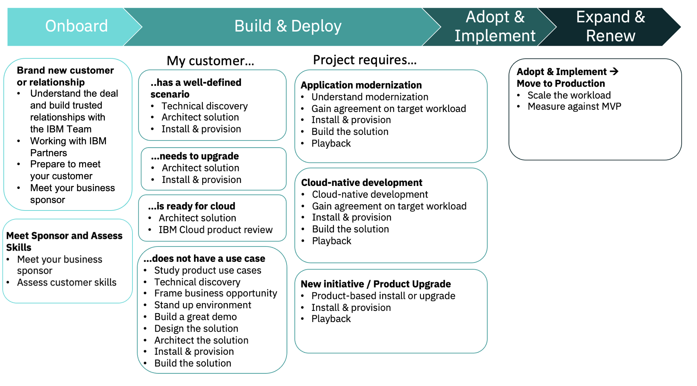

<Row>

<Column colMd={9} colLg={9}>

## Kick-start your success plans

Templates are pre-defined sets of objectives and tasks that you can pull into a Success Plan. The success plan templates in Gainsight are based on the CSM playbook methods, which help you drive specific customer outcomes. This can help Customer Success deliver a consistent customer experience across portfolios.

The templates contain pre-defined objectives with specific steps and assets that will help you follow the playbook. Currently, templates are available for a Growth Plan and Nurture Plan.

</Column>
</Row>

<Row>

<Column colMd={9} colLg={9}>

## Add a template to your plan

Templates are optional but they can guide you through the key steps in your customer's deployment journey.  You can use one or more templates and you can edit the objectives as needed after you add them to your plan. Select as many templates as needed to fit your customer's situation.

There are three ways to add a template to your success plan. After adding a template to the plan, the steps will appear on the Objectives tab. Customize the objectives to match your plan.

- On the initial Create Success Plan screen, the "Choose Template" link in the lower left becomes active after you select your plan type, assuming the selected plan type has associated templates.
1. Click Choose Template to show a list of available templates.
2. You can select as many templates as desired, and click Apply.
3. The Objectives tab will populate with the pre-defined objectives and tasks.  Customize them to make your plan as relevant and useful as possible.

- On the R360, open the success plan and go to the Objectives tab. 
1. In the upper right corner click Create...
2. Select Apply Manually.  This opens a window where you can select one or more templates.  Select them and click Apply.
3. The Objectives tab is now populated with the pre-defined objectives and tasks.  Customize them to make your plan as relevant and useful as possible.  Note: You may need to exit the Objectives tab and come back in for the newly added objectives to appear.

- On the Success Plans view, either on an R360 or from the left nav:
1. Locate your success plan and click the 3-dot menu on the right
2. Select Add Template. You might need to reload your page to see the Objectives.
3. From the window that opens, you can select one or more templates.  Select them and click Apply.
4. The Objectives tab is now populated with the pre-defined objectives and tasks.  Customize them to make your plan as relevant and useful as possible.

## Customize the template

After you have applied the template, it is converted into Objectives on the Objectives tab. The Objectives appear as CTAs in your Cockpit.  You can edit or remove any of these template Objectives to fit your project. 
By default, the templates do not contain any due dates.  You should customize the due dates for each Objective to fit the goals of your project's schedule. All due dates are set to the date the templates were added to the plan. 
Several templates have similar steps such as Install and Provision.  Simply delete the one/s you do not need. 
The templates listed in the Build & Deploy section will take you through "Deploying", which is installed in a non-production environment.  To deploy into Production and reach "Deployed", add the template called "Move to Production".

</Column>

<Column colMd={3} colLg={3}>

 

<Aside>

**IBM Cloud templates**

<a href='https://w3.ibm.com/w3publisher/customersuccess/community-connections/public-cloud-community/playbooks' target='_blank' rel='noreferrer noopener'>Growth and Retention Plans</a>

</Aside>

</Column>

</Row>

<Row>

<Column colMd={9} colLg={9}>

## Growth Plan templates

In this image, each box represents a template, and the bullets inside are the Objectives. 

## Custom templates

You do not have the authority to create your own success plan templates.  If you feel that a new template is needed, connect with your Practice Leader to define a template that would meet the needs of the practice overall.  You'll want to think about the structure (objectives and tasks), relevant methods and assets (where are they stored?), and any triggers for Gainsight to act on.

After the template is defined, you can submit a support ticket for the admin team to review, approve, and create it.

## Nurture Plan Template

The "Standard Nurture Plan Activities" template provides typical activities that a CSM would perform to nurture their client until a deployment use case is identified.  You can remove any that do not apply and add others that are specific to your customer's situation.

These activities include:

- Establish your meeting cadence 
- Schedule your meetings 
- Schedule Executive Business Reviews 
- Refresh CSM Sentiment every 90 days 
- Perform Advocacy Activities 
- Check / Monitor usage 
- Update Timeline at least monthly

## CDP on Cloud Growth Plan templates

Some of the Watson entitlements on the IBM Cloud relationship will have success plan templates available to help guide the team through deployment.  These templates use the following naming convention: Watson "offering name" Onboarding and will only be available on the CPP on Cloud Growth Plan.

</Column>
</Row>
