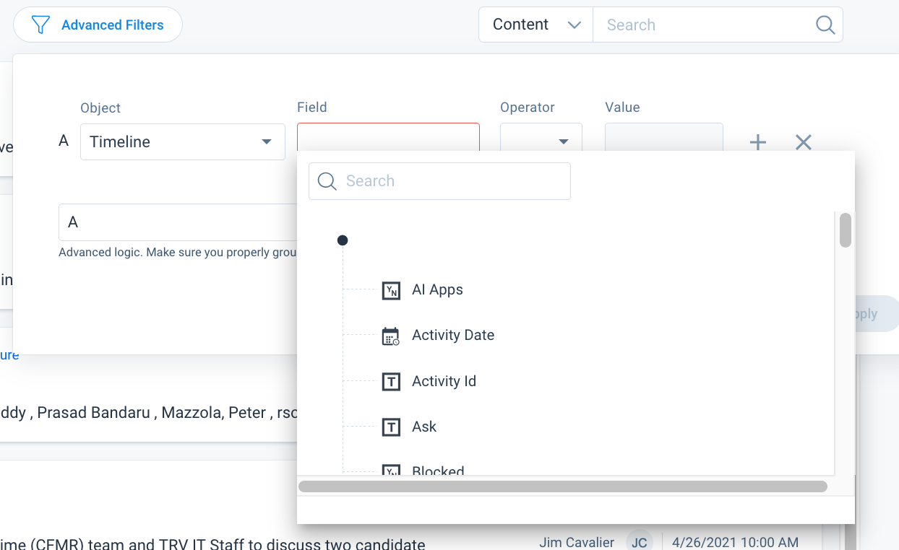

import {Link} from 'gatsby';

<Row>

<Column colMd={9} colLg={9}>

## Use Timeline to communicate your updates and activity

Use Timeline to log information about your own activity and customer interactions in a way that enables you to gather insights and drive action. Timeline is accessible from almost anywhere in Gainsight; a best practice is to add a Timeline entry from the entity you're working on. For example, if you have an update based on work you're doing on a growth plan, create a Timeline entry from that growth plan.  If it is an update about the customer that anyone working with the customer should be aware of, create a Timeline entry on the C360.

When making Timeline updates, be sure to include information that would help your manager, leadership or someone newly assigned to that customer be effective.

See the official <a href='https://support.gainsight.com/Gainsight_NXT/Timeline/01About/Timeline_Overview' target='_blank' rel='noreferrer noopener'>Gainsight Timeline documentation</a> for detailed information about using Timeline.

See the <a href='https://w3.ibm.com/w3publisher/gainsight-user-community/help-and-support/faq#Timeline' target='_blank' rel='noreferrer noopener'>Timeline FAQs</a> for IBM-specific information in addition to the items below.

## When to make Timeline updates

Update Timeline to capture activity for the account that provides additional information, results in actions or follow-up, or raises questions. Think about what a CSM new to the account would want or need to know.

Examples:

* Meetings
* Phone calls
* Email exchanges
* Chats or texts
* Internal IBM discussions

## Where to make updates

If an update is tied to the objectives and tasks in your success plan, navigate to your success plan, click on Timeline in that plan and make the update there.

If the update is more general, navigate to the offering relationship for your customer, click on Timeline at the top of the UI (next to Detail) and make the update there.

Finally, on rare occasions, you might have an update that is customer-wide.  In that case, you can make an update at the customer level, but be cautious in using this.  These can easily get lost in the customer activity.

## Types of Timeline updates

Use the following types:

**Update:** Capture customer discussions.  Be sure to use the Client attended checkbox if it was a meeting with the customer. 
**Email:** Capture an email exchange with the customer. Also used in the Email to Timeline process. 
**Internal Activity:** Capture notes of a discussion among IBMers, or with business partners, about the customer. 
**Renewal Update:** Capture key notes regarding the renewal. 
**Onboarding (IBM Cloud only):** used when new IBM Cloud customers require assistance in using the platform. 
**Client Business Review:** Capture insights from Executive Business Reviews (and track the last time you had one) to ensure a frequent cadence of strategic executive interlocks. 
**Teaming for Success:** Used to capture CSM activity on a relationship to which the CSM is not assigned. 
**Technical Accelerator (Use from within a success plan):** capture Technical Accelerator engagements (MVP, POC, Workshop, Solution Architecture, Demo) 
**Client Flash:**  Provide a 1-2 sentence headline describing the status of the deployment and next steps.  Client Flash updates made in the last two weeks are displayed on the Manager Renewal Dashboard to provide Executives insight into the status of the deployment. IBM Cloud should continue to use the IBM Cloud template.  <Link to='/onboard/gainsight-client-flash' target='_blank' rel='noreferrer noopener'>How to update Client Flash</Link>. 
**Artifact:** Use this when attaching a file and you'll be able to filter your timeline view on this type to see a list of timeline with attachments.  Categorize the attachment as Technical, Billing, Sales or Other.  Supported attachments include: txt, ppt, pptx, xls, xlsx, xlsm, csv, msg, eml, avi, flv, wmv, mov, mp4, wav, aiff, flac, alac, mp3, aac, wma, ogg.

You can create a timeline entry on the C360 to track POC activities before a deal is executed and a Relationship is created.

</Column>

<Column colMd={3} colLg={4}>

  

<Aside>

**Use Client Flash to update executives**

<Link to='/onboard/gainsight-client-flash' target='_blank' rel='noreferrer noopener'>How to update Client Flash</Link>

</Aside>

</Column>

</Row>

<Row>

<Column colMd={8} colLg={8}>

## Use Timeline effectively: Tag people!

You can tag other Gainsight users in Timeline notes by typing '@' in the notes and selecting the users you want to tag. People that are tagged will get an email that they were tagged.  When they respond to the timeline entry, you will be notified in-app as well as get an email to ensure you don't miss it!

Use this when:

* You need help (tag the person who might be able to help!) 
* There is a question or followup to an update 
* You want to be sure that someone sees the update 

## Add followups in Timeline

If there are follow-ups from the meeting that you are documenting, add them as "Tasks" in your update, and they will show up in your Cockpit as Calls to Action.

This ensures you never miss a follow-up!

## Create Timeline Views

When you first enter the main Timeline view (from the left navigator), you'll see the default view.  You can customize your Timeline with a variety of views to help you run more efficiently by using filters.

These videos show you how to create some helpful filters:

<a href='https://ibm.box.com/s/1dv7gelntzvlksbp23iawdxlzwdav9rl' target='
_blank'>Milestones by Manager</a> 
<a href='https://ibm.box.com/s/7bk7zhuph82pmnpgtbwtvsfaowp4dl8c' target='_blank' rel='noreferrer noopener'>Open Shift Deployments for a specific Market</a> 
<a href='https://ibm.box.com/s/vfvkskccj77zviqpo1987g5c5jr2qmcf' target='_blank' rel='noreferrer noopener'>QBRs in the current month for a specific Manager</a> 
<a href='https://ibm.box.com/s/xbq51vapzvww75mqxdxvz33ylo3u70w8' target='_blank' rel='noreferrer noopener'>Cloud Pak Renewals in the next quarter for Americas</a>

</Column>
</Row>

<Row>

<Column colMd={8} colLg={8}>

## Email to Timeline

The Email to Timeline function enables you to create a Timeline entry directly from an email by sending an email to a special Gainsight email address called the "Unique Inbound Email Address". This can be useful when you're sending an update to a client over email and don't want to recreate the information in Gainsight; BCC'ing this Unique Inbound Email Address will send the data directly to Timeline.

To enable the Gainsight Email to Timeline function, perform the following steps:

1. Open a Ticket to request that your ID be enabled for email to Timeline.
2. After this is completed, you will receive an email from Gainsight with your Unique Inbound Email Address. Go into your My Settings > Inbound Emails and configure per the instructions from Gainsight.
To use the function, include the Unique Inbound Email Address in the BCC field of any emails you send that you want Gainsight to capture.

Gainsight will try to match the recipient's email address with known Relationship Person records. If the recipient email address can be resolved, the email will be copied to the timeline of the relevant relationship.

If the email address can't be resolved, you will receive an email from Gainsight indicating that an email was received that could not be resolved and is in the Drafts area. You can then go to Drafts and manually assign the email to the correct relationship.  Resolution can fail if either the recipient is not in Relationship Person, or they are defined in multiple relationships. In the latter case Gainsight will not try to pick the correct one and will leave it to you.

</Column>

<Column colMd={4} colLg={4}>

  

<Aside>

**Request access to email to Timeline**

<a href='https://github.ibm.com/hybrid-cloud/gainsight-support/issues/new' target='_blank' rel='noreferrer noopener'>Open a ticket</a>

</Aside>

<Aside>

**Configure inbound emails**

<a href='https://support.gainsight.com/Gainsight_NXT/Timeline/02User_Guides/Log_Customer_Emails_as_Timeline_Activities#Send_Email_to_Timeline' target='_blank' rel='noreferrer noopener'>See how to set up inbound email</a>

</Aside>

</Column>

</Row>
