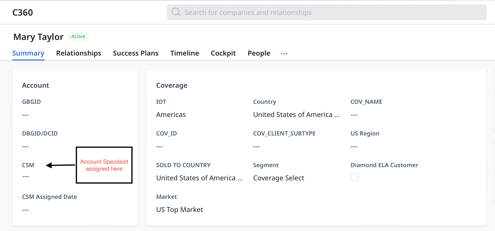
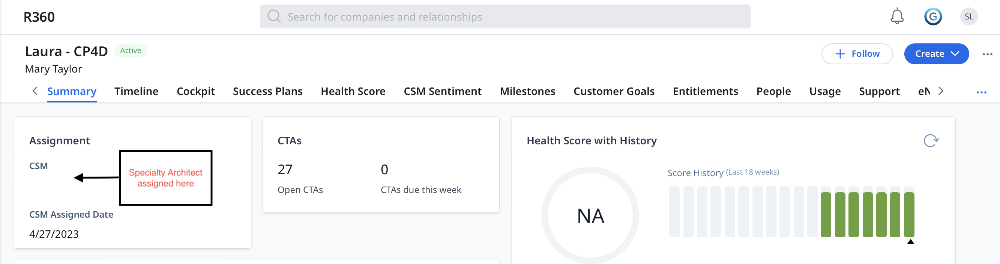
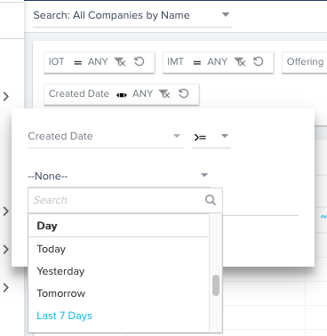
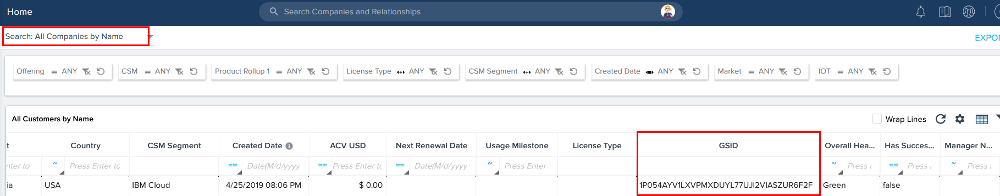
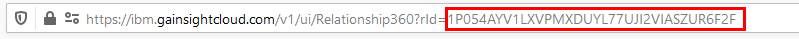
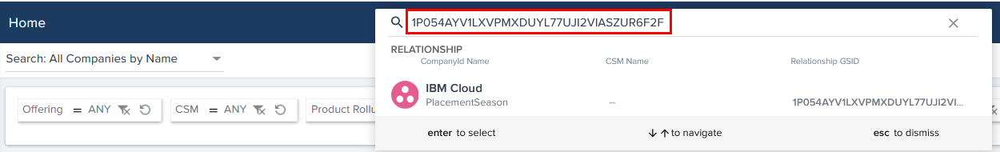

import {Link} from 'gatsby'

<AnchorLinks small>
<AnchorLink>Look in Gainsight to understand what was sold</AnchorLink>
  <AnchorLink>The Customer 360 record</AnchorLink>
  <AnchorLink>The Relationship 360 record</AnchorLink>
  <AnchorLink>How to find your customer in Gainsight</AnchorLink>
  <AnchorLink>How to find your customer in IBM Sales Cloud (ISC)</AnchorLink>
</AnchorLinks>

<Row>

<Column colMd={9} colLg={9}>

## Look in Gainsight to understand what was sold

Congratulations! You have a new customer to work with! Visit your customer's Customer 360 (C360) in Gainsight to gather the information you will need to locate your customer's account in ISC. 

When a customer purchases one of the CSM-covered growth offerings, entitlement data flows through IBM systems, Gainsight picks up the information through (mostly) daily feeds and then creates records for the customer and associated relationships.

</Column>

</Row>

<Row>

<Column colMd={5} colLg={5}>

 

<Aside>

**Customer**

A client of IBM who has purchased at least one of our growth offerings.  Customers are loaded into Gainsight at the domestic buying group ID (DBGID) and Country level.  

</Aside>

</Column>

<Column colMd={5} colLg={5}>

 

<Aside>

**Relationship**

A Relationship represents an entitlement or offering purchased by a customer. A Relationship can have one to many entitlements and is represented by the R360.  Almost all of your CSM work should be done at the Relationship level. A Customer can have many Relationships, viewable from the C360 in the Relationships section.

</Aside>

</Column>

</Row>

<Row>

<Column colMd={9} colLg={9}>

<InlineNotification>
Account, Client, Customer, Company. In IBM, these terms are used interchangeably.

</InlineNotification>

</Column>
</Row>

<Row>

<Column colMd={9} colLg={9}>

## The Customer 360 record

The Customer 360 (C360) record contains information about your customers, their IBM coverage, and the entitlements, or relationships they have purchased. Account, Company, and Client are other common terms.  You may rearrange or hide the tabs across the top using the 3-dot menu to the right of the last tab.

**Status:** Displayed to the right of the customer name, indicates if this C360 has active entitlements in Gainsight (Active) or not (Churn).  You should only work on Active customers; if you are directed to a Churned C360, reach out to the Gainsight support team.

**Summary Tab:**
A view of key information about the customer, including details about the CS Account Specialist assigned, coverage, CTAs, Relationships and last five timeline activities.  More details can be found in the tabs across the top. For Diamond ELA clients, the CS Account Specialist is assigned in the CSM field on the Summary tab. 

For Diamond ELA clients, who have a reporting clause in the catalog portion of their ELA, CADET will only accept the Deployed milestone after the customer reports it.  This can cause a mismatch between the Gainsight Deployed project stage as reported by the CSM and the executive milestone from CADET.  The "Customer must report Deployment" indicator = True will tell you that the deployment will not be reported as Deployed until the customer reports it.  If a growth plan has been deployed and meets all deployment criteria but is waiting for customer reporting, the milestone will be "Deploying" and the plan will appear in the stretch forecast widgets.

The "Customer must report Deployment" indicator can be seen on the Summary tab of each R360 for a Reporting client. It is also visible in the deployment widgets, Milestone drill-through dashboard reports and on the Search: All Customers reports. 

This flag will change if the customer's Reporting requirements change or if the Customer has reported already.  The CSM does not have to take any action other than be aware of possible mismatches in deployment forecasts.

**Relationships:** A listing of the various covered offerings that the customer is entitled to. Active relationships (top report) are those relationships with active entitlement data in IBM's systems.  Churned relationships (lower report) are those for which Gainsight has not received active entitlement data in the last 3 days - likely because the customer did not renew.

**Success Plans:** A view of all success plans of all types across all relationships for this customer. Click on the Link to Success plan to be taken to that plan.  Note: you may see an "add record" button in the upper right - ignore this. It is a Gainsight artifact that we cannot remove.  Success plans must be created on Relationships, not at the Customer level.

**Timeline:** The timeline for this customer, showing all entries across all relationships and success plans. 

**Cockpit:** View and act upon customer-specific CTAs.

**People:** Add IBMers or external people you are working with across the entire customer.  You will need to add people to each Relationship as needed. If you add IBMers with the role of "IBM Internal", include notes about what role this person is playing on the account. 

The customer can opt out of any email communications at the customer level. The Gainsight Opt Out selections on the People record only apply to Gainsight communications. They do not apply to Medallia.

**TEL:** Use this TEL Project information to understand how TEL is engaged with your customers and to collaborate with your TEL colleagues. This report displays the customer projects, the project manager, the delivery manager, project status, start and end dates, and overall project health.  You can view details about the health of the project on the <a href='https://pages.github.ibm.com/expertlabs-playbook/playbook/el-manage-project/maintain-project-health/'>Project Health Settings</a> page. Use the Customers with Active TEL Projects widget on the CSM dashboards to display similar data. 

Note: Only a small percentage of TEL Projects include the UT30 codes, which enable Gainsight to match them to Relationships.  Where possible, the Relationship is included in the TEL Project reports.  Since this number is so small, TEL Projects are not displayed at the Relationship level; to do so would be misleading since so many projects would not be listed.
</Column>

<Column colMd={3} colLg={3}>

  

<Aside>

**Communicate your updates and activity**

<Link to='/onboard/gainsight-timeline' target='_blank' rel='noreferrer noopener'>Gather insights and actions using Timeline in Gainsight</Link>

</Aside>

</Column>
</Row>

<Row>
<Column>

## How are CSMs assigned to customers?

| CS | Type of relationship | Description |
| --- | --- | --- |
| CS Account Specialist | Diamond ELA clients | This CSM is assigned in the "CSM" field on the Customer 360 Summary Tab. | 
| CS Brand Architect | All |  These CSMs are assigned in the "CSM" field on the Relationship 360 Summary Tab.  Regardless of role, anyone who is responsible for a relationship should be assigned in this field. |
| CS Brand Architect | IBM Cloud clients | For IBM Cloud, the public cloud CSM is assigned in the "Public Cloud CSM" field on the Relationship 360 Summary Tab.  If a Data and AI CSM is working on Watson offerings within the IBM Cloud relationship, they should be assigned to the Data and AI CSM field. |
| CS Specialist (CSS) | IBM Cloud only | The Public Cloud CSS Team supports IBM Public Cloud customers who don't meet criteria for dedicated CSM coverage and are deemed a "target client" by the CSS priority workstream. The CSS onboards new Public Cloud customers and is available to help remove issues/blockers preventing IBM Cloud usage and overall adoption. The CSS Team is available in The Americas only, during normal (US-CT) business hours.   For general questions, visit #pc_csm_frontdesk and submit CSS assistance request via ibm.biz/cloudcss.   Visit the CSS Team publisher page to <a href='https://w3.ibm.com/w3publisher/new-pc-csm-americas-site/onboard-and-practice-programs/css-team' target='_blank' rel='noreferrer noopener'>Learn more.</a> |
| CS Partner Specialist | The partner is a customer (e.g. Deloitte, TCS, SAP, Adobe, or other GSI, ESA partner/build). | - A CS Partner Specialist might be assigned to a C360 where the partner is the Customer.   - Supporting CSM Brand Architects are assigned to R360s they are covering.   - In most cases, the partner will be covered by either a CS Partner Specialist or a CS Account Specialist but not both. In the rare event that both are assigned, the Account Specialist is assigned to the C360. The CS Partner Specialist will need to use other partner dashboards for visibility. |
| CS Partner Specialist | The partner is a reseller. | - The CS Partner Specialist is not assigned to the C360 because there can be more than one partner selling to that same customer across the same or different products.   - The CS Partner Specialist will have visibility to the partner entitlements by using partner dashboards. (See <a href='https://w3.ibm.com/w3publisher/gainsight-user-community/get-learning/dashboards-101' target='_blank' rel='noreferrer noopener'>Dashboards 101</a> for more details on these views.) |
| CS Partner Specialist   CS Brand Architect | The partner is a reseller and a CS Brand Architect is covering an R360 sold by that partner.  (e.g. Mainline in US sells to US National customers in squad 14 and a CS Brand Architect covers that squad.) | - The CS Partner Specialist is not assigned to the R360 if the CS Brand Architect is directly engaged with a partner or customer to drive deployment.   - The CS Partner Specialist is measured on total deployments for Mainline regardless of their Gainsight assignment. We can see overall partner deployments by viewing the Partner Deployment Outlook dashboard by partner. (See See <a href='https://w3.ibm.com/w3publisher/gainsight-user-community/get-learning/dashboards-101' target='_blank' rel='noreferrer noopener'>Dashboards 101</a>  for more details on these views.)   - If no CS Brand Architect is assigned, then the CS Partner Specialist can be assigned to the R360 and is responsible for working with a partner to progress deployment. |

</Column>

</Row>

<Row>

<Column colMd={9} colLg={9}>

## How to find your customer in Gainsight

There are several ways to find a customer to whom you've been assigned in Gainsight.  After you've located your customer, you can make note of the Geo, Country and DBGID / DCID to locate them in ISC.

1. Go to your Cockpit. Find your customer and click on their name.  OR

2. Go to your CSM Dashboard and click on your "My Total # of Customers" widget to see a list of your customers and their covered offerings.  Click on a customer name. OR

3. Visit the "Search: All Companies by Name" dashboard and filter for your name in the CSM global filter at the top.

4. Once you've found your Customer record, go to the Summary tab.

5. From the Summary tab, find the Geo and the Sold to Country. Jot it down. Write down the DBGID/DCID, which you will use to find your customer in ISC.

## How to find your customer in IBM Sales Cloud (ISC)

1. Go to Sales Cloud and paste the DBGID or DCID into the search bar. The search results will return the DBGID with a two-letter country code. Select the record with the country that matches the one you're working in Gainsight. In contrast, DCID is tied to a single country so the search results will already be for that country.

2. Browse through the customer record in Sales Cloud to gather insights, review opportunities won, and client use cases, and find the sellers associated with the customer's account.

3. When needed, <a target='_blank' rel='noreferrer noopener' href="https://w3-314.ibm.com/software/sales/passportadvantage/dswattach/ms/home?iiid=49650[&amp;]086b544g6cbf1dc4aaacac66279d8f0d4633f1c4acf873cee68abdb8b30a8">look up the original order</a> to see who submitted, and any attached documentation like a Purchase Order (PO) that has the customer sponsor name. (<a target='_blank' rel='noreferrer noopener' href="https://w3-314.ibm.com/software/sales/passportadvantage/dswpricebook/sqohelp/qrc/access_sqo_qrc.pdf">Requires access to SQO</a>)

## The Relationship 360 record

The Relationship 360 (R360) record contains information about the entitlement such as contract number, purchased parts, and usage where relevant.  The R360 is also where the CSM creates success plans, monitors health scores and records key contacts. Relationship, Entitlement, and Offering are often used interchangeably.

If you have a CSM-covered offering but do not see a relationship for your client, you can try to locate the entitlement by searching on the Sales order number or various other criteria in our Search: All Companies by Other Criteria dashboard.

If you still cannot find the relationship, then submit a support ticket and include FastPass data so that the admin team can investigate. A part number might need to be loaded into Gainsight.

**Summary Tab:**  A view of key information about the relationship, including details about the Brand Architect assigned, CTAs, Health Score, success plans, milestones, coverage information and the last five timeline activities.  More details can be found in the tabs across the top.  The Brand Architect is assigned in the CSM field on the Relationship Summary tab.

* **Customer Must Report Deployment:** For customers with a reporting clause in the catalog portion of their ELA, CADET will only accept the Deployed milestone after the customer reports it.  This can cause a mismatch between the Gainsight Deployed project stage as reported by the CSM and the executive milestone from CADET.  The "Customer must report Deployment" indicator = True will tell you that the deployment will not be reported as Deployed until the customer reports it.  If a growth plan has been deployed and meets all deployment criteria but is waiting for customer reporting, the milestone will be "Deploying" and the plan will appear in the stretch forecast widgets.

The "Customer must report Deployment" indicator is also visible on the C360 ELA attributes on the Summary tab, in the deployment widgets, Milestone drill-through dashboard reports and on the Search: All Customers reports. 

This flag will change if the customer's Reporting requirements change or if the Customer has reported already.  The CSM does not have to take any action other than be aware of possible mismatches in deployment forecasts.

* **In Deployment Scorecard:** When this flag is 'true' it means that deployments for this relationship are being reported in the executive Deployment Scorecard. Usually, this means that the Ledger has reported annuity revenue in the last 3 months.  If this flag is false, deployed growth plans will appear in the Non-Scorecard Deployments widget.   If revenue is later visible in the ledger, the deployments will move into the QTD widget and scorecard. 

Note that new entitlements can have a delay in this flag being set to true because it can take time for revenue to flow into the ledger.  Entitlements that lapsed but recently renewed can temporarily fall out of the scorecard until revenue starts to flow again.  FYI, Ledger is pulled into the tools mid-month and the Gainsight Status page will indicate the month of the current Ledger loaded in Cadet and Gainsight.

* **GS Churn:** This flag is automatically set via a Gainsight rule 30 days after the customer's final entitlement is no longer active in the system and when there is no longer any current annuity revenue.  The flag cannot be edited manually.  If you know your client will churn, create a Defection Report to explain the situation.

If an account's GS Churn Flag is marked and the client renews late, once they have an active part number the GS Churn Flag will be removed overnight.

If you have a churned relationship but you are still working with the customer to deploy, you can select the "Churned but Being Worked" flag on the R360 Summary tab.  This will display the relationship in selected reports on the CSM and FLM Dashboards as well as the Search All Customers report.

Note: one or more continuously billed line items, without a saas_term_date set in SSABL, will keep the Relationship active.  To resolve this, work with the offering's Financial Analyst to have the "SaaS_Term_Date" in SSABL set to the date when the Continuously Billing lines were terminated.

**Timeline:** The timeline for this relationship, including entries made on success plans. 

**Cockpit:** View and act upon relationship-specific CTAs

**Health Score:** Understand your health score and where you may need to take action to improve the score.

**Success Plans:** Create and work with all types of success plans here.

**Milestones:** This section contains two reports: 
* Scorecard Milestones: Fed from the scorecard, these display the deployment progress of your offering
* All Project Plans: View all growth plans for this relationship and use them to understand the reported milestones

**Entitlements:** This section also has multiple reports:
* ELA Attributes: If the relationship is tied to any ELAs, see the ELA details here. Includes rate pace end date.
* Entitlements: View what the customer has purchased. Use the sales order number, ICN or Site ID to search in FastPass for more information.

**People:** Contacts with email addresses must be created here to be added as Sponsors in growth plans. You can add IBMers with the role of "IBM Internal", and include notes about what role this person is playing on the account. 

If you run any eNurture campaigns, you will likely want to filter out these IBM Internal users from any email lists.

The customer can opt out of email communications for this Relationship. The Gainsight Opt Out selections on the People record only apply to Gainsight communications. They do not apply to Medallia.
The "OK to email" is a filter that can be applied to any transactional email sent from Gainsight.

**Usage:** Provides usage data and trends for offerings that are instrumented.

**Support:** See any open support tickets. 

The purpose of the report is to provide awareness about tickets your customer has submitted.
In the event your customer asks about a ticket they submitted, you will be able to see the status and summary.
Gainsight displays the status from Case Viewer (Salesforce/Merlin). Support tickets in Gainsight come from a nightly feed, so updates can lag up to 24-hours.

IMPORTANT - If your customer has specific questions about a ticket, guide them to connect with the support team. (don't do it, I know you want to, but don't reach out to the support team for your client.)  

**eNurture:**  If campaigns have been run for this relationship, the details are provided here.

**NPS:** Surveys are sent when a project reaches Deploying and Deployed; see the results here.

**Attributes:** Other pieces of information about the relationship such as the trade-up flag, reseller name, etc.

## Finding Relationships in Gainsight

On the Search: All Companies by Name dashboard, you can use the "Created Date" Filter to select the date range you'd like to see.  For example, to see all new Relationships added to Gainsight in the last week, set the filter to be "greater than or equal to the Last 7 days and click APPLY. It will look like this:

## Finding Relationships when there are more than 20 assigned

You can now use the unique ID for any relationship to search, when trying to find a relationship to associate a draft email to, using the email to timeline feature.

There are two ways to find this unique ID.

   1. Navigate to the dashboard Search: All Companies by Name. Using the dashboard search options, find the relationship you are looking for, and copy the value showing under GSID:

2. You can also take the unique ID from the end of the URL when you are on the Relationship 360 page:

3. You can now use this value to search and find your specific relationship.

</Column>

</Row>
