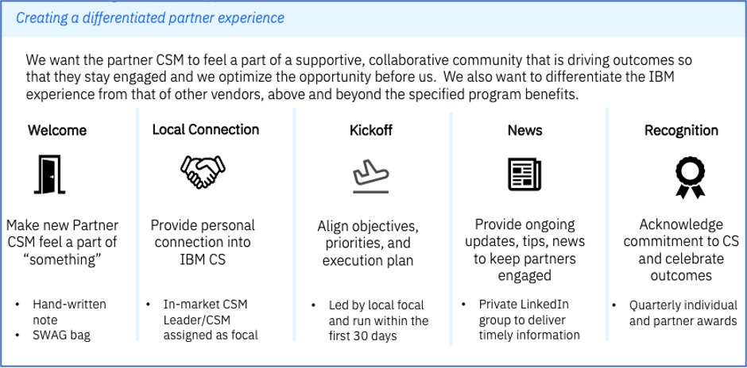

import {Link} from 'gatsby';
import FileLink from '../../components/FileLink';

<AnchorLinks small>
  <AnchorLink>How to recruit Partners</AnchorLink>
  <AnchorLink>Who are the right Partners?</AnchorLink>
  <AnchorLink>What are the steps to recruit partners?</AnchorLink>
  <AnchorLink>What happens when a partner enrolls?</AnchorLink>
  <AnchorLink>CSM focal role</AnchorLink>
  <AnchorLink>How do partners access each of the program elements?</AnchorLink>
  <AnchorLink>Measuring program success</AnchorLink>
  <AnchorLink>Executive business reviews</AnchorLink>
</AnchorLinks>

<Row>

<Column colMd={9} colLg={9}>

This guide is intended to support CSM leaders and CSMs involved in recruiting or supporting partners in the Customer Success Premier Program.

## How to recruit Partners

The goal is to grow the number of partners in the Customer Success Premier program to at least 100 partners by the end of 2024. Given the investment IBM is making in the program, we need to enroll the “right” partners and provide those partners with the best experience to be successful.

</Column>

<Column colMd={3} colLg={3}>

 
 

<Aside>

**Partner Plus**

<a href='https://ibm.seismic.com/Link/Content/DCGb2QGpm49GB8FWBcMWmbphhb8V' target='_blank' rel='noreferrer noopener'>Partner Plus overview in Seismic</a>

</Aside>

</Column>
</Row>

<Row>

<Column colMd={9} colLg={9}>

## Who are the right partners?

All Partner Plus members with Platinum status are eligible to enroll in the program. However, we want to proactively approach the Platinum partners that have the highest potential for success. These partners:

-	Have sold significant CSM-covered software. Partners that sell non-CSM covered IBM software are eligible; however, we are limited in the amount of support we can provide for these offerings both in terms of expertise and visibility via the Customer Success platform.
- See the value of Customer Success and are willing to sponsor and invest in this mission within their own organizations.
- Recognize that the program requires them to dedicate at least one resource to a Customer Success practice around IBM Software.

Start by reviewing the <a href='https://ibm.box.com/s/o7h0q9lq30ju8tyjmrm3l2r7nf3ng8se' target='_blank' rel='noreferrer noopener'>list of Platinum Partners</a> within your market. The linked report indicates whether there was CSM-Covered revenue in 2022. Work together with your local Ecosystem to identify and approach partners.

</Column>

<Column colMd={3} colLg={3}>

 
 

<Aside>

**List of Platinum Partners**

<a href='https://ibm.box.com/s/o7h0q9lq30ju8tyjmrm3l2r7nf3ng8se' target='_blank' rel='noreferrer noopener'>Platinum Partners</a>

</Aside>

</Column>

</Row>

<Row>

<Column colMd={12} colLg={12}>

## What are the steps to recruit partners?

1.	Identify target Platinum Partners.
2.	Determine who within the IBM team has a relationship with the partner and will make the initial contact and invite senior partner leaders to a program briefing.

  a.	Typically, initial contact is made by a Technology Partner Seller (TPS) but it might also be a CSM leader or other team member that has an established relationship with senior leaders. 

  b.	Partner participants need to be able to commit resources to the program. They are typically C-Level or Senior leaders within the partner firm that own the IBM relationship. The roles can vary based on the size of the partner.
3.	Hold the partner briefing. Use the <a href='https://ibm.box.com/s/kk3nizzmreiw8nlu4np19cjo3g5jqzt1' target='_blank' rel='noreferrer noopener'>program overview deck.</a>
4.	Send a follow up after the briefing to address any open questions and provide reference materials for the partner to review. Include links to the following documents:
  - <a href='https://ibm.seismic.com/Link/Content/DCCDHhQ36cJVB8qRTc7VRVpcXfBV' target='_blank' rel='noreferrer noopener'>Program overview</a>
  - <a href='https://ibm.seismic.com/Link/Content/DCHcVccDVh3RfG9BRfDggp2CVXmV' target='_blank' rel='noreferrer noopener'>Enrollment process</a>
5.	Follow up with the partner to gain their commitment or decision not to participate.
6.	If the partner commits to the program, notify your market leader and Jane Bossert (jbossert@us.ibm.com)of their plans to enroll.
7.	Identify a local CSM focal that will work with the partner throughout the program.

</Column>
</Row>

<Row>

<Column colMd={9} colLg={9}>

## What happens when a partner enrolls?

Review the <a href='https://ibm.seismic.com/Link/Content/DCHcVccDVh3RfG9BRfDggp2CVXmV' target='_blank' rel='noreferrer noopener'>enrollment steps</a> so you understand the process. If you have notified the program team of the partner’s plan to enroll, you will be copied on the <a href='https://ibm.box.com/s/hhaet1gkw6p3wov2hkah6tcj28q73qyl' target='_blank' rel='noreferrer noopener'>Welcome email</a> that is sent from IBM.Partner.Customer.Success@ibm.com upon their enrollment. The Market leader should make a CSM focal assignment at this point if one has not been previously identified.

After the partner has enrolled, it is important to create a differentiated experience for the partner organization and the partner CSM. Below is an overview of the desired experience. Each geography or market might augment this experience with additional elements based on resource availability.

**Welcome:** The global team distributes the welcome gift. 
**Local Connection:** Is delivered through the local CSM Focal. (See below) 
**Kickoff:** Is delivered through the local CSM Focal. (See below) 
**News:** The LinkedIn group is administered by the global team. Partner CSMs are invited to join along with CSM Focals. 
**Recognition:** The global team administers the recognition program. Additional details forthcoming.

</Column>
</Row>

<Row>

<Column colMd={9} colLg={9}>

## CSM focal role

The local CSM focal is the partner’s day-to-day operational contact and provides a personal connection in the partner’s own time zone and language. In most cases, the local CSM focal is a CS Partner Specialist and the participating partner is among those assigned to the CSM. 

As a local CSM, you are responsible for the following tasks:

-	Send a personal welcome to partner upon enrollment.
-	Deliver a kickoff session and establish joint goals.
-	Help the partner get started in Gainsight by directing them to available training and starting with 3 key tasks: relationship assignment, updating relationship health, and creating growth plans.
- Review and prioritize the partner's relationships in Gainsight to identify the relationships the partner will assign to themselves to lead and progress.
-	Host regular check-ins to see how the partner is doing and what help is needed.  Evaluate progress against goals and identify actions and owners needed to accelerate progress. 
-	Connect the partner with IBM customer-assigned CSMs as needed.
-	Address simple requests for program assistance at the local level and engage the global program team for more complex needs/deeper engagement.
-	Hold a periodic review with the local IBM ecosystem team attached to the partner (e.g., Technology Partner Seller and/or Partner Technical Specialist).
-	Provide the global program team with program insights and feedback.
- With the Partner CSM, co-lead the Executive Business Review (EBR) each quarter, including the IBM ecosystem sellers and the customer success sponsor from the partner.
-	(optional) Offer lunch/coffee meeting once a quarter.
-	(optional) Offer partner the opportunity to shadow/mentor a CSM working with their end customer.

As a best practice, follow the 30-day onboarding plan. Contact the CSM for Americas Partners, Sid Mehta (sid.mehta@ibm.com), for additional information and assets available to execute this plan.

</Column>
</Row>

<Row>

<Column colMd={9} colLg={9}>

### How does the CSM focal identify the Partner CSM and contact info?

The Welcome email that the Partner receives is sent to the contacts provided in their enrollment form. The enrollment form requires them to provide a “Requestor” and “CSM Sponsor” name, email, and phone number. There are three potential scenarios. The CSM focal will need to ask the partner for clarification at the time of introduction.

1.	The CSM Sponsor has identified the CSM and is ready to get started. In this case, the IBM CSM focal can proceed with the kickoff.
2.	The CSM Sponsor is the same person as the CSM. In this case, the IBM CSM focal can proceed with the kickoff.
3.	The CSM Sponsor plans to hire a new resource to perform the CSM role. In this case, the IBM CSM focal might be asked to provide the partner with recommendations on the skills of the CSM they should hire. The CSM focal might be asked for candidates or to interview potential hires. The IBM CSM focal should periodically touch base with the partner CSM Sponsor on their progress and expected timeframe and offer any assistance. After the resource is in place, the IBM CSM focal can proceed with the kickoff.

Note: The IBM CSM focals, Partner CSM Sponsors, and Partner CSMs are documented in the <a href='https://ibm.box.com/s/o7h0q9lq30ju8tyjmrm3l2r7nf3ng8se' target='_blank' rel='noreferrer noopener'>Participation report.</a>

</Column>
</Row>

<Row>

<Column colMd={9} colLg={9}>

## How do partners access each of the program elements?

The enrolled partner receives a <a href='https://ibm.box.com/s/hhaet1gkw6p3wov2hkah6tcj28q73qyl' target='_blank' rel='noreferrer noopener'>Welcome email</a> that outlines each element and the steps necessary to activate. A summary is provided below.

**Practice: Customer Success Industry Training**
This program element is delivered through Gainsight’s Pulse+ digital learning offering. Enrolled partners are eligible for one subscription. The partner provides the name of the resource and that resource receives instructions to register along with a coupon code.

In addition, IBM hosts periodic webinars and workshops. Some sessions are exclusive to enrolled partners while others are open to the broader IBM partner community. Replays and upcoming sessions are on the <a href='https://ibm.seismic.com/Link/Content/DCWh8CWDW68FF8FJc6JdBmRgHWGG' target='_blank' rel='noreferrer noopener'>Customer Success Training & Workshops page</a> on Seismic.

**Platform: Gainsight**
Enrolled partners are offered 1 full license and 3 viewer plus licenses.* After the partner provides the user names as instructed in the Welcome email, the global program support team submits the requests to the IBM Gainsight team. Users receive an <a href='https://ibm.box.com/s/la9jytvdrzvxlh0xr5rath6lz0t4mhe2' target='_blank' rel='noreferrer noopener'>onboarding email</a> with links to the training and instructions on how to access Gainsight.
-	Review <a href='https://ibm.seismic.com/Link/Content/DC27BJCBBT4pPGMDG4BcMRX49TfP' target='_blank' rel='noreferrer noopener'>Partner information and training</a> on IBM Gainsight
-	Visit “Partner Dashboards” for IBM CSMs working with partners on the Gainsight community <a href='https://w3.ibm.com/w3publisher/gainsight-user-community/get-learning/dashboards-101' target='_blank' rel='noreferrer noopener'>Dashboards 101 page</a>.
-	Review <a href='https://ibm.box.com/s/td788ps3vkur9y4cfofzxg7n5uvyd1pm' target='_blank' rel='noreferrer noopener'>sample views</a> of Partner C360 and R360 layouts.
- Watch the <a href='https://ibm.seismic.com/Link/Content/DCWmfjfTBQWjmGcQfWXjH2JfQbCB' target='_blank' rel='noreferrer noopener'>demo</a> of the Partner experience.
-	See additional <Link to='/onboard/csm-partner-ecosystem'>Partner information</Link> for IBM CSMs working with partners in Gainsight.

*Note: Currently, all users receive full licenses.

**People: Partner CSM Financial Support**
Complete details are available in the <a href='https://ibm.seismic.com/Link/Content/DCjjGWfjVjq68G4WVqBjBdjqh99P' target='_blank' rel='noreferrer noopener'>Partner CSM Funding Program Guide</a>. The guide includes details on how the partner activates this benefit as well as requirements for claim submissions and timing.

**Assets:**
IBM CSM playbooks have been versioned for partner use. These include practice playbooks, technical playbooks, modernization guides, etc. Available on the Customer Success for Partners page on Seismic.

**Additional resources:**
 Enrolled partners are invited to join the <a href='https://www.linkedin.com/groups/12788300/' target='_blank' rel='noreferrer noopener'>Customer Success Premier Program LinkedIn Group</a>, a private space to obtain news, tips, and program updates. Upon enrollment, the program administrator connects with each partner CSM and the IBM CSM focal. After confirming the connection, they are invited to the group.

Note: The <a href='http://ibm.biz/Partner_CS' target='_blank' rel='noreferrer noopener'>landing page on Seismic</a> is the single destination for program resources for partners.
</Column>

<Column colMd={3} colLg={3}>

  

<Aside>

**Customer Success for Partners page**

<a href='https://ibm.seismic.com/Link/Content/DCPR9h4J3WWgcGfVfdjHPdjX3Dp8' target='_blank' rel='noreferrer noopener'>CSM Playbooks for Partners</a>

</Aside>

</Column>

</Row>

<Row>

<Column colMd={9} colLg={9}>

## Measuring program success

The goal of the Customer Success Premier Program is to activate partners’ Customer Success practice to scale IBM’s reach and impact on adoption, consumption, renewals, and expansion. Participating partners must recognize business value from their commitment to customer success. Since program funding is unlikely to continue past the two-year program participation, each partner must be convinced to continue the investment on their own based on the business outcomes they have achieved. Further, while a partner’s CSM resource funding is not subject to the achievement of a quantitative target, the IBM CSM and the partner should establish goals together and track progress towards these goals, assessing what is working and what is not working, and addressing gaps. 

Some goals can be established and tracked together with the partner. Other goals, the partner must measure for themselves because they will have the data required. 

Jointly tracked goals, evaluated quarterly:

**Deployment Progression:** Track the deployment progression from the partner’s entry into the program quarterly. Consider:
  *	A reduction in the percent of relationships “Not started”, especially those not covered by IBM CSMs.
  * An increase in the number of deployments completed in the period, distinguishing between IBM CSM covered and not covered. Establish a goal for each quarter.
  * The percentage of deployed projects on Red Hat OpenShift. Aim for greater than 30%.  

  Be sure to follow the guidance on <Link to='/onboard/gainsight-create-growth-plan/#when-do-i-need-a-growth-plan'>when to create growth plans</Link>.

**Partner CSM Engagement:** This is evaluated quarterly and assumes partners are using Gainsight:
  * The percent of relationships assigned to the Partner CSM, distinguish between IBM covered and not covered. Aim for at least a 50/50 mix. The target percentage will depend on the total number of entitlements. For example, if the partner only has ten relationships, aim for a higher percentage of coverage. If the partner has 100 relationships, the partner will provide high touch coverage for a lower number of them.
  * Growth/Retention plan creation. You will have to consider each partner's 
situation and establish the appropriate goals. For some partners, you 
might target Target creating a growth or retention plan for 100% of the Partner CSM assigned relationships where there is no IBM CSM coverage. If the volume of relationships is too high, you can identify a 
realistic but challenging goal. Also, determine an appropriate target for the IBM CSM-covered relationships. All plans need to articulate a use case and the business value expected by 
the end customer and will need to be validated by the IBM CSM to be 
counted towards the market achievement.
  * Relationship Health sentiment. Ensure that all CQ and NQ relationships have a relationship health provided.

When accompanied by actions that drive desired deployment outcomes, these are leading indicators of higher-order business value measurements. The partner will need to establish and track leveraging data held within their organization. Examples include:
*	Average customer growth rate (CSM covered vs non CSM covered)
*	Contract Extension/Renewal Rates
*	<Link to='/deploy/measure-success/#net-revenue-retention-(nrr)'>Net Revenue Retention (NRR)</Link>

After the metrics are established, use Executive Business Reviews to discuss progress and actions needed to maintain momentum or address gaps. 

</Column>
</Row>

<Row>

<Column colMd={9} colLg={9}>

## Executive business reviews

**What?**
A review with Customer Success executive sponsors at the Partner organization about engagement, outcomes, and strategic direction. Includes deployment progression and Customer Success as a function.

**Why?**
Provide visibility of the work and impact of the Partner CSM on achieving desired business outcomes to ensure continued investment in the program. Output also helps the partner to prepare for funding claim submission.

**Who?**
*	Jointly led by Partner CSM and IBM CSM Focal.
*	Partner Executive sponsors and stakeholders.
*	IBM Ecosystem sellers, at least Technology Partner Seller (TPS).

**When?**
At least quarterly, regardless of the partner’s tenure in the Customer Success Premier Program.

**Recommended Agenda:**
*	Review of progress against previously agreed goals since the last update.
*	Highlights of customer engagement and outcomes.
*	What’s working or not working. What help is needed.
*	Revisit overall and next quarter goals and forecasts to ensure continued alignment.
*	Next steps/actions to continue progression towards goals.

Pro Tips:
*	You must have goals to review. Be sure to have a goal-setting conversation in advance.
*	Meet in person if possible.
*	Use screenshots from Gainsight as much as possible.
*	Celebrate above-and-beyond efforts (E.g., contributing to blogs, posting in LinkedIn group, speaking to other Partners, or presenting to IBM CSMs).

</Column>

<Column colMd={3} colLg={3}>

 
<Aside>

**EBR template**

Use this <a href='https://ibm.box.com/s/18kfi2z7v9bhp1sx3ljz2ulti1hd5gyb' target='_blank' rel='noreferrer noopener'>template</a> to get started.

</Aside>

</Column>
</Row>

