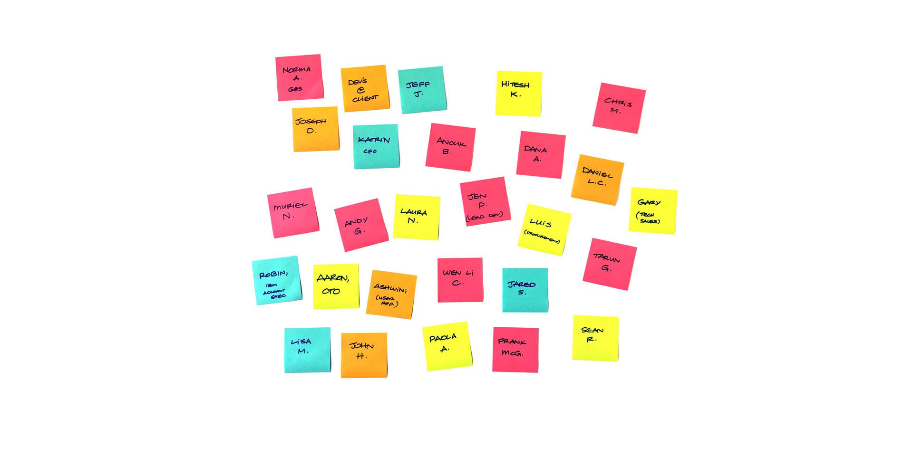
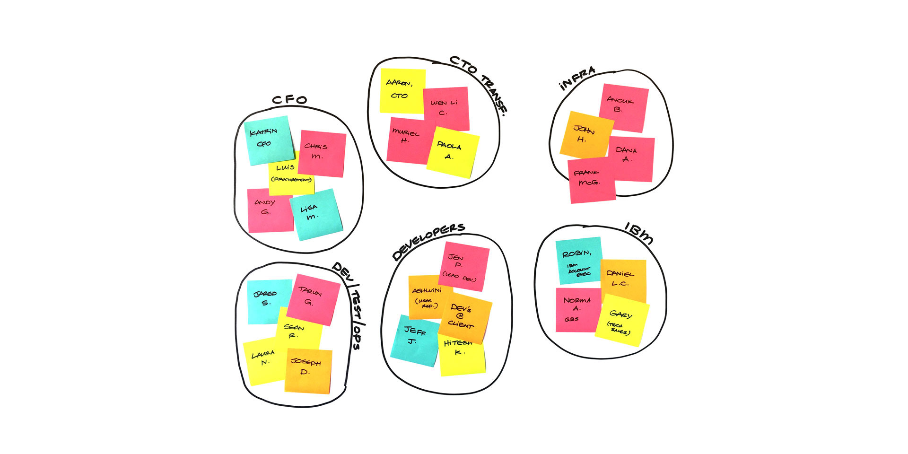
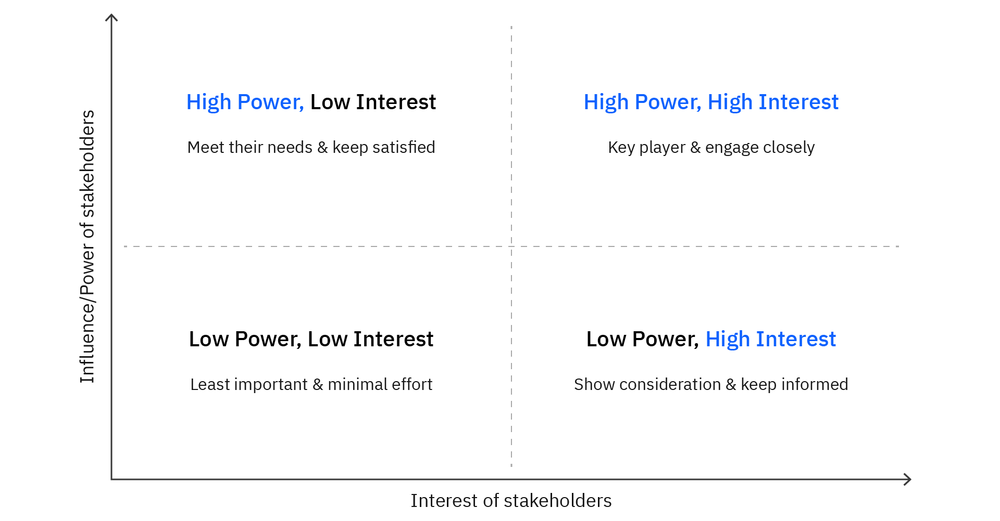

<Row>
<Column>

## Develop a stakeholder map

Use a stakeholder map to understand the roles of IBM and customer stakeholders who are engaged on your project.  Use the map to identify each stakeholder, their scope of influence, and what motivates them.

**Learn how**

</Column>
</Row>

<Row>

<Column colMd={4} colLg={4}>

</Column>

<Column colMd={4} colLg={4}>

### Build a stakeholder map to keep track of who's who on your engagement.

</Column>

</Row>

<Row>

<Column colMd={8} colLg={8}>

As you begin to build trusted relationships with your IBM team and the client team, it might become hard to keep track of who’s who.  A stakeholder map is a tool that can help you to identify all of the people involved in your project, their role, and their relationships with others on the team.

You can create a stakeholder map using the tool of your choice. You might choose to use mural or a whiteboard with sticky notes.

</Column>
<Column colMd={4} colLg={4}>

<Aside>

**Relationship Barometer**

Use the <a href='https://ibm.seismic.com/Link/Content/DCQjf8FMD4jpb89XB624MmTQ9h48'>Relationship Barometer</a> in ISC to help you gauge the political power of the client team.

</Aside>

</Column>

</Row>

<Row>

<Column colMd={8} colLg={8}>
Build a stakeholder map over time by taking the following steps.

1. From the first day you are assigned to your customer, you will start to learn about the stakeholders by talking to the members of the IBM extended team who work you’re your customer.  Record the name of each stakeholder you meet along with their role, what motivates them, and anything else that could affect the relationship.  As the engagement progresses add information about stakeholders in your customer’s enterprise.

2. As you add more stakeholders, combine them into logical groupings.

3. Draw lines between the groups that indicate their relationships.  As you add stakeholders in your customer’s enterprise, you can add a + or a – to indicate whether their relationship with IBM and/or your product is positive or not.

After you’ve mapped your stakeholders, you can create a view that helps you track who the decision makers are and how invested each is in your project.

To do this, create a grid like the following.  You can write the names of each customer stakeholder in the appropriate quadrant, so you know where they fall in terms of interest and power/influence to make decisions.

As your relationship with your customer progresses, continue to update and add stakeholders to your stakeholder map and quadrant chart so you can always know at a glance who’s who.

</Column>

</Row>
