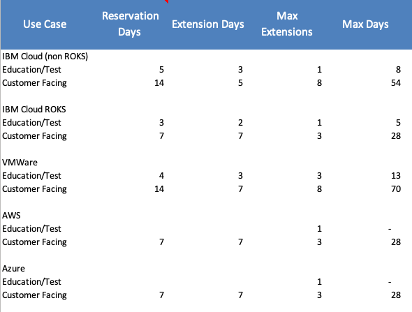

<AnchorLinks small>
  <AnchorLink>Hands-on environments</AnchorLink>
  <AnchorLink>Reserve a Cloud Pak</AnchorLink>
  <AnchorLink>Environment options at a glance</AnchorLink>
  <AnchorLink>Reservation policies</AnchorLink>
  <AnchorLink>Custom requests</AnchorLink>
</AnchorLinks>

<Row>

<Column colMd={8} colLg={8}>

## Hands-on environments

Want to get your hands on an environment to get ready for a customer call? Need to become more familiar with an environment, hands-on?
You've to come to the right place!

## Reserve a Cloud Pak

1. Search for the Cloud Pak you need in the <a href="https://techzone.ibm.com/decisionpoints" target='_blank' rel='noreferrer noopener'>IBM Technology Zone</a>.

2. Reserve it. Be sure to have your opportunity number available when you are ready to start this process.

</Column>

<Column colMd={4} colLg={4}>

  

<Aside>

**Techzone environments**

<a href='https://techzone.ibm.com/environments' target='_blank' rel='noreferrer noopener'>Access Techzone for demo environments</a>

</Aside>

</Column>

</Row>

<Row>
<Column>

## Environment options at a glance

In TechZone, there are a number of options available to you based on your customer's needs. You should bookmark the <a href='https://techzone.ibm.com/collection/tech-zone-certified-base-images' target='_blank' rel='noreferrer noopener'>TechZone Certified Base Images</a> as these are the verified environments of choice.

**Ready made environments**   Easily access environments to build technical ‘Show Me’ demos that you can share with peers for customer PoXs. Includes a variety of environment options for Cloud Paks, OCP, and AI Apps.

**A custom OCP Cluster**   Practice deploying OCS/NFS and Cloud Paks on VMware or ROKS.

**Build your own environment (VMware)**   Practice deploying OpenShift, OCS, and Cloud Paks on VMware.

**Build your own environment (Power + z A&PS)**   General Purpose instances for setting up demos, PoXs with clients, and self-education to learn IBM Technology.

**Get a quick cluster**   Gain familiarity with the IBM Cloud Services or reserve a lab to host workshops.

**End to end demos**   Ready made demo environment within IBM Public Cloud.

</Column>

</Row>

<Row>
<Column>

## Reservation policies

IBM Technology Zone's reservation forms will show you how long you can reserve an environment.
By selecting a "Customer Demo", "Proof of Concept", or "Proof of Technology" purpose and providing a valid IBM Sales Cloud or Gainsite relationship ID you will be alloted more time on the intial reservation form. The lowest cost options allot more time for customer facing or self-education purposes. For more details, refer to the <a href='https://github.com/IBM/itz-support-public/blob/main/IBM-Technology-Zone/IBM-Technology-Zone-Runbooks/reservation-duration-policy.md' target='_blank' rel='noreferrer noopener'>runbook</a>.

**Education/Testing** – preparing for a demo or learning IBM Technology - does not require an opportunity code 
**Customer Facing** (Demo, POC, POT, MVP) – requires an active opportunity code

These <a href='https://techzone.ibm.com/environments?StatusFilter=%5B%22Enabled%22%5D&CollectionStatusFilter=%5B%22Active%22%5D&OwnerFilter=%5B%22christopher.horn%40ibm.com%22%5D' target='_blank' rel='noreferrer noopener'>Power & z A&PS instances</a> fall under the following reservation policies:

**Client-facing purpose policy:** 
Reservation days: 7 days 
Extension days: 7 days 
Max Extensions: 3  

**Education purpose policy:** 
Reservation days: 3 days 
Extension days: 5 days 
Max Extensions: 1 

## Custom requests
You should leverage and build on the self-service <a href='https://techzone.ibm.com/collection/tech-zone-certified-base-images' target='_blank' rel='noreferrer noopener'>TechZone Certified Base Images</a>.
A custom request should only be submitted for an active opportunity where a base image does
not meet client requirements and additional enhancements are required.  In addition, the
infrastructure expense must not exceed the potential revenue opportunity.

</Column>
</Row>
