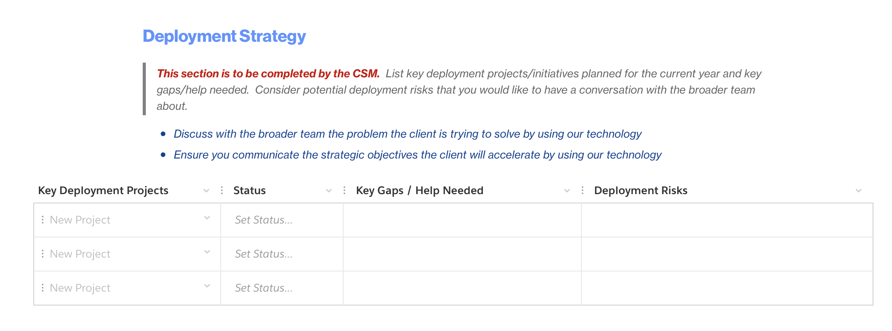

import {Link} from 'gatsby'

<AnchorLinks small>
<AnchorLink>Contribute to IBM Strategic Account Planning</AnchorLink>
</AnchorLinks>

<Row>

<Column colMd={8} colLg={8}>

## Contribute to IBM Strategic Account Planning

IBM Strategic Account Planning can offer insight into the strategy the IBM team and the customer are working on together.

A strategic account plan is a living, internal business plan. Your customer's goals provide a roadmap that is supported by IBM growth initiatives, which serve as the method for how these goals can be attained. As part of the IBM team, you will use the strategic account plan at regular intervals to look for growth opportunities.

There are changes to the account planning process and templates for 2023. Plan owners will first need to archive the 2022 Account Technology Plan template and generate the new template, which has the 2023 updates. As a CSM, you will need to ensure that the plan owner shares access with you so you have permission to view and update the plan. You will find a section in the plan for Deployment Strategy. Use this portion of the plan to raise any deployment risks and use it to generate discussion with the larger team IBM.

</Column>

<Column colMd={3} colLg={4}>

 
 

<Aside>

**Find strategic initiatives in ISC**

<a href='https://w3.ibm.com/w3publisher/accountplanning/strategic-initiative' target='_blank' rel='noreferrer noopener'>Strategic initiatives are added directly to ISC</a>

</Aside>

<Aside>

**IBM Strategic Account planning roles**

<a href='https://w3.ibm.com/w3publisher/accountplanning/roles' target='_blank' rel='noreferrer noopener'>IBM Strategic Account planning - your role</a>

</Aside>

<Aside>

**Tools**

<a href='https://ibm.quip.com/eCY1Al56yJae/IBM-Quip-HomePage' target='_blank' rel='noreferrer noopener'>IBM Quip Homepage</a>

</Aside>

</Column>

</Row>

<Row>

<Column colMd={8} colLg={8}>

### Step 1. Know Your Client
_____________________________

**Objective:** Gain a common team understanding of the client

**Your role as a CSM:** You are responsible for providing input: Deployment status and future plans

</Column>

<Column colMd={4} colLg={4}>

  

<Aside>

**Account planning: Know your client**

<a href='https://w3.ibm.com/w3publisher/accountplanning/planning-overview/know-my-client' target='_blank' rel='noreferrer noopener'>Know your client</a>

</Aside>

<Aside>

**Learn the practices**

<a href='https://ibm.seismic.com/app?ContentId=4fe7828c-34b6-4357-b3ba-ef4f08c953f3#/doccenter/5477419a-9474-4c51-94af-b442e9169fab/doc/%252Fdd98c5a3df-6b7c-1d77-6f07-d12e63954c78%252FdfOTRiYmU4NTQtNWY4NC03Y2QyLWZjYWUtOGIxYmFmZjkyZThk%252CPT0%253D%252CUm91bmR1cCBvciBzdW1tYXJ5%252Flf4d5bfede-4db1-407b-a7ed-aca2706957cf/grid/?anchorId=4cdfc40d-5750-4837-8514-874997730d6a' target='_blank' rel='noreferrer noopener'>Know Your Client</a>

 

<a href='https://ibm.seismic.com/app?ContentId=b95a2f35-afd9-4207-b6f9-aa2c3b63bd94#/doccenter/5477419a-9474-4c51-94af-b442e9169fab/doc/%252Fdd98c5a3df-6b7c-1d77-6f07-d12e63954c78%252FdfOTRiYmU4NTQtNWY4NC03Y2QyLWZjYWUtOGIxYmFmZjkyZThk%252CPT0%253D%252CUm91bmR1cCBvciBzdW1tYXJ5%252Flf6b3d8e11-82e7-43fa-9f96-9a441303d956/grid/' target='_blank' rel='noreferrer noopener'>Execute Stakeholder Strategy</a>

</Aside>

<Aside>

**Tools**

<a href='https://ibm.seismic.com/Link/Content/DCQjf8FMD4jpb89XB624MmTQ9h48' target='_blank' rel='noreferrer noopener'>Relationship Barometer</a>

</Aside>

</Column>
</Row>

<Row>

<Column colMd={8} colLg={8}>

### Step 2. Create the Strategy
________________________________

**Objective:**
Select opportunities based on the client's strategic priorities and initiatives together with TDPs and IBM competitive strengths

**Your role as a CSM:** Share the CSM Deployment Plan with Team IBM and discuss current and future plans.

</Column>

<Column colMd={4} colLg={4}>

  

<Aside>

**Account planning: Create the Strategy**

<a href='https://w3.ibm.com/w3publisher/accountplanning/planning-overview/account-strategy' target='_blank' rel='noreferrer noopener'>Create the Strategy</a>

</Aside>

<Aside>

**Read the practice**

<a href='https://ibm.seismic.com/app?ContentId=d0abac1a-ae67-4ab9-ab05-d4bfa0444d5b#/doccenter/5477419a-9474-4c51-94af-b442e9169fab/doc/%252Fdd98c5a3df-6b7c-1d77-6f07-d12e63954c78%252FdfOTRiYmU4NTQtNWY4NC03Y2QyLWZjYWUtOGIxYmFmZjkyZThk%252CPT0%253D%252CUm91bmR1cCBvciBzdW1tYXJ5%252Flfa4c49b27-c81c-4e09-94ca-f6329fdce9c6/grid/' target='_blank' rel='noreferrer noopener'>Plan strategically</a>

 

<a href='https://ibm.seismic.com/app?ContentId=b95a2f35-afd9-4207-b6f9-aa2c3b63bd94#/doccenter/5477419a-9474-4c51-94af-b442e9169fab/doc/%252Fdd98c5a3df-6b7c-1d77-6f07-d12e63954c78%252FdfOTRiYmU4NTQtNWY4NC03Y2QyLWZjYWUtOGIxYmFmZjkyZThk%252CPT0%253D%252CUm91bmR1cCBvciBzdW1tYXJ5%252Flfb4c94fa4-8c2a-43f9-8e9a-c4a9ba2181bb//?mode=view&parentPath=sessionStorage' target='_blank' rel='noreferrer noopener'>Prospect with impact</a>

</Aside>

</Column>

</Row>

<Row>

<Column colMd={8} colLg={8}>

### Step 3. Develop the Plan
________________________________

**Objective:**
Create/update Sales Strategies and plan elements to guide and enable sales execution. Enter Opportunities in ISC.

**Your role as a CSM:** Discuss existing OpenShift deployment status and plans. Provide status on any open access to OpenShift where the customer is not deployed or is running on legacy.

</Column>

<Column colMd={4} colLg={4}>

  

<Aside>

**Account planning: Develop the plan**

<a href='https://w3.ibm.com/w3publisher/accountplanning/planning-overview/develop-the-plan' target='_blank' rel='noreferrer noopener'>Develop the plan</a>

</Aside>

 

<Aside>

**A focus on Red Hat OpenShift adoption**

<a href='https://w3.ibm.com/w3publisher/accountplanning/planning-overview/red-hat-joint-planning' target='_blank' rel='noreferrer noopener'>Red Hat & IBM Joint Planning</a>

</Aside>

<Aside>

**Read the practice**

<a href='https://ibm.seismic.com/app?ContentId=d0abac1a-ae67-4ab9-ab05-d4bfa0444d5b#/doccenter/5477419a-9474-4c51-94af-b442e9169fab/doc/%252Fdd98c5a3df-6b7c-1d77-6f07-d12e63954c78%252FdfOTRiYmU4NTQtNWY4NC03Y2QyLWZjYWUtOGIxYmFmZjkyZThk%252CPT0%253D%252CUm91bmR1cCBvciBzdW1tYXJ5%252Flfa4c49b27-c81c-4e09-94ca-f6329fdce9c6/grid/' target='_blank' rel='noreferrer noopener'>Plan strategically</a>

</Aside>

</Column>

</Row>

<Row>

<Column colMd={8} colLg={8}>

### Step 4. Operationalize the Plan
________________________________

**Objective:** Execute on the plan

</Column>

<Column colMd={4} colLg={4}>

  

<Aside>

**Account planning: Operationalize the plan**

<a href='https://w3.ibm.com/w3publisher/accountplanning/planning-overview/operationalize-the-plan' target='_blank' rel='noreferrer noopener'>Operationalize the plan</a>

</Aside>

<Aside>

**Read the practices**

<a href='https://ibm.seismic.com/Link/Content/DCJ8c99XXf9jF8HWcf9PbFbdmm63' target='_blank' rel='noreferrer noopener'>Execute stakeholder strategy</a>
 
<a href='https://ibm.seismic.com/Link/Content/DCfDMqbq43JJG8CCjMfpm87CVfHj' target='_blank' rel='noreferrer noopener'>Negotiate to win</a>
 
<a href='https://ibm.seismic.com/app?ContentId=b95a2f35-afd9-4207-b6f9-aa2c3b63bd94#/doccenter/5477419a-9474-4c51-94af-b442e9169fab/doc/%252Fdd98c5a3df-6b7c-1d77-6f07-d12e63954c78%252FdfOTRiYmU4NTQtNWY4NC03Y2QyLWZjYWUtOGIxYmFmZjkyZThk%252CPT0%253D%252CUm91bmR1cCBvciBzdW1tYXJ5%252Flfa37ca972-7bc6-4f23-98a0-1eef04bf37ce//?mode=view&parentPath=sessionStorage' target='_blank' rel='noreferrer noopener'>Handle Objections</a>

</Aside>

</Column>

</Row>

<Row>

<Column colMd={8} colLg={8}>

### Step 5. Manage the Plan
________________________________

**Objective:** Ongoing management of the plan

</Column>

<Column colMd={4} colLg={4}>

  

<Aside>

**Account planning: Manage the plan**

<a href='https://w3.ibm.com/w3publisher/accountplanning/planning-overview/manage-the-plan' target='_blank' rel='noreferrer noopener'>Manage the plan</a>

</Aside>

</Column>

</Row>
