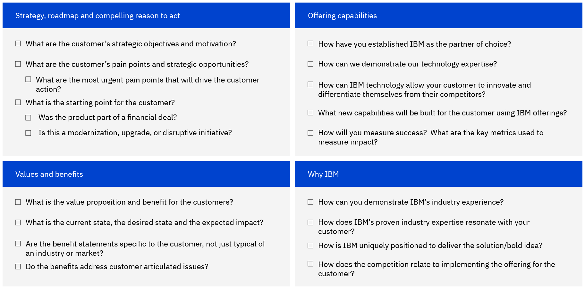

import {Link} from 'gatsby'

<Row>
<Column colMd={9} colLg={9}>

## You have been assigned a new customer ... now what?

No matter what type of CSM you are, whether you are a CS Account Specialist, a CSM Brand or a CS Digital Architect you will want to find out as much as possible about your new customer. There are several core tools you will need to start with.
The best places to start to find information related to your newly assigned customer are Gainsight, IBM Sales Cloud (ISC), and CADET (for Diamond clients).

</Column>
</Row>

<Row>

<Column colMd={3} colLg={4}>

</Column>

<Column colMd={6} colLg={6}>

  

### Understand your customer and prepare to engage with your IBM team.

</Column>

</Row>

--------------------

<AnchorLinks small>
  <AnchorLink>Start by learning about your customer</AnchorLink>
  <AnchorLink>Build a deep understanding of the customer's business</AnchorLink>
  <AnchorLink>Understand your customer and their industry</AnchorLink>
  <AnchorLink>Understand the products and relevant use cases</AnchorLink>
  <AnchorLink>Prepare to be your customer’s advocate with IBM Support</AnchorLink>
</AnchorLinks>

---------------------

<Row>
<Column colMd={9} colLg={9}>

**<a href='http://ibm.biz/client_success' target='_blank' rel='noreferrer noopener'>In Gainsight</a>**, you can find your client and review their entitlements and whether they were purchased through IBM or an IBM Partner.
You can review the C360 in Gainsight, Relationship 360. The **Relationships**, will show you the entitlements purchased by the customer. The **Other Relationships** are other offerings in the ELA catalog. If you find there is an opportunity related to one of these offerings, you can assign yourself to the relationship and pursue it. **Non-covered Relationships** are not covered and not assigned.

Likely, your new customer is not your only assigned customer. To ensure you are focused on the right customer and their deployment journey, you can use the <Link to='/onboard/gainsight-csm-dash'>CSM Dashboard in Gainsight.</Link>
 

**<a href='https://ibmsc.lightning.force.com/lightning/page/home' target='_blank' rel='noreferrer noopener'>In ISC</a>**, you can <a href='https://ibm.ent.box.com/s/6oaiitc1mx8wqco3iskruj6ta7wgvwk5' target='_blank' rel='noreferrer noopener'>research customers</a>, connect with sellers, identify Partner contacts, and create expansion opportunities. You should be able to find the Account Planning documents, which will provide the strategic intent for this customer.
One document that you should be familiar with is the Technology Plan. It is created as part of the <Link to='/onboard/strategic-account-planning' target='_blank' rel='noreferrer noopener'>account planning process</Link>.

**<a href='https://w3.ibm.com/w3publisher/client-success-and-software-adoption/cadet' target='_blank' rel='noreferrer noopener'>In CADET</a>**, if you are working with a Diamond client, you will find the contract information. You will need to understand the contract terms and deployment strategy.

</Column>

</Row>

<Row>

<Column colMd={9} colLg={9}>

## Start by learning about your customer

Based on what you learn about your customer’s industry, team, and technical landscape, you now have a basic understanding of their starting point. Meet your customer where they are and provide them with the best possible experience with their IBM entitlements. In every case, getting your customer's offering up and running in their environment and demonstrating the function that is in line with their use case is one of the first steps to take.

Understand the strategic objectives of the client, the health of the client, and their Partner relationships, and make a plan to drive positive outcomes for the client, their partners, and IBM.

### Learn from the Opportunity documents

#### Transition document

Not all entitlements have a <Link to='/onboard/transition-doc'>Transition document</Link>, but you should look for one in ISC to use as the starting point for the plan for deployment with the client.
You can leverage the transition document to establish their growth plan for
deployment at the account. To better understand the contents of the Transition document, read the <a href='https://ibm.seismic.com/app?ContentId=2488d059-ae87-4239-a3f5-27c90914d630#/doccenter/5477419a-9474-4c51-94af-b442e9169fab/doc/%252Fddf1dbfee9-0f74-8b63-0adf-9bc88689151d%252Fdf48a6d366-1efd-415a-ad51-7e53d37ae0f4%252Fdf3a06671b-59d5-4d9c-a7bf-7a48bc8c489a%252Flff7ca73e5-830a-4661-a33b-31e331ea59bd/grid/' target='_blank' rel='noreferrer noopener'>Transition deck</a>.

#### Client Value Deal Management (CVDM) document

If you have a large, complex, strategic opportunity, including Business Partner opportunities, you might find a <a href='https://ibm.seismic.com/Link/Content/DC2MGgfWf9qc68WCVRMgfh3MFGVP?anchorId=9a9b257c-e834-4403-b831-9aeb6461e65a#/?anchorId=9a9b257c-e834-4403-b831-9aeb6461e65a' target='_blank' rel='noreferrer noopener'>CVDM document</a>, which can provide context to the opportunity, including a use case.

</Column>
</Row>

<Row>
<Column colMd={9} colLg={9}>

###  Questions to consider as you learn about your customer

As you work with your customer, you need to understand the answers to many of the following questions. How you get the answers depends on where you are starting with your customer.

If they have a well-defined use case and a process for building new solutions that do not require enterprise transformation, you might find much of this information already exists. You can learn about it by talking to the sales team and through the customer information sites that you have access to.

If your customer does not have a clearly defined reason for using the product, you might have to help them define use cases using techniques defined in the Use Case Discovery framework, which includes Enterprise Design Thinking.

Regardless of the starting point, knowing the answers to these questions helps to guide your work with the customer.

</Column>

</Row>

<Row>

<Column colMd={9} colLg={9}>

## Build a deep understanding of the customer's business

As you prepare to engage with your customers, you need to develop a baseline understanding of their industry, the top use cases for IBM growth offerings in their industry, and key competitors. This enables you to project confidence at your initial customer meeting.

</Column>
</Row>

<Row>

<Column colMd={9} colLg={9}>

## Understand your customer and their industry

The best way to get current information on your customer? You can always search the web for them and you might find their latest quarterly earnings and any recent press releases to try to gauge the temperature of the customer environment.

After you have an initial read on your customer, you are ready to go deeper. Your primary source of information about your customer and their industry (if they are publicly traded) is the <a href='https://financial-selling.yourlearning.ibm.com' target='_blank' rel='noreferrer noopener'>Client Business Value (CBV) tool</a>. CBV contains a wealth of knowledge, including financial and growth information, business performance, and competitive landscape, about your customer and their industry. Understanding your client’s business is the foundation for identifying their business needs and for gaining insights where IBM can help them solve business challenges, create competitive advantages, gain market share, and achieve their business goals.

For privately held companies, you can use CBV to discover the key trends, market disruptors, and risks currently impacting your client’s industry.

<Aside>

**Read this blog about making inroads with your customer**

<a href='https://w3.ibm.com/w3publisher/customersuccess/csm-team-blog/ee018d80-d54d-11ec-8156-7f4e31f0fa86' target='_blank' rel='noreferrer noopener'>Understand your customer</a>

  

**Build skills**

<a href='https://yourlearning.ibm.com/activity/PLAN-2193269FEE9B' target='_blank' rel='noreferrer noopener'>CSM Skills: Demonstrate Knowledge of Customer's Business</a>

</Aside>

<Aside>

**See the marketing assets your client has accessed**

<a href='https://ibm.seismic.com/app?ContentId=6d0f7f48-3e04-4869-b5cf-c3ed5aee4271#/doccenter/5477419a-9474-4c51-94af-b442e9169fab/doc/%252Fdd98c5a3df-6b7c-1d77-6f07-d12e63954c78%252FdfOTRiYmU4NTQtNWY4NC03Y2QyLWZjYWUtOGIxYmFmZjkyZThk%252CPT0%253D%252CSG93LXRv%252Flf4b93f70e-59d0-4635-8f51-88234fc0df9c/grid/?anchorId=7c69fd41-5ca3-4501-b24a-e73b270abddf' target='_blank' rel='noreferrer noopener'>Read about it in Seismic</a>

  

<a href='https://ibm.biz/salesintelligenceslack' target='_blank' rel='noreferrer noopener'>Subscribe to a Sales Intelligence SlackBot to get alerts of new Client Interests (CI) and Patterns of Interest (POI). Alerts for CIs are sent daily and POIs weekly.</a>

</Aside>

</Column>
</Row>

<Row>

<Column colMd={9} colLg={9}>

### Industry resources

As you build a strategic relationship with your customer, it is important to show you understand their industry.

In addition to CBV, you can use tools like <a target='_blank' rel='noreferrer noopener' href="https://ibm.northernlight.com/dashboard.php?id=416&fid=1298">Northern Light</a>, <a target='_blank' rel='noreferrer noopener' href="https://w3.ibm.com/services/lighthouse/">Lighthouse</a>, and <a target='_blank' rel='noreferrer noopener' href="https://w3.ibm.com/w3publisher/ibmsaleszone/industry-technology">Industry Hubs</a> will help you show your customer that you understand industry trends, typical use cases, and general challenges facing the industry.

**Other resources**

<a href="http://ibm.biz/IBM_Technology_Global_Industry" target='_blank' rel='noreferrer noopener'>Seismic pages</a> with links to the Global Industry Team members, information on Industry use-cases for our ISP’s / TDP’s / technology, and key Industry Client Imperatives, WIN references, Case Studies with quantified business value propositions, and  Industry learning enablement materials. 

<a href='https://w3.ibm.com/w3publisher/industry-skills-roadmap' target='_blank' rel='noreferrer noopener'>Industry Skills</a> 

<a href='https://sail.yourlearning.ibm.com/search?f=type&q=Industry' target='_blank' rel='noreferrer noopener'>Industry learning</a> 

<a href='https://yourlearning.ibm.com/channel/CNL_LCB_1498730425314/add' target='_blank' rel='noreferrer noopener'>Subscribe to learning</a>

</Column>

</Row>

<Row>
<Column colMd={8} colLg={8}>

## Understand the products and relevant use cases

As the technical expert, review the IBM products and how the most <a href='https://ibm.biz/IBM_STARS' target='_blank' rel='noreferrer noopener'>common use cases</a> map to your customer's typical challenges.

* Review the product entry points
* Review product competitors so you are prepared for any customer objections
* Review the product roadmap for key upcoming changes
* Review the technology pages in this playbook for a list of use cases per product
* Review the <a target='_blank' rel='noreferrer noopener' href="https://ibm.seismic.com/app#/search?appType=All&keyword=use%2520cases%25202021&contentType=All%20Documents&selectedProperties=&folderId=&folderName=&fromAppType=&currentTeamSiteId=&sharedTeamSiteId=&pageIndex=0">Seismic use cases</a>

</Column>
</Row>

<Row>
<Column colMd={9} colLg={9}>

## Prepare to be your customer's advocate with IBM Support

As part of the technical community, your role in this process is to see that your customer is getting the attention they need from IBM Support. You are not responsible for following and reporting back on the progress of open issues.

However, you can and should be an advocate for your customer (and their partners) with IBM Support. You will need <Link to='/common/support/access-ibm-support#getting-ready-to-advocate-for-your-customers' target='_blank' rel='noreferrer noopener'>access to the tools</Link> so you are ready to advocate for your customer.

</Column>

</Row>

<Row>
<Column colMd={9} colLg={9}>

## Next steps

It is critical to get as much information as possible regarding the sale. Tap the IBM Sales team or the IBM Business Partner to find out as much as possible.

</Column>
</Row>
