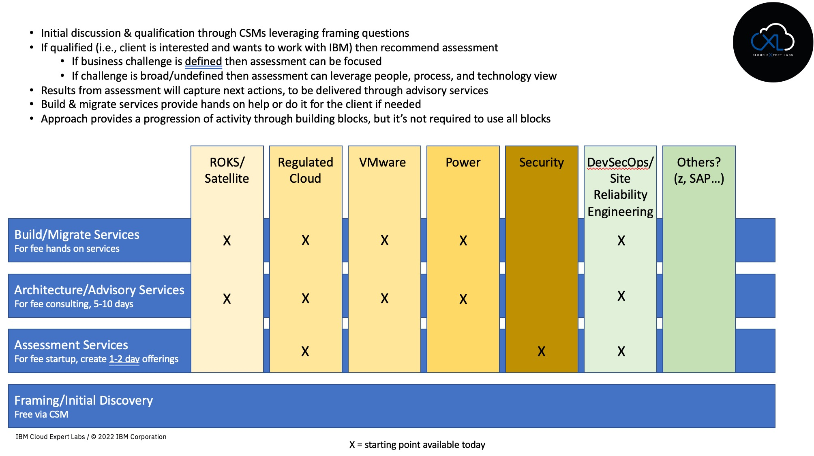
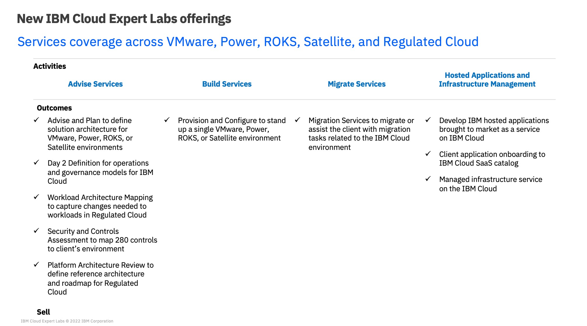

import {Link} from 'gatsby';
import FileLink from '../components/FileLink';

<Row>

<Column colMd={8} colLg={8}>

IBM Cloud Technology Expert Labs has three existing technical health assessments defined and ready to deliver to your customer for a fee.

Technical health assessments typically involve an opening presentation, a series of interviews with customer personnel and other data gathering techniques, and a concluding report and presentation to the customer on findings and recommendations for further action.

Technology Expert Labs can also provide architectural design, as well as build & migrate services to help execute on those recommendations. The picture below provides a view of the categories where IBM Cloud Expert Labs can provide assessments, architectural and advisory, and build and migrate services.

</Column>

<Column colMd={4} colLg={4}>

 
 

<Aside>

**Technical Health assessments delivered via Technology Expert Labs**

<a href='https://ibm.seismic.com/Link/Content/DCb6p8CT2JmRm8MFPdX7VPJDTC98' target='_blank' rel='noreferrer noopener'>Security and Compliance Essentials</a>

</Aside>

</Column>

</Row>
