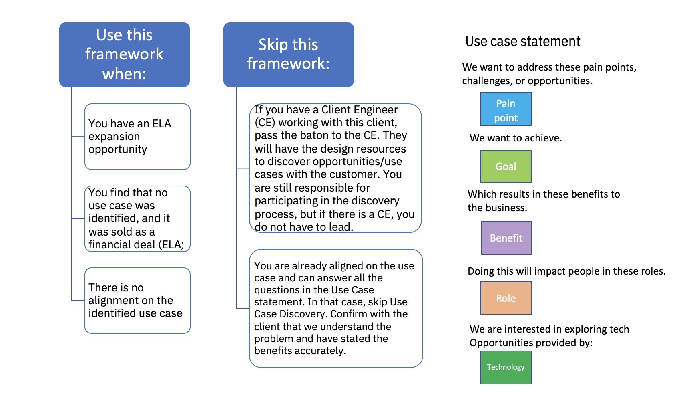
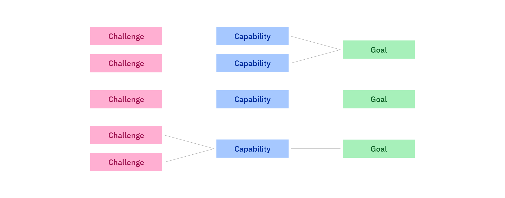
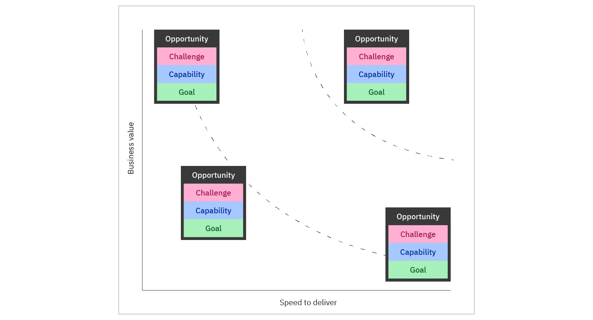
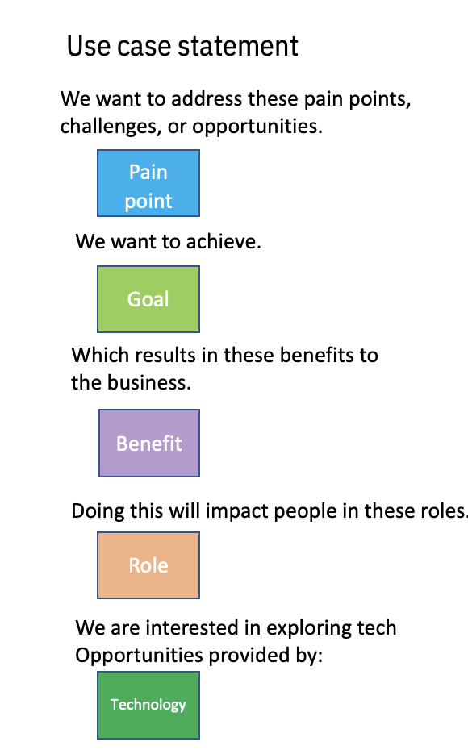
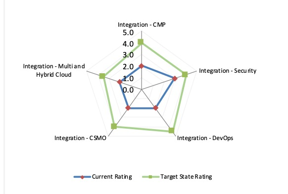

<AnchorLinks small>
 <AnchorLink>What is a Use Case Discovery session?</AnchorLink>
 <AnchorLink>When should I hold a Use Case Discovery session?</AnchorLink>
 <AnchorLink>How do I prepare to deliver the Use Case Discovery session?</AnchorLink>
 <AnchorLink>Who participates?</AnchorLink>
 <AnchorLink>Steps to hold the session</AnchorLink>
 <AnchorLink>Outcomes of the session</AnchorLink>
 <AnchorLink>Next steps</AnchorLink>
</AnchorLinks>

import {Link} from 'gatsby';
import FileLink from '../components/FileLink';

<Row>

<Column colMd={6} colLg={6}>

###   Entry point

You have engaged the customer sponsor and met with the IBM team to understand the client strategy and their pain points.

</Column>

<Column colMd={6} colLg={6}>

###   Outcomes

Clarity on opportunities to address your customer's goals and challenges. 
Use cases that align the goal to the challenge, process, and people impacted. 
A starting point to collaborate and ensure your customer's return on investment. 
Stakeholder alignment on prioritized goals and challenges.

</Column>

</Row>

<Row>

<Column colMd={8} colLg={8}>

## What is a Use Case Discovery session?

If your customer does not have a well-defined business use case statement, meet with them to discover a prioritized use case that IBM technology can help them solve. The session helps clarify and enlist sponsorship from the customer around an opportunity, including budget, authority, and timeline.

This is an opportunity for customers to reflect on their business and share areas where we might collaborate. It's an interactive and constructive session that deepens IBM's relationship with the customer as we identify a range of customer opportunities.

In the session, the customer is guided through a series of collaborative activities to explore their business goals and align them to the challenges that block or slow them down. As a CSM, you will work with the customer to uncover and describe opportunities as concrete use cases focused on the people who require the outcomes and the experiences that need to change. As a team, you prioritize the opportunities to explore further with IBM.

You might request that the Client Engineering team assigned to your customer perform the Use Case Discovery activities (Business Framing).

</Column>

<Column colMd={4} colLg={4}>

  

<Aside>

**STARS**

<a href='https://ibm.biz/IBM_STARS' target='_blank' rel='noreferrer noopener'>Find a use case similar to your customer's needs</a>

</Aside>

 

<Aside>

**Pain points for Growth products**

<Link to='/pain-points' target='_blank' rel='noreferrer noopener'>Pain points listed in CSM Playbook pages</Link>

</Aside>

<Aside>

**Pain points for non-Growth products**

<a href='https://ibm.seismic.com/app?NewsId=e29a0ab8-86e5-4dd6-b00f-247774af9d99#/home' target='_blank' rel='noreferrer noopener'>Search Seismic</a>

</Aside>

 

<Aside>

**Client Engineering**

<a href='https://w3.ibm.com/w3publisher/client-engineering' target='_blank' rel='noreferrer noopener'>Client Engineering publisher pages</a>

</Aside>

</Column>

</Row>

<Row>

<Column colMd={8} colLg={8}>

## When should I hold a Use Case Discovery session?

You should hold this session when you have an ELA expansion opportunity, you have no use case identified, or there is no alignment on a prioritized use case.

You can skip the session if you have a Client Engineer (CE) already working with the client. They should have the design resources available to facilitate a discovery session. You are still responsible for taking part in the session, but you would not have to faciitate.

You can also skip the session if you are already aligned on the use case.

</Column>

<Column colMd={4} colLg={4}>

  

<Aside>

**Slides for a Use Case Discovery session**

<FileLink to="/files/CSM-use-case-discovery-client-facing.pptx" target='_blank' rel='noreferrer noopener'>Use Case Discovery session</FileLink> (Use for either face-to-face or remote.)

</Aside>

 

<Aside>

**Mural templates**

<a href="https://app.mural.co/invitation/room/1673456331005?code=a1e39f4e7b8a4708af21813497bd5329&sender=slafera" target='_blank' rel='noreferrer noopener'>Mural templates for your session</a> (use the templates or a whiteboard)

</Aside>

</Column>
</Row>

<Row>
<Column colMd={8} colLg={8}>

## How do I prepare to deliver the Use Case Discovery session?

Before you and the customer decide you need a Use Case Discovery session, you will need to align with team IBM and your client business sponsor on a number of fronts.

| Team IBM | Client |
| ---------- | ---------- |
| Discuss conducting a Use Case discovery workshop to identify use cases & business outcomes | Ask your customer to prepare for the session by identifying their main pain points in light of their strategy and competitive position |
| Identify Team IBM & customer sponsor| Confirm executive sponsor, product owner, and governance model and date & time of the workshop.   Confirm attendees for the workshop |
| Leverage information available from the Know my Client practice    Gather insights about the customer:    Understand the business strategy  Understand what was sold & why  Gather insights & trends in the industry | Confirm customer strategic initiatives & pain points    Identify target persona + stakeholders |
| Determine business/technology initiatives to focus on.   Identify potential use cases by Capability/TDP  Identify potential business outcomes relevant to the customer|  Align stakeholders on vision and desired outcomes from the workshop |

## Who participates?

Strive for a good mix of customer and IBMer attendees to achieve an impactful session by not overwhelming the customer with IBMers.

Avoid "observers" who do not have a key role in the session.

| IBM | Customer |
| -------- | --------- |
| - You, the CSM |  - No more than 5 - 7 people |
| - Principal or Account team | - Senior decision makers from both IT and LOB if possible
| - Designer (as needed) | - Experts on the problem and opportunity space
| - Domain SMEs, as necessary | - Individuals who will likely be involved in workload co-creation |
| | - Budget holder or decision maker |

</Column>

<Column colMd={4} colLg={4}>

 

 

<Aside>

**Facilitator's Guide**

<FileLink to='/files/Use-Case-Discovery-Workshop-Facilitator-Guide.docx' target='_blank' rel='noreferrer noopener'>Use the guide to help deliver the session</FileLink>

</Aside>

 
 

<Aside>

**Skills you need**

 

**CSM Skills: Using Your Communication Skills to Persuade**

<a href='https://yourlearning.ibm.com/activity/PLAN-49ADF5FCBB60' target='_break'>Persuade your customer to engage</a>
  

**CSM Skills: Presenting**

<a href='https://yourlearning.ibm.com/activity/PLAN-CCA7A0BBCC32' target='_break'>Learn to present well</a>

  

**CSM Skills: Facilitation**

<a href='https://yourlearning.ibm.com/activity/PLAN-DE050FB1766C' target='_break'>Learn how to facilitate a session</a>

  

**CSM Skills: MURAL Quick Start**

<a href='https://yourlearning.ibm.com/activity/PLAN-4AA3059CEA06' target='_blank' rel='noreferrer noopener'>Learn how to use MURAL</a>

 

</Aside>

<Aside>

**Customer training**

<a href="https://ibm.box.com/s/hutfx0lfqp84dl6zvbf0ho5mxwxr0s73" target='_blank' rel='noreferrer noopener'>Customer intro to remote collaboration and mural.</a>

</Aside>

</Column>

</Row>

<Row>

<Column colMd={8} colLg={8}>

## Steps to hold the session

Use Case Discovery sessions are not meant to be rigid. They are highly customizable based on a customer's need. For example, a session might include education on a technology or practice area as necessary to set greater context for customer stakeholders before diving into a customer's opportunity spaces.

Note: Remote relies primarily on Mural for collaboration.

In general, Use Case Discovery includes:

1. Opportunity alignment

  Identify IBM capabilities that can help your customer with their challenges and bring them closer to their goal.

2. Opportunity prioritization

  Focus in on the opportunities to advance that will deliver the most value for your customer.

3. Describe the use case statement

  During the session, write a Use Case statement to identify the problem you're trying to solve, who you're solving the problem for, why they're struggling, and how solving the problem can help their business.

</Column>

</Row>

<Row>

<Column colMd={4} colLg={4}>

</Column>
</Row>

<Row>

<Column colMd={8} colLg={8}>

## Outcomes of the session

The session should answer: 

* What's the starting point / the lay of the land for this customer?
* What's the customer's roadmap of opportunities to consider?
* Where should we focus our collaborative efforts first?
* Who are the right people to champion this project/initiative from the customer's side?
* Who has authority?
* Where do they sit within the hierarchy or Business Unit matrix?
* What's the approximate budget and timeline?

Note: At this point, our goal is not to define a PoX or focus on solutions. 

</Column>
</Row>

<Row>

<Column colMd={8} colLg={8}>

## Next steps

After defining the statement, you can use this same statement to kickoff another workshop and further explore the technical aspects of the solution. As a CSM, you can start to work with your customer to further refine the use case and explore how IBM technology can solve the customer pain points. You can use the Business Outcomes Framework to help your customer understand the business outcomes for their use case.

You can move on to an architecture workshop to design a solution. You can also hold an Enterprise Design Thinking (EDT) workshop with expanded stakeholders from the customer and IBM (beyond those who participated in the Use Case Discovery session).

</Column>

<Column colMd={3} colLg={4}>

 
 

<Aside>

**Business Outcomes Framework**

<Link to='/onboard/business-outcomes-framework' target='_blank' rel='noreferrer noopener'>View the Business Outcomes Framework practice</Link>

</Aside>

<Aside>

**Design a solution as part of the EDT workshop**

<Link to="/csm-cocreate" target='_blank' rel='noreferrer noopener'>Co-create the solution</Link>

  

**Architect the solution**

<Link to="/architect-the-solution" target='_blank' rel='noreferrer noopener'>Architect a solution</Link>

</Aside>

</Column>

</Row>

<Row>

<Column colMd={8} colLg={8}>

## Achieve business value through a Technical Health Assessment

As you work with your customer to define a new use case, you might find that they do not have a clear and detailed understanding of their own pain points. Use cases are meant to address and resolve pain points, resulting in business value. If the customer cannot identify or define their pain points clearly, it is difficult to create a use case that will deliver tangible business value.

If your customer is having trouble clearly understanding and defining their pain points, a technical health assessment, delivered by IBM Cloud Technology Expert Labs, or an IBM Business Partner, might help. Even if the pain points are defined and understood, an assessment can provide validation and clarity on the parts of the problem to focus on.

In all cases, if there is an incumbent IBM Business Partner active with your customer, include them in the discussion from the very beginning, The Business Partner might have similar assessment, architectural, and build/migrate services to offer, and should be given the opportunity to do so.

</Column>

<Column colMd={4} colLg={4}>

 
 

<Aside>

**Technical Health assessments delivered via Technology Expert Labs**

 

<Link to='/technical-health-assessment' target='_blank' rel='noreferrer noopener'>Expert Lab Technical Health Offerings</Link>

 
 

<a href='https://ibm.seismic.com/Link/Content/DCb6p8CT2JmRm8MFPdX7VPJDTC98' target='_blank' rel='noreferrer noopener'>Security and Compliance Essentials</a>

 
 

<a href='https://ibm.seismic.com/Link/Content/DC6jRRM8CGFTFG2Thq3VJjhhP32d' target='_blank' rel='noreferrer noopener'>DevSecOps</a>

 
 

<a href='https://ibm.seismic.com/Link/Content/DC9VGfm2j2qjh8qDgpBTqTDBHmQV' target='_blank' rel='noreferrer noopener'>Site Reliability Engineering (SRE)</a>

</Aside>

</Column>
</Row>
